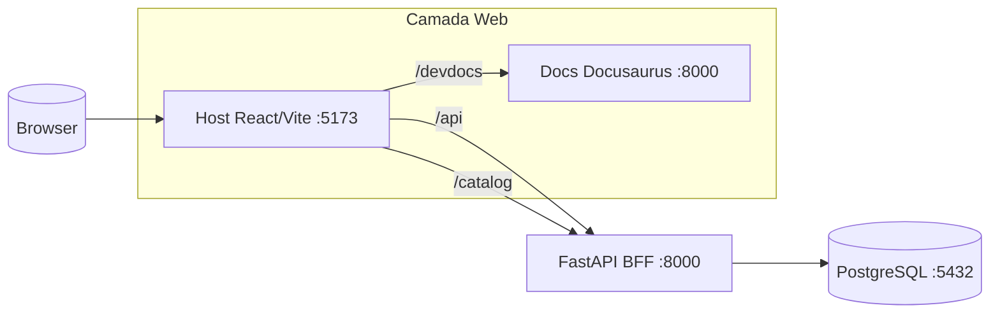

Esta página descreve o estado atual do monorepo:
**Docusaurus + PostgreSQL + `/devdocs/`**.

## Diagrama alto nível

## Fluxo principal

1. o navegador acessa o Host em `:5173`;
2. o Host encaminha:
   - `/api` para o BFF;
   - `/catalog` para o BFF;
   - `/devdocs` para o site Docusaurus;
3. o BFF persiste o estado em PostgreSQL.

## Onde isso aparece no repo

- `apps/host/vite.config.ts`
- `apps/bff/app/main.py`
- `apps/bff/app/db.py`
- `infra/docker-compose.dev.yml`
- `infra/docker-compose.pg.yml`
- `apps/docs-site/docusaurus.config.ts`
