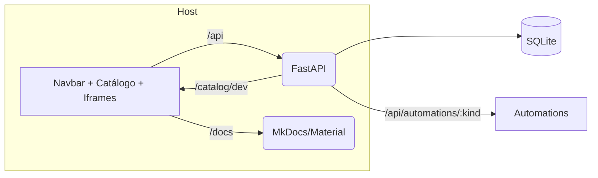

Esta página apresenta o **diagrama alto nível** da Plataforma AGEPAR e como os componentes se conectam em **dev** e **produção**.

## Diagrama (alto nível)



**Portas e _proxies_ (dev):**
- **host**: 5173 (Vite) → _proxy_ para `/api`, `/catalog` e `/docs`
- **bff**: 8000 (FastAPI)
- **docs**: servido via host em `/docs` (backend MkDocs)

> Em produção, os componentes permanecem os mesmos, com _build_ otimizado do Host, CORS/cookies endurecidos no BFF e logs/auditoria ativos.

## Responsabilidades por componente

- **Host (Vite/React/TS)**: navegação por categorias; renderização de blocos via `ui` (ex.: `iframe` aponta para `/api/automations/:kind/ui`); RBAC **ANY-of** com `requiredRoles`.
- **BFF (FastAPI)**: login mock (`POST /api/auth/login`), identidade (`GET /api/me`), catálogo (`/catalog/dev`), rotas de automations (`/schema`, `/ui`, `/submit`, etc.) e persistência (`submissions`, `audits`).
- **Docs (MkDocs/Material)**: conteúdo para não-devs servido via Host em `/docs`.
- **SQLite**: base local inicializada no _startup_, usada para submissões e auditorias.
- **Automations**: módulos isolados (BFF + UI no-build), expostos sob `/api/automations/:kind/...` e carregados no Host por _iframe_.

## Exemplos (cURL)

```bash
# Health (se disponível)
curl -i http://localhost:8000/api/health

# Catálogo (usado pelo Host para montar navbar/cards)
curl -s http://localhost:8000/catalog/dev | jq .

# Sessão mock
curl -i -X POST http://localhost:8000/api/auth/login   -H "Content-Type: application/json"   -d '{"username":"dev","password":"dev"}'

# UI de uma automação (iframe)
curl -s http://localhost:8000/api/automations/dfd/ui
```

## Evidências no repositório

- Compose: `—`
- Vite config: `apps/host/vite.config.ts`
- Pistas FastAPI (exemplo): `apps/bff/app/main.py`
- Catálogo JSON (exemplo): `catalog/catalog.dev.json`

## Notas de operação

- **Erros**: padronizados (`400/401/403/404/409/422`) com mensagens claras.
- **Validação**: Pydantic v2 (`populate_by_name=True`, `extra="ignore"`) e normalização para evitar `422` triviais.
- **Logs**: `INFO` no caminho feliz; `ERROR` com contexto (request_id, user, automation, submission_id).

---

> _Criado em 2025-10-27_