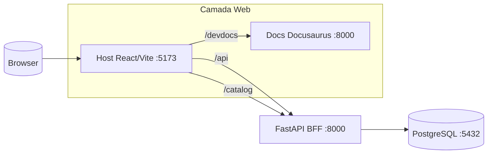

> O nome do arquivo é histórico. O conteúdo abaixo foi atualizado para o estado
> atual do monorepo: **Docusaurus + PostgreSQL + `/devdocs/`**.

## Diagrama alto nível

```mermaid
flowchart LR
  Browser[(Browser)]
  subgraph Front["Camada Web"]
    Host["Host React/Vite :5173"]
    Docs["Docs Docusaurus :8000"]
  end
  BFF["FastAPI BFF :8000"]
  PG[(PostgreSQL :5432)]

  Browser --> Host
  Host -->|/api| BFF
  Host -->|/catalog| BFF
  Host -->|/devdocs| Docs
  BFF --> PG
```

## Leitura do diagrama

### Host
- monta a SPA;
- carrega o catálogo;
- protege navegação;
- filtra categorias e blocos por RBAC;
- embute módulos por iframe.

### BFF
- autentica usuários;
- mantém sessão em banco;
- expõe `/api`, `/catalog/dev` e as automações;
- inicializa schema no startup;
- registra auditoria e resultados.

### Docs
- projeto Docusaurus v3 em `apps/docs-site`;
- servido em dev via proxy do Host em **`/devdocs/`**;
- pode ser acessado diretamente em `:9000/devdocs/`.

### Banco
- PostgreSQL;
- `DATABASE_URL` obrigatória;
- compose dividido entre arquivo base + override de Postgres.

## Pontos que mudaram em relação ao desenho antigo

- `/docs` → `/devdocs`
- MkDocs → Docusaurus
- SQLite → PostgreSQL
- “mock como fluxo principal” → auth local + mock legado opcional
