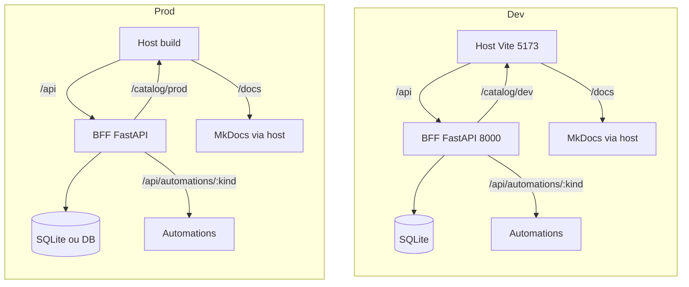

Esta página compara o **fluxo de desenvolvimento local** com o **fluxo de produção** para o Portal AGEPAR.

## Visão geral do fluxo



> **Nota Mermaid**: evitar chaves em labels. Usar `:kind` em vez de `{kind}`.

## Desenvolvimento local (dev)

- **Subida**: `docker compose up --build`
- **Host**: Vite em **5173**, com _proxies_ para `/api`, `/catalog`, `/docs`
- **BFF**: FastAPI em **8000**, inicializa **SQLite** e tabelas `submissions`, `audits`
- **Docs**: servidas via host em `/docs`
- **Catálogo**: `/catalog/dev` (ordem preservada, RBAC ANY-of)

### cURLs úteis

```bash
# health (se disponível)
curl -i http://localhost:8000/api/health

# catálogo
curl -s http://localhost:8000/catalog/dev | jq .

# sessão mock
curl -i -X POST http://localhost:8000/api/auth/login   -H "Content-Type: application/json"   -d '{"username":"dev","password":"dev"}'
```

## Produção (prod)

- **Build do Host**: assets estáticos servidos por PWA/NGINX/rev proxy; sem Vite dev server
- **BFF**: mesmos endpoints, com **CORS/cookies endurecidos**, logs/auditoria ativos
- **Banco**: SQLite ou **DB gerenciado** conforme ambiente
- **Catálogo**: `/catalog/prod` (ou _variant_ por env)
- **Observabilidade**: métricas, trilhas de auditoria e alarmes

### Boas práticas de promoção

- **Versionar Catálogo** por ambiente (dev/hml/prod)
- **Checklists de release**: migrações (se houver), _feature flags_, testes de fumaça
- **RBAC**: validar `requiredRoles` por perfil
- **Erros**: garantir `400/401/403/404/409/422` com mensagens claras

## Diferenças chave (dev vs. prod)

- **Server do Host**: Vite (dev) vs. build estático (prod)
- **Segurança**: sessão mock (dev) vs. autenticação real (prod)
- **Banco**: SQLite (dev) vs. DB gerenciado (prod)
- **Catálogo**: `/catalog/dev` vs. `/catalog/prod`
- **Telemetria**: logs locais vs. _stack_ de observabilidade

---

> _Criado em 2025-10-27_