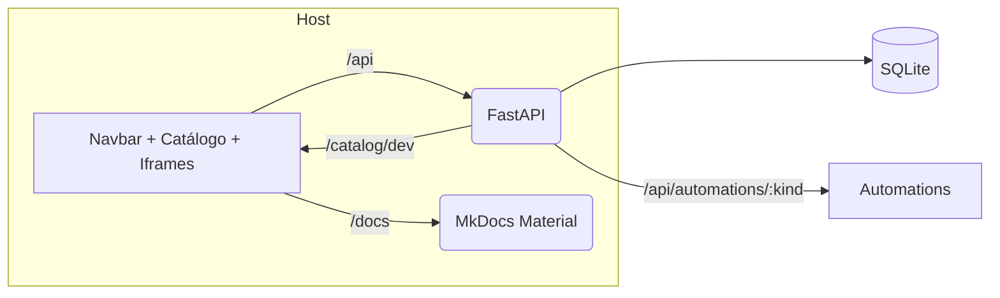

## Objetivos
- Descrever: Objetivo da Plataforma AGEPAR, escopo e público, Diagrama alto nível (Host React/Vite, BFF FastAPI, Docs proxy, SQLite), Monorepo: estrutura de pastas, Fluxo dev local vs. produção

## Sumário Rápido
- Estrutura e conceitos
- Padrões adotados
- Exemplos e referências aos arquivos do repositório

## Visão da Arquitetura (alto nível)



**Portas e rotas (dev):**
- **host**: 5173 (Vite), com _proxies_ para `/api`, `/catalog` e `/docs`
- **bff**: 8000 (FastAPI)
- **docs**: servido via host em `/docs` (backend MkDocs interno)

## Monorepo — Estrutura de Pastas (alto nível)

```text
(Preencher com a árvore do repositório: apps/, docker-compose*, etc.)
```

## Fluxo: Dev local vs. Produção

- **Dev local**: `docker compose up --build` sobe host (frontend), bff (API) e docs. O host faz _proxy_ para o BFF e para as docs. Banco local **SQLite** inicializado no _startup_.
- **Produção**: mesmos componentes, com build otimizado do host, _hardening_ de CORS/cookies no BFF, logs/auditoria ativos e catálogo versionado.

## Padrões adotados (resumo)

- **BFF / FastAPI**: sessões mock (`POST /api/auth/login`, `GET /api/me`); automations em `/api/automations/:kind/...`; validação Pydantic v2 (`populate_by_name`, `extra="ignore"`); _error codes_ padronizados `400/401/403/404/409/422`.
- **Host / Vite React TS**: navbar por categorias; cards por categoria; renderização de blocos conforme `ui` (iframe); RBAC **ANY-of** por `requiredRoles`; preserva ordem de escrita no catálogo.
- **Docs / MkDocs**: servidas via `/docs` pelo host; conteúdo para não-devs; tema Material com Mermaid/Glightbox.
- **Catálogo**: servido em `/catalog/dev` com `categories[]` e `blocks[]`; blocos com `ui.type="iframe"`.

> _Criado em 2025-10-27 12:49:10_