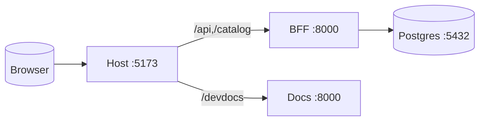

Esta seção documenta o **contrato real** do portal no estado atual do repositório.

## Resumo executivo

- monorepo em `apps/`
- BFF FastAPI
- Host React/Vite/TS
- Docs em Docusaurus
- Postgres no ambiente dev
- catálogo em `catalog/catalog.dev.json`
- docs publicadas em **`/devdocs/`** em dev

## Diagrama

```mermaid
flowchart LR
  Browser[(Browser)]
  Host[Host :5173]
  BFF[BFF :8000]
  Docs[Docs :8000]
  PG[(Postgres :5432)]

  Browser --> Host
  Host -->|/api,/catalog| BFF
  Host -->|/devdocs| Docs
  BFF --> PG
```

## Temas cobertos aqui

- objetivo e escopo do portal
- diagrama alto nível
- estrutura de pastas
- fluxo dev local x produção

## Observação importante

Esta revisão substitui referências históricas a:
- `/docs`
- MkDocs
- SQLite

pelo comportamento realmente implementado no código:
- `/devdocs`
- Docusaurus
- PostgreSQL
