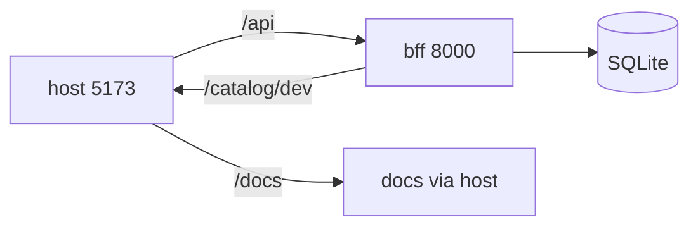

_Criado em 2025-10-27 13:54:16_

Esta página detalha a **orquestração local** com Docker Compose para a Plataforma AGEPAR — serviços, portas e _healthchecks_, além de exemplos de verificação.

> **Resumo das portas (dev):**
> - **5173** → Host (Vite/React)
> - **8000** → BFF (FastAPI)
> - **/docs** → MkDocs (servido via **host**; opcionalmente `docs:8000` interno)

## Arquitetura (Compose)



> Mantemos a UI simples e de baixo acoplamento: o Host faz _proxy_ para `/api`, `/catalog` e `/docs`.

## Exemplo de `docker-compose.yml` (sugerido)

> Adapte os caminhos de acordo com seu monorepo. Este exemplo segue a convenção do projeto.

```yaml
version: "3.9"

services:
  bff:
    build:
      context: ./apps/bff
    command: uvicorn app.main:app --host 0.0.0.0 --port 8000 --reload
    ports:
      - "8000:8000"
    volumes:
      - ./apps/bff:/app
    environment:
      - APP_ENV=dev
      - DB_URL=sqlite:///./data.db
      - CORS_ORIGINS=http://localhost:5173
    healthcheck:
      test: ["CMD", "curl", "-f", "http://localhost:8000/api/health"]
      interval: 10s
      timeout: 3s
      retries: 10

  host:
    build:
      context: ./apps/host
    command: pnpm dev --host
    ports:
      - "5173:5173"
    volumes:
      - ./apps/host:/app
    environment:
      - VITE_API_BASE=http://localhost:8000
      - VITE_CATALOG_BASE=http://localhost:8000
      - VITE_DOCS_BASE=http://localhost:8000
    depends_on:
      bff:
        condition: service_healthy

  # Opcional: servir MkDocs diretamente (normalmente é via host em /docs)
  docs:
    build:
      context: ./apps/docs
    command: mkdocs serve -a 0.0.0.0:8000
    expose:
      - "8000"
    volumes:
      - ./apps/docs:/docs
```

### Proxies do Vite (Host)

No `vite.config.ts`, garanta:

```ts
export default defineConfig({
  server: {
    port: 5173,
    proxy: {
      "/api": "http://localhost:8000",
      "/catalog": "http://localhost:8000",
      "/docs": "http://localhost:8000" // ou http://docs:8000 se rodar o serviço docs
    }
  }
})
```

## Smoke tests (cURL)

```bash
# BFF health (se existir)
curl -i http://localhost:8000/api/health

# Catálogo
curl -s http://localhost:8000/catalog/dev | jq .

# Sessão mock
curl -i -X POST http://localhost:8000/api/auth/login \\
  -H "Content-Type: application/json" \\
  -d '{{"username":"dev","password":"dev"}}'
```

## Boas práticas

- **Healthcheck do BFF** antes do Host depender (reduz flakiness).
- **CORS**: `CORS_ORIGINS=http://localhost:5173` quando Host roda fora do compose.
- **Volumes**: monte o código (`./apps/...:/app`) para _hot reload_ em dev.
- **RBAC**: teste `requiredRoles` com usuários/personas diferentes antes de promover.
- **SQLite**: mantenha o arquivo no volume do serviço (pasta persistente).

## Problemas comuns

- **Porta em uso (5173/8000)** → finalize processos ou troque portas.
- **Mermaid/MDX quebrando** → evite `[]` em `subgraph` e chaves em labels; use `:kind`.
- **CORS/Sessão** → alinhar origens, cookies e _proxies_.

---

_Criado em 2025-10-27 13:54:16_