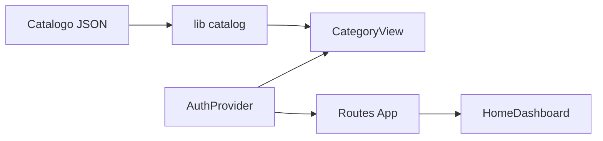

Esta página descreve a **organização do Host (React/Vite/TS)**: pastas, páginas, componentes e bibliotecas de apoio que integram **catálogo** e **BFF**.

> Referências principais:  
> `apps/host/src/App.tsx`, `apps/host/src/main.tsx`, `apps/host/src/auth/AuthProvider.tsx`,  
> `apps/host/src/lib/api.ts`, `apps/host/src/lib/catalog.ts`,  
> `apps/host/src/pages/*.tsx`, `apps/host/src/types.ts`

---

## 1) Árvore de diretórios (Host)

```text
apps/host/
└─ src/
   ├─ auth/
   │  └─ AuthProvider.tsx
   ├─ lib/
   │  ├─ api.ts
   │  └─ catalog.ts
   ├─ pages/
   │  ├─ HomeDashboard.tsx
   │  ├─ CategoryView.tsx
   │  ├─ AccountSessions.tsx
   │  ├─ Login.tsx
   │  ├─ Register.tsx
   │  ├─ RegisterDisabled.tsx
   │  ├─ Forbidden.tsx
   │  └─ NotFound.tsx
   ├─ types.ts
   ├─ App.tsx
   ├─ main.tsx
   └─ index.css
````

**Ideia geral**

* `auth/` centraliza **contexto de sessão** e helpers.
* `lib/` guarda **acesso à API** e **leitura do catálogo**.
* `pages/` são **rotas** renderizadas pelo `App.tsx`.
* `types.ts` contém **tipos compartilhados** (Catálogo, Auth, RBAC).
* `App.tsx` define **roteamento** e **layout**.
* `main.tsx` faz o **bootstrap** do React com o `AuthProvider`.

---

## 2) Fluxo de dados (alto nível)



* O **catálogo** é lido por `lib/catalog.ts`.
* As **páginas** consomem o catálogo e aplicam **RBAC** simples (ANY-of).
* `AuthProvider` expõe **usuário** e **roles** às páginas.

---

## 3) Tipos essenciais (types.ts)

> Os nomes podem variar; abaixo um modelo compatível com o projeto.

```ts
// apps/host/src/types.ts
export type Role = "viewer" | "editor" | "admin" | string;

export type CatalogCategory = {
  id: string;
  label: string;
  icon?: string;
  order?: number;
  hidden?: boolean;
};

export type CatalogBlockUI =
  | { type: "iframe"; url: string }
  | { type: "link"; href: string }
  | { type: "placeholder"; text: string };

export type CatalogBlock = {
  categoryId: string;
  ui: CatalogBlockUI;
  description?: string;
  routes?: string[];
  navigation?: string[];
  requiredRoles?: Role[]; // regra: ANY-of
  order?: number;
  hidden?: boolean;
};

export type Catalog = {
  categories: CatalogCategory[];
  blocks: CatalogBlock[];
  generatedAt?: string;
};
```

---

## 4) Acesso à API e Catálogo (lib/)

**api.ts** — *wrapper* simples para chamadas ao BFF via **proxies do Vite**:

```ts
// apps/host/src/lib/api.ts
export async function api<T>(path: string, init?: RequestInit): Promise<T> {
  const res = await fetch(path, {
    credentials: "include",
    headers: { "Content-Type": "application/json" },
    ...init,
  });
  if (!res.ok) throw new Error(`${res.status} ${res.statusText}`);
  return (await res.json()) as T;
}
```

**catalog.ts** — leitura do catálogo de desenvolvimento:

```ts
// apps/host/src/lib/catalog.ts
import type { Catalog } from "../types";
import { api } from "./api";

export async function loadCatalog(): Promise<Catalog> {
  // via proxy do Vite: /catalog -> BFF
  return api<Catalog>("/catalog/dev");
}

export function anyRoleAllowed(userRoles: string[] | undefined, required?: string[]) {
  if (!required || required.length === 0) return true;
  if (!userRoles || userRoles.length === 0) return false;
  return required.some(r => userRoles.includes(r));
}
```

---

## 5) Autenticação e sessão (auth/AuthProvider.tsx)

Contexto mínimo com **usuário** e **roles** (mock ou real via `/api/me`):

```tsx
// apps/host/src/auth/AuthProvider.tsx
import React, { createContext, useContext, useEffect, useState } from "react";
import { api } from "../lib/api";

type User = { id: string; name: string; roles: string[] } | null;

type AuthCtx = {
  user: User;
  loading: boolean;
  login: (u: string, p: string) => Promise<void>;
  logout: () => Promise<void>;
};

const Ctx = createContext<AuthCtx>({} as any);

export const AuthProvider: React.FC<React.PropsWithChildren> = ({ children }) => {
  const [user, setUser] = useState<User>(null);
  const [loading, setLoading] = useState(true);

  useEffect(() => {
    api<User>("/api/me")
      .then(setUser)
      .catch(() => setUser(null))
      .finally(() => setLoading(false));
  }, []);

  async function login(username: string, password: string) {
    await api("/api/auth/login", { method: "POST", body: JSON.stringify({ username, password }) });
    const me = await api<User>("/api/me");
    setUser(me);
  }

  async function logout() {
    await api("/api/auth/logout", { method: "POST" });
    setUser(null);
  }

  return <Ctx.Provider value={{ user, loading, login, logout }}>{children}</Ctx.Provider>;
};

export const useAuth = () => useContext(Ctx);
```

---

## 6) Roteamento e layout (App.tsx)

Exemplo de **react-router** com páginas principais e *fallback*:

```tsx
// apps/host/src/App.tsx
import React, { useEffect, useState } from "react";
import { BrowserRouter, Routes, Route, Navigate } from "react-router-dom";
import { AuthProvider, useAuth } from "./auth/AuthProvider";
import { loadCatalog, anyRoleAllowed } from "./lib/catalog";
import type { Catalog, CatalogBlock } from "./types";

import HomeDashboard from "./pages/HomeDashboard";
import CategoryView from "./pages/CategoryView";
import Login from "./pages/Login";
import Forbidden from "./pages/Forbidden";
import NotFound from "./pages/NotFound";

function Guard({ children, required }: { children: React.ReactNode; required?: string[] }) {
  const { user, loading } = useAuth();
  if (loading) return <div>Carregando…</div>;
  if (!anyRoleAllowed(user?.roles, required)) return <Forbidden />;
  return <>{children}</>;
}

function AppRoutes() {
  const [catalog, setCatalog] = useState<Catalog | null>(null);

  useEffect(() => {
    loadCatalog().then(setCatalog).catch(console.error);
  }, []);

  if (!catalog) return <div>Carregando catálogo…</div>;

  return (
    <Routes>
      <Route path="/" element={<HomeDashboard catalog={catalog} />} />
      <Route path="/category/:id" element={<CategoryView catalog={catalog} />} />
      <Route path="/login" element={<Login />} />
      {/* Exemplo de rota protegida */}
      <Route
        path="/account/sessions"
        element={
          <Guard required={["editor", "admin"]}>
            <React.Suspense fallback="..."> {/* sua página aqui */}</React.Suspense>
          </Guard>
        }
      />
      <Route path="/forbidden" element={<Forbidden />} />
      <Route path="*" element={<NotFound />} />
    </Routes>
  );
}

export default function App() {
  return (
    <AuthProvider>
      <BrowserRouter>
        <AppRoutes />
      </BrowserRouter>
    </AuthProvider>
  );
}
```

---

## 7) Páginas chave (pages/)

### `HomeDashboard.tsx`

* Lê `catalog.categories` e renderiza **cards** por categoria, preservando a **ordem**.
* Links levam a `/category/:id`.

### `CategoryView.tsx`

* Recebe `catalog` via props, filtra `blocks` por `categoryId`.
* Aplica **RBAC ANY-of** com `requiredRoles`.
* Renderiza bloco por **tipo de UI**; para `iframe`:

```tsx
// trecho típico em CategoryView
function BlockCard({ block }: { block: CatalogBlock }) {
  if (block.ui.type === "iframe") {
    return (
      <div className="card">
        <iframe src={block.ui.url} title={block.ui.url} style={{ width: "100%", height: 600, border: 0 }} />
      </div>
    );
  }
  // outros tipos: link, placeholder...
  return null;
}
```

### Demais páginas

* `Login.tsx`, `Register*.tsx` — autenticação/UI de entrada.
* `AccountSessions.tsx` — exibe sessões ativas (quando implementado no BFF).
* `Forbidden.tsx` e `NotFound.tsx` — estados de erro.

---

## 8) Estilos e UX

* `index.css` para resets e tokens simples de design.
* **Acessibilidade**: título em `iframe`, `aria-*` em botões/links.
* **Layouts em grid** para cards; **loading states** visíveis em fetch do catálogo.

---

## 9) Boas práticas adotadas

* **RBAC ANY-of** em nível de bloco.
* **Proxies do Vite**: chamadas usam caminhos relativos (`/api`, `/catalog`).
* **Sem segredos** no front; cookies de sessão sob controle do BFF.
* **Ordenação**: respeitar a ordem definida no catálogo salvo pedido explícito.

---

## 10) Problemas comuns

* **Catálogo 404**
  Verifique o proxy `/catalog` e se o BFF está no ar. Teste `curl -s http://localhost:5173/catalog/dev`.

* **Conteúdo não renderiza em iframe**
  Cheque `X-Frame-Options` no alvo. Se bloqueado, avalie renderização alternativa.

* **RBAC bloqueando tudo**
  Garanta que `useAuth()` esteja propagando `roles` corretas; teste removendo `requiredRoles` para isolar o problema.

* **CORS/sessão**
  Ajuste `CORS_ORIGINS` no BFF para incluir `http://localhost:5173` e `http://host:5173` (Compose).

---

## Próximos passos

* **[Proxies do Vite](/docs/03-build-run-deploy/proxies-do-vite-api-catalog-docs)** para garantir roteamento correto em dev.
* **Testes de navegação** (Vitest/RTL) dos componentes principais.
* **Hardening de UX**: estados de erro e *skeletons* nas listas de blocos.

---

> _Criado em 2025-11-18_
