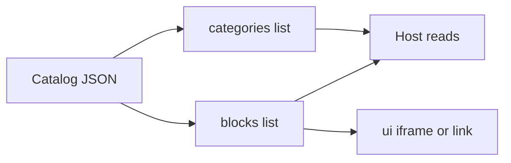

Esta página define a **estrutura do catálogo** servido em **`/catalog/dev`**, com os campos obrigatórios/opcionais de **`categories[]`** e **`blocks[]`**, além de convenções de ordenação, RBAC e extensão.

> Fonte: `catalog/catalog.dev.json` (carregado pelo BFF e consumido pelo Host).

---

## 1) Visão geral

O catálogo é um JSON com duas listas principais:

```json
{
  "categories": [ /* ... */ ],
  "blocks": [ /* ... */ ],
  "generatedAt": "2025-11-18T12:34:56Z"
}
````

* **categories[]**: metadados de navegação (id, rótulo, ícone, etc.).
* **blocks[]**: itens renderizáveis (ex.: iframes) vinculados a uma categoria via `categoryId`.
* **generatedAt** (opcional): carimbo de geração para auditoria/cache.



---

## 2) `categories[]` — esquema

Campos e regras:

```ts
// Tipagem de referência (Host)
export type CatalogCategory = {
  id: string;        // obrigatório, único no catálogo
  label: string;     // obrigatório, exibido na navbar/cards
  icon?: string;     // opcional, classe/slug do ícone (livre)
  order?: number;    // opcional, usado APENAS se escolher ordenar por 'order'
  hidden?: boolean;  // opcional, omite a categoria da UI
};
```

**Boas práticas**

* `id` curto e sem espaços (`compras`, `contratos`, `orcamento`).
* `label` voltado ao usuário final.
* `hidden: true` para itens em rascunho.
* **Ordem**: por padrão **preservamos a ordem do array**. Use `order` **apenas** se você optar explicitamente por ordenação por número.

---

## 3) `blocks[]` — esquema

Cada bloco pertence a **uma** categoria e descreve **como** renderizar:

```ts
// Tipagem de referência (Host)
export type CatalogBlock = {
  categoryId: string; // obrigatório, deve existir em categories[].id
  ui:
    | { type: "iframe"; url: string }  // recomendado
    | { type: "link"; href: string };  // fallback externo
  description?: string;     // opcional (tooltip/resumo)
  navigation?: string[];    // opcional (rotas auxiliares)
  routes?: string[];        // opcional (rotas internas do host)
  requiredRoles?: string[]; // opcional, regra RBAC ANY-of
  order?: number;           // opcional, usado APENAS se optar por ordenar
  hidden?: boolean;         // opcional, oculta o bloco
};
```

**UI suportada**

* `iframe` → renderização embutida (`ui.url`).
* `link` → abre em nova aba (`ui.href`) quando `iframe` não é possível (ex.: `X-Frame-Options: DENY`).

**RBAC**

* `requiredRoles` ausente ou vazio ⇒ **público**.
* Se houver, aplica-se **ANY-of** (qualquer role do usuário habilita).

**Compatibilidade futura**

* O BFF/Host tolera campos extras (estratégia “**extra: ignore**”); evite **quebrar** nomes já usados.

---

## 4) Exemplo mínimo (público)

```json
{
  "categories": [
    { "id": "compras", "label": "Compras" }
  ],
  "blocks": [
    {
      "categoryId": "compras",
      "ui": { "type": "iframe", "url": "/api/automations/dfd/ui" }
    }
  ],
  "generatedAt": "2025-11-18T12:00:00Z"
}
```

---

## 5) Exemplo completo (RBAC, ordem e ocultos)

```json
{
  "categories": [
    { "id": "compras",   "label": "Compras" },
    { "id": "contratos", "label": "Contratos", "order": 1 },
    { "id": "orcamento", "label": "Orçamento", "order": 0, "icon": "mdi-cash" }
  ],
  "blocks": [
    {
      "categoryId": "compras",
      "ui": { "type": "iframe", "url": "/api/automations/dfd/ui" },
      "description": "Documento de Formalização da Demanda",
      "requiredRoles": ["editor", "admin"]
    },
    {
      "categoryId": "compras",
      "ui": { "type": "iframe", "url": "/api/automations/pca/ui" },
      "order": 0
    },
    {
      "categoryId": "contratos",
      "ui": { "type": "iframe", "url": "/api/automations/tr/ui" },
      "hidden": true
    },
    {
      "categoryId": "orcamento",
      "ui": { "type": "link", "href": "https://transparencia.exemplo.gov.br" }
    }
  ],
  "generatedAt": "2025-11-18T12:34:56Z"
}
```

**Leitura pelo Host**

* **Navbar**: mostra categorias com **pelo menos 1 bloco visível** após RBAC/hidden.
* **Ordem padrão**: **a do arquivo**. Se (e somente se) optar por ordenação, `order: 0,1,2,...` antecipa itens.

---

## 6) Convenções e validações

**IDs**

* Únicos, `kebab-case`/`snake_case`/`sem espaços`. Evite acentos.

**Ícones**

* Campo livre (`icon: "mdi-cash"`). A aplicação decide como mapear.

**URLs**

* Para `iframe` **interno** prefira caminhos relativos: `"/api/automations/&lt;slug&gt;/ui"`.
* Para externo, confirme que o domínio **permite** `frame-ancestors`/`X-Frame-Options`.

**Ocultação e rascunho**

* Use `hidden: true` até que o bloco/categoria esteja pronto.

**RBAC**

* Mantenha listas curtas e coerentes com o BFF (ex.: `"viewer"`, `"editor"`, `"admin"`).

**Extensão segura**

* Campos adicionais são ignorados pelo Host, mas **não** sobrescreva chaves existentes.

---

## 7) cURLs úteis

```bash
# Direto no BFF
curl -s http://localhost:8000/catalog/dev | jq .

# Via proxy do Host (deve responder igual)
curl -s http://localhost:5173/catalog/dev | jq .

# Ver quem sou (para testar RBAC no Host)
curl -s http://localhost:5173/api/me
```

---

## 8) Problemas comuns

* **Categoria sem blocos visíveis** → não aparece na navbar (RBAC/hidden filtram tudo).
* **Iframe não carrega** → alvo bloqueia por `X-Frame-Options`/CSP. Use `ui.type = "link"` como fallback.
* **Ordem “mudando”** → verifique se algum helper aplicou `sort`. Padrão é **não** ordenar.
* **`categoryId` inválido** → garanta correspondência com `categories[].id`.

---

## 9) Dicas de manutenção

* **Agrupe** automations por categorias funcionais do processo (Compras → DFD, PCA, TR…).
* **Escreva primeiro a ordem do arquivo** como deseja ver na UI; só use `order` quando realmente precisar.
* **Versione** o catálogo como código (PRs curtos e descritivos).

---

## Próximos passos

* **[Esquema de bloco (categoryId, ui, ...)](./esquema-de-bloco)**
* **[Convenções (icon, order, hidden)](./convencoes-icon-order-hidden)**
* **[Exemplos e extensão](./exemplos-e-extensao)**

---

> _Criado em 2025-11-18_
