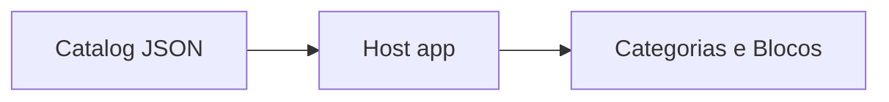

Esta página reúne **exemplos práticos** para evoluir o catálogo de **`/catalog/dev`** com segurança: criação de novos blocos, fallback para links externos, variações por ambiente, versionamento, feature flags simples e validação.

> Fonte: `catalog/catalog.dev.json`.  
> Regras lembradas: **RBAC ANY-of**, **ordem do arquivo preservada** por padrão, campos **extras são ignorados** no BFF.

---

## 1) Novo bloco de automação (iframe interno)

Use `ui.type = "iframe"` e caminho relativo para o BFF.

```json
{
  "categoryId": "compras",
  "ui": { "type": "iframe", "url": "/api/automations/dfd/ui" },
  "description": "DFD — Documento de Formalização da Demanda",
  "requiredRoles": ["editor", "admin"]
}
````

**Checklist**

* `categoryId` existe em `categories`.
* Endpoint responde:

  ```bash
  curl -I http://localhost:8000/api/automations/dfd/ui
  ```
* Se o alvo bloquear `frame-ancestors`, troque para **link externo** (ver seção 2).

---

## 2) Fallback para link externo

Quando o serviço não permite `iframe`, mude para `link`.

```json
{
  "categoryId": "orcamento",
  "ui": { "type": "link", "href": "https://transparencia.exemplo.gov.br" },
  "description": "Portal de transparência"
}
```

No Host, este bloco abre em **nova aba**.

---

## 3) Agrupar blocos por fluxo

Exemplo de categoria **Compras** com três blocos. A UI preserva a **ordem do arquivo**.

```json
{
  "categories": [
    { "id": "compras", "label": "Compras" }
  ],
  "blocks": [
    { "categoryId": "compras", "ui": { "type": "iframe", "url": "/api/automations/dfd/ui" }, "description": "DFD" },
    { "categoryId": "compras", "ui": { "type": "iframe", "url": "/api/automations/pca/ui" }, "description": "PCA" },
    { "categoryId": "compras", "ui": { "type": "iframe", "url": "/api/automations/tr/ui"  }, "description": "TR"  }
  ]
}
```



---

## 4) Variações por ambiente com overlay JSON

Mantenha um **arquivo base** e aplique **overlays** por ambiente (dev, staging, prod) com `jq`.
Estrutura sugerida:

```
catalog/
  catalog.base.json
  overlays/
    dev.json
    staging.json
    prod.json
```

**Exemplo de overlay** (staging ajustando um link e ocultando um bloco):

```json
{
  "overrides": {
    "blocks": [
      {
        "match": { "ui": { "type": "link", "href": "https://transparencia.exemplo.gov.br" } },
        "set":   { "ui": { "type": "link", "href": "https://staging.transparencia.exemplo.gov.br" } }
      },
      {
        "match": { "ui": { "type": "iframe", "url": "/api/automations/tr/ui" } },
        "set":   { "hidden": true }
      }
    ]
  }
}
```

**Script simples (Node) para aplicar overlay**:

```ts
// tools/mergeCatalog.ts
import fs from "fs";

type Block = any;

function applyBlocks(base: Block[], rules: any[]): Block[] {
  return base.map(b => {
    for (const r of rules) {
      const m = JSON.stringify(b);
      const target = JSON.stringify(r.match);
      if (m.includes(target)) {
        b = { ...b, ...r.set };
      }
    }
    return b;
  });
}

const base = JSON.parse(fs.readFileSync("catalog/catalog.base.json", "utf-8"));
const ov   = JSON.parse(fs.readFileSync(process.argv[2], "utf-8")); // overlays/dev.json

const out = { ...base, blocks: applyBlocks(base.blocks, ov.overrides?.blocks ?? []) };
fs.writeFileSync("catalog/catalog.dev.json", JSON.stringify(out, null, 2));
console.log("catalog.dev.json gerado");
```

Uso:

```bash
node tools/mergeCatalog.js catalog/overlays/dev.json
```

> Em pipelines, rode esse merge antes de publicar o catálogo.

---

## 5) Feature flags simples com `hidden`

Para liberar gradualmente:

```json
{
  "categoryId": "compras",
  "ui": { "type": "iframe", "url": "/api/automations/novidade/ui" },
  "hidden": true
}
```

Quando estiver pronto, mude para `false` ou remova a chave.

---

## 6) RBAC progressivo

Comece público e endureça aos poucos:

```json
{
  "categoryId": "compras",
  "ui": { "type": "iframe", "url": "/api/automations/dfd/ui" }
}
```

Depois de validar, restrinja:

```json
{
  "categoryId": "compras",
  "ui": { "type": "iframe", "url": "/api/automations/dfd/ui" },
  "requiredRoles": ["editor", "admin"]
}
```

---

## 7) Campos auxiliares de navegação

Use `navigation` para links úteis (docs, tutoriais) e `routes` para **deep links** internos:

```json
{
  "categoryId": "contratos",
  "ui": { "type": "iframe", "url": "/api/automations/contrato/ui" },
  "navigation": ["/docs/automacoes/contrato", "/guia/contratos"],
  "routes": ["/contratos/novo", "/contratos/lista"]
}
```

A UI pode transformar isso em **atalhos** no card ou na página.

---

## 8) Versionamento do catálogo

* **Commits pequenos** e descritivos (um bloco por PR quando possível).
* **Validação local**:

  ```bash
  jq -e . catalog/catalog.dev.json > /dev/null
  ```
* **Diffs legíveis**: mantenha **ordem do arquivo** estável para o histórico não “pular”.

---

## 9) Validação e lint

Valide o shape com um **schema JSON** (ver página de Esquema de bloco). Exemplo de check local:

```bash
# usando ajv-cli (npm i -g ajv-cli)
ajv validate -s tools/catalog.schema.json -d catalog/catalog.dev.json
```

---

## 10) Diagnóstico rápido

```bash
# BFF servindo o catálogo
curl -s http://localhost:8000/catalog/dev | jq .

# Proxy do Host
curl -s http://localhost:5173/catalog/dev | jq .

# Teste um iframe
curl -I http://localhost:8000/api/automations/dfd/ui
```

**Problemas típicos**

* Bloco não aparece → `hidden: true` ou `requiredRoles` sem correspondência.
* Iframe em branco → alvo bloqueia embedding; use `link`.
* Ordem estranha → algum sort aplicado; regra padrão é **não ordenar**.

---

## 11) Template para novo bloco (copie e cole)

```json
{
  "categoryId": "coloque_aqui",
  "ui": { "type": "iframe", "url": "/api/automations/slug/ui" },
  "description": "",
  "navigation": [],
  "routes": [],
  "requiredRoles": [],
  "hidden": false
}
```

---

## 12) Fluxo sugerido de PR

1. Crie/edite o bloco no `catalog.dev.json`.
2. Valide com `jq` e, se disponível, com o schema.
3. Teste no Host e verifique RBAC/ordem/iframe.
4. Abra PR com **título claro** e **screenshot** da UI.
5. Após merge, gere o catálogo do ambiente alvo com overlay (se houver).

---

## Próximos passos

* **[Estrutura JSON (categories, blocks)](./estrutura-json-categories-blocks)**
* **[Esquema de bloco (categoryId, ui, navigation, routes, ...)](./esquema-de-bloco-categoryid-ui-navigation-routes)**
* **[Convenções (icon, order, hidden)](./convenções-icon-order-hidden)**

---

> _Criado em 2025-11-18_