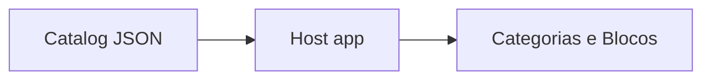

Esta página reúne **exemplos práticos** para evoluir o catálogo de **`/catalog/dev`** com segurança: criação de novos blocos, fallback para links externos, variações por ambiente, versionamento, feature flags simples e validação.

> Fonte: `catalog/catalog.dev.json`.  
> Regras lembradas: **RBAC ANY-of**, **ordem do arquivo preservada** por padrão, campos **extras são ignorados** no BFF.

---

## 1) Novo bloco de automação (iframe interno)

Use `ui.type = "iframe"` e caminho relativo para o BFF.

```json
{
  "categoryId": "compras",
  "ui": { "type": "iframe", "url": "/api/automations/dfd/ui" },
  "description": "DFD — Documento de Formalização da Demanda",
  "requiredRoles": ["editor", "admin"]
}
```

**Checklist**

- `categoryId` existe em `categories`.
- Endpoint responde:

  ```bash
  curl -I http://localhost:8000/api/automations/dfd/ui
  ```

- Se o alvo bloquear `frame-ancestors`, troque para **link externo** (ver seção 2).

---

## 2) Fallback para link externo

Quando o serviço não permite `iframe`, mude para `link`.

```json
{
  "categoryId": "governanca",
  "ui": { "type": "link", "href": "https://transparencia.exemplo.gov.br" },
  "description": "Portal de transparência"
}
```

No Host, este bloco abre em **nova aba**.

---

## 3) Agrupar blocos por fluxo

Exemplo de categoria **Compras** com três blocos. A UI preserva a **ordem do arquivo**.

```json
{
  "categories": [
    { "id": "compras", "label": "Compras" }
  ],
  "blocks": [
    { "categoryId": "compras", "ui": { "type": "iframe", "url": "/api/automations/dfd/ui" }, "description": "DFD" },
    { "categoryId": "compras", "ui": { "type": "iframe", "url": "/api/automations/etp/ui" }, "description": "ETP" },
    { "categoryId": "compras", "ui": { "type": "iframe", "url": "/api/demo?view=pca" }, "description": "PCA (demo)" }
  ]
}
```


```mermaid
flowchart LR
  Cat[Catalog JSON] --> Host[Host app]
  Host --> UI[Categorias e Blocos]
```

---

## 4) Variações por ambiente com overlay JSON

Mantenha um **arquivo base** e aplique **overlays** por ambiente (dev, staging, prod) com `jq`.

> Observação importante: o repositório atual **não versiona** `catalog.base.json`,
> `catalog.hml.json` ou `catalog.prod.json`. O exemplo abaixo é um **padrão
> recomendado**, não uma descrição do que já existe no snapshot.

Estrutura sugerida:

```text
catalog/
  catalog.base.json
  overlays/
    dev.json
    staging.json
    prod.json
```

**Exemplo de overlay** (staging ajustando um link e ocultando um bloco):

```json
{
  "overrides": {
    "blocks": [
      {
        "match": { "ui": { "type": "link", "href": "https://transparencia.exemplo.gov.br" } },
        "set":   { "ui": { "type": "link", "href": "https://staging.transparencia.exemplo.gov.br" } }
      },
      {
        "match": { "ui": { "type": "iframe", "url": "/api/demo?view=pca" } },
        "set":   { "hidden": true }
      }
    ]
  }
}
```

---

## 5) Validação do catálogo

O snapshot atual **não inclui** um arquivo versionado como `tools/catalog.schema.json`.

Ainda assim, há duas estratégias úteis:

### 5.1) Validação leve com `jq`

```bash
jq . catalog/catalog.dev.json >/dev/null
```

### 5.2) Validação formal com schema ad hoc

Se o time decidir versionar um schema, a página
`15-apêndices/02-esquema-formal-do-catálogo-json-schema`
já traz um modelo de referência.

Exemplo de comando, assumindo que você salvou esse schema localmente como
`catalog.schema.json`:

```bash
ajv validate -s catalog.schema.json -d catalog/catalog.dev.json
```

---

## 6) Checklist de mudança segura

1. editar `catalog/catalog.dev.json`;
2. validar o JSON com `jq`;
3. conferir `categoryId`, `requiredRoles`, `navigation[]` e `routes[]`;
4. abrir o Host e validar a navegação;
5. testar a URL de `ui` diretamente no BFF quando o bloco for iframe.
