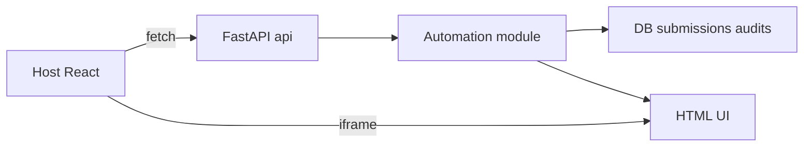

Esta página apresenta a **organização do BFF (FastAPI)**, como os módulos se conectam (**auth**, **automations**, **db**, **utils**) e os pontos de entrada expostos em `/api` e `/api/automations/*`.

> Referências principais no repositório:  
> `apps/bff/app/main.py`, `apps/bff/app/db.py`, `apps/bff/app/auth/*`,  
> `apps/bff/app/automations/*.py`, `apps/bff/app/automations/templates/*`, `apps/bff/app/utils/*`

---

## 1) Árvore de diretórios (essencial)

```text
apps/bff/
├─ Dockerfile.dev
├─ requirements.txt
├─ run_dev.sh
└─ app/
   ├─ main.py                # App FastAPI, montagem de routers, middlewares, init_db
   ├─ db.py                  # init_db e acesso a banco (submissions, audits)
   ├─ utils/
   │  └─ docx_tools.py       # utilidades de manipulação DOCX/PDF
   ├─ auth/
   │  ├─ routes.py           # POST /api/auth/login, POST /api/auth/logout, etc.
   │  ├─ sessions.py         # criação/consulta de sessão (cookies)
   │  ├─ middleware.py       # injeta usuário em request, valida sessão
   │  └─ rbac.py             # helpers de roles
   ├─ automations/
   │  ├─ form2json.py        # exemplo de automação
   │  ├─ dfd.py              # DFD (ui, history, submit)
   │  ├─ ferias.py           # Férias (ui, submit, download)
   │  ├─ controle.py         # ...
   │  ├─ controle_ferias.py  # ...
   │  ├─ fileshare.py        # ...
   │  ├─ support.py          # ...
   │  ├─ accounts.py         # ...
   │  ├─ whoisonline.py      # ...
   │  └─ templates/
   │     ├─ dfd/ui.html
   │     ├─ dfd/history.html
   │     ├─ ferias/ui.html
   │     ├─ controle/ui.html
   │     ├─ controle_ferias/ui.html
   │     ├─ fileshare/ui.html
   │     ├─ support/ui.html
   │     ├─ accounts/ui.html
   │     └─ whoisonline/ui.html
   └─ games/
      └─ snake.py            # rotas lúdicas/exemplo
````

**Ideia geral**

* `main.py` cria a app FastAPI, registra **middlewares**, **CORS**, **routers** e chama `init_db()`.
* `auth/*` contém **sessões mock** e **RBAC** simples consumidos pelo Host.
* `automations/*` implementa **módulos isolados** com o **padrão de endpoints**.
* `db.py` provê inicialização de tabelas **submissions** e **audits** e utilitários de persistência.
* `templates/*` hospedam UIs simples (HTML+JS+CSS **sem build**) embutidas via `/ui`.

---

## 2) Padrão de endpoints por automação

Cada automação segue um **contrato mínimo** (variações podem existir):

```
GET  /api/automations/{slug}/schema         # opcional, JSON para validações no front
GET  /api/automations/{slug}/ui             # UI HTML embutível (iframe)
POST /api/automations/{slug}/submit         # cria submission, dispara BackgroundTasks
GET  /api/automations/{slug}/submissions    # lista submissions
GET  /api/automations/{slug}/submissions/{id}
POST /api/automations/{slug}/submissions/{id}/download
```

**Princípios**

* **Entrada validada** com Pydantic v2; modelos usam `ConfigDict(populate_by_name=True, extra="ignore")`.
* **Normalização** de campos para evitar 422 triviais (strings vazias, datas, etc.).
* **Persistência** em `submissions` (`payload`, `status`, `result`, `error`) e **auditoria** em `audits`.
* **Erros claros**: `400/401/403/404/409/422` com mensagens úteis.

---

## 3) Roteamento e montagem (main.py)

```python
# apps/bff/app/main.py (esqueleto ilustrativo)
from fastapi import FastAPI
from fastapi.middleware.cors import CORSMiddleware
from .db import init_db
from .auth.routes import router as auth_router
from .automations.form2json import router as form2json_router
# ... importe demais routers de automations

app = FastAPI(title="Portal AGEPAR BFF")

# CORS: alinhar com o Host (5173) e nome do container (host:5173) quando em Compose
app.add_middleware(
    CORSMiddleware,
    allow_origins=["http://localhost:5173", "http://host:5173"],
    allow_credentials=True,
    allow_methods=["*"],
    allow_headers=["*"],
)

# Middlewares de sessão/usuário (se existirem)
# from .auth.middleware import SessionMiddlewareX
# app.add_middleware(SessionMiddlewareX, ...)

# Routers de domínio
app.include_router(auth_router, prefix="/api/auth", tags=["auth"])
app.include_router(form2json_router, prefix="/api/automations", tags=["automations"])
# app.include_router(dfd_router, prefix="/api/automations", tags=["automations"])
# ...

# Rotas gerais
@app.get("/api")
def root():
    return {"ok": True}

@app.get("/api/docs")
def docs_link():
    # atalho: redirecionar p/ OpenAPI UI se necessário
    return {"openapi": "/openapi.json"}

# Inicialização do banco ao subir a app
@app.on_event("startup")
def _startup():
    init_db()
```

---

## 4) Sessões mock e RBAC

**Endpoints típicos**

* `POST /api/auth/login` → cria cookie de sessão.
* `POST /api/auth/logout` → invalida.
* `GET /api/me` → retorna usuário atual e `roles`.

**Módulos**

* `auth/routes.py` expõe rotas.
* `auth/sessions.py` centraliza criação/validação de sessão (cookies).
* `auth/middleware.py` injeta `request.user` quando a sessão está válida.
* `auth/rbac.py` oferece helpers de **ANY-of** para verificar `roles`.

> No Host, o `AuthProvider` consulta `/api/me`; com isso, páginas e blocos aplicam **RBAC** (ANY-of).

---

## 5) Banco de dados e auditoria (db.py)

* **init_db()**: cria tabelas **submissions** e **audits** no **startup**.
* **Persistência** mínima para armazenar o **payload** recebido, **status** da execução e **resultado** (ou **erro**).
* **Auditoria** registra eventos relevantes (criação, processamento, download).

> Implementação padrão é simples (ex.: SQLite local). Se houver `DATABASE_URL`, adapte para Postgres; mantenha a **mesma estrutura lógica** de colunas para portabilidade.

---

## 6) Pydantic v2 e validação

Modelo típico de entrada:

```python
from pydantic import BaseModel, ConfigDict, Field

class SubmitPayload(BaseModel):
    model_config = ConfigDict(populate_by_name=True, extra="ignore")
    name: str = Field(min_length=1)
    email: str | None = None
    # campos adicionais...

    # normalização leve (ex.: trim, lower)
    def normalized(self):
        self.name = self.name.strip()
        if self.email:
            self.email = self.email.strip()
        return self
```

**Boas práticas**

* Chame `.normalized()` no handler antes de processar para evitar **422** desnecessárias.
* Trate `ValueError` e `ValidationError` e retorne mensagens **amigáveis** ao usuário (evite stacktraces).

---

## 7) Tratamento de erros e logs

* **Mapeamento de erros**

  * `400 Bad Request` → payload inválido fora de validação de esquema.
  * `401 Unauthorized` → sessão ausente/expirada.
  * `403 Forbidden` → RBAC falhou (roles insuficientes).
  * `404 Not Found` → recurso não encontrado (submission inexistente).
  * `409 Conflict` → submissão duplicada ou estado incompatível.
  * `422 Unprocessable Entity` → falha de validação Pydantic.

* **Logs**

  * **INFO** no caminho feliz (submissão criada, tarefa iniciada, download gerado).
  * **ERROR** com contexto (`submission_id`, `user_id`, payload resumido).

---

## 8) Padrão de UI HTML (sem build)

As rotas `GET /ui` servem **HTML/JS/CSS simples** direto do BFF (páginas em `automations/templates/*/ui.html`).
**Vantagens**

* Independência do pipeline do Host.
* Embutível via `iframe` no Host.
* Deploy de automations como **módulos isolados**.

---

## 9) Fluxo alto nível



---

## 10) cURLs úteis (sanidade)

```bash
# API "viva"
curl -i http://localhost:8000/api

# OpenAPI (ver se está subindo)
curl -i http://localhost:8000/api/docs

# Sessão atual
curl -i http://localhost:8000/api/me

# Uma automação (UI)
curl -i http://localhost:8000/api/automations/form2json/ui

# Submissão (ajuste payload conforme automação)
curl -s -X POST http://localhost:8000/api/automations/form2json/submit \
  -H "Content-Type: application/json" \
  -d '{"name":"Alice","email":"alice@example.com"}' | jq .
```

---

## 11) Problemas comuns

* **CORS/Sessão falhando** → alinhar `allow_origins` com `http://localhost:5173` e `http://host:5173`; `allow_credentials=True`.
* **422 inesperado** → garantir `extra="ignore"` e normalização antes da validação rígida.
* **Downloads quebrados** → validar MIME e headers no endpoint `/download`.
* **UI não carrega no iframe** → conferir caminho de template e **Content-Type**; ver console do navegador.

---

## 12) Próximos passos

* **Sessões mock: POST /api/auth/login, GET /api/me**
* **Rotas /api/automations** por módulo (DFD, Férias, etc.)
* **Pydantic v2: padrões de modelos e validação**
* **Mapeamento de erros com respostas padronizadas**

---

> _Criado em 2025-11-18_