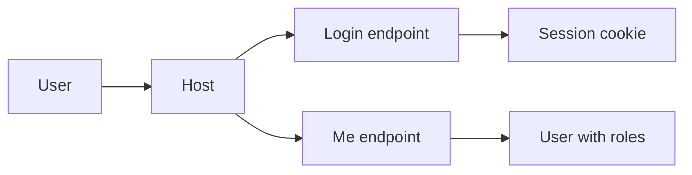

Esta página documenta as **sessões mock** do BFF (FastAPI): o **login** que emite **cookie de sessão** e o endpoint **`/api/me`** que retorna o usuário autenticado (incluindo **`roles`** para RBAC no Host).

> Referências no repo:  
> `apps/bff/app/auth/routes.py`, `apps/bff/app/auth/sessions.py`, `apps/bff/app/auth/middleware.py`, `apps/bff/app/main.py`  
> No Host: `apps/host/src/lib/api.ts`, `apps/host/src/auth/AuthProvider.tsx`, `apps/host/src/pages/Login.tsx`

---

## 1) Endpoints

- **POST `/api/auth/login`**  
  Corpo (JSON) típico:
  ```json
  { "username": "alice", "password": "secret" }
````

Efeitos:

* Cria **cookie** de sessão (HttpOnly).

* Resposta `200` com o usuário atual (ex.: `{ "id": "...", "name": "Alice", "roles": ["editor"] }`).

* **POST `/api/auth/logout`**
  Invalida a sessão (apaga o cookie). Resposta `204` ou `200`.

* **GET `/api/me`**
  Retorna o **usuário corrente** (inclui `roles`).

  * Com sessão válida → `200 { id, name, roles }`
  * Sem sessão → `401` ou `200 null` (varia pela implementação)



---

## 2) Implementação FastAPI (ilustrativa)

### 2.1) `auth/routes.py`

```python
from fastapi import APIRouter, Response, Depends, HTTPException
from pydantic import BaseModel, ConfigDict, Field
from .sessions import create_session, get_user_from_session, clear_session

router = APIRouter()

class LoginBody(BaseModel):
    model_config = ConfigDict(populate_by_name=True, extra="ignore")
    username: str = Field(min_length=1)
    password: str = Field(min_length=1)

@router.post("/login")
def login(body: LoginBody, resp: Response):
    # MOCK: qualquer user válido recebe um perfil padrão
    user = {
        "id": body.username.strip().lower(),
        "name": body.username.strip().title(),
        "roles": ["viewer"] if body.username != "admin" else ["admin", "editor"],
    }
    session_id = create_session(user)
    # Cookie HttpOnly (ajuste secure/samesite conforme ambiente)
    resp.set_cookie(
        key="session",
        value=session_id,
        httponly=True,
        samesite="lax",
        secure=False,   # True atrás de HTTPS
        path="/",
    )
    return user

@router.post("/logout")
def logout(resp: Response, user=Depends(get_user_from_session)):
    clear_session(user)
    resp.delete_cookie("session", path="/")
    return {"ok": True}

@router.get("/me")
def me(user=Depends(get_user_from_session)):
    # Pode retornar 200 null ou 401. Aqui optamos por 200 null.
    return user
```

### 2.2) `auth/sessions.py` (mock simples em memória)

```python
from typing import Dict, Any, Optional
from fastapi import Cookie, HTTPException, Depends
import secrets

_SESSIONS: Dict[str, Dict[str, Any]] = {}

def create_session(user: Dict[str, Any]) -> str:
    sid = secrets.token_urlsafe(24)
    _SESSIONS[sid] = user
    return sid

def clear_session(user: Optional[Dict[str, Any]]):
    # na prática, deletar por sid; aqui fica como no-op ilustrativo
    pass

def get_user_from_session(session: Optional[str] = Cookie(default=None)) -> Optional[Dict[str, Any]]:
    if not session:
        return None
    return _SESSIONS.get(session)
```

### 2.3) `auth/middleware.py` (opcional)

```python
# Middleware opcional se quiser injetar request.state.user
# ou exigir sessão em rotas específicas via dependências.
```

### 2.4) `main.py` (trechos relevantes)

```python
from fastapi import FastAPI
from fastapi.middleware.cors import CORSMiddleware
from .auth.routes import router as auth_router

app = FastAPI(title="Portal AGEPAR BFF")

app.add_middleware(
    CORSMiddleware,
    allow_origins=["http://localhost:5173", "http://host:5173"],
    allow_credentials=True,
    allow_methods=["*"],
    allow_headers=["*"],
)

app.include_router(auth_router, prefix="/api/auth", tags=["auth"])

@app.get("/api/me")
def me_passthrough():
    # se preferir consolidar /api/me aqui usando get_user_from_session
    from .auth.sessions import get_user_from_session
    return get_user_from_session()
```

> **Observação**: em produção, substitua o **mock** por um provedor real (SSO, JWT, OIDC). Ajuste `secure=True` no cookie atrás de HTTPS e revise `SameSite` conforme o domínio.

---

## 3) Integração no Host

### 3.1) Fetch utilitário (`lib/api.ts`)

```ts
// todas as requisições com credentials p/ enviar cookies
export async function api<T = unknown>(path: string, init?: RequestInit): Promise<T> {
  const res = await fetch(path, { credentials: "include", ...init });
  if (!res.ok) throw new Error(`${res.status} ${res.statusText}`);
  return (await res.json()) as T;
}
```

### 3.2) AuthProvider (consulta `/api/me`)

```ts
// apps/host/src/auth/AuthProvider.tsx (resumo)
useEffect(() => {
  api<User>("/api/me")
    .then(setUser)
    .catch(() => setUser(null))
    .finally(() => setLoading(false));
}, []);
```

### 3.3) Página de Login

```ts
// apps/host/src/pages/Login.tsx (resumo)
await api<User>("/api/auth/login", {
  method: "POST",
  headers: { "Content-Type": "application/json" },
  body: JSON.stringify({ username, password }),
});
```

---

## 4) cURLs úteis

```bash
# Login (mock)
curl -i -c cookies.txt -X POST http://localhost:8000/api/auth/login \
  -H "Content-Type: application/json" \
  -d '{"username":"alice","password":"secret"}'

# Conferir sessão atual
curl -i -b cookies.txt http://localhost:8000/api/me

# Logout
curl -i -b cookies.txt -X POST http://localhost:8000/api/auth/logout
```

> Via Host (proxy Vite): troque `8000` por `5173` e mantenha `-c/-b` para cookies.

---

## 5) Erros e respostas esperadas

* **Credenciais ausentes/ruins** → `400 Bad Request` ou `401 Unauthorized` (dependendo da política do mock).
* **Sem sessão em `/api/me`** → `200 null` (mock permissivo) **ou** `401` (mock estrito).
* **CORS/Sessão não persiste** → veja a seção de troubleshooting.

---

## 6) Troubleshooting

* **Cookie não chega ao navegador**
  Verifique:

  * `allow_credentials=True` no CORS do BFF.
  * No fetch, use `credentials: "include"`.
  * `SameSite`: para ambientes multi-domínio, pode exigir `None; Secure` (HTTPS).
  * Caminho do cookie (`path="/"`) e domínio coerentes.

* **`/api/me` sempre null**

  * O cookie não foi salvo (ver DevTools → Application → Cookies).
  * O backend não achou a sessão (limpeza do dicionário, reinício do server em dev, etc.).

* **Host via Docker**

  * Adicione **ambas** origens ao CORS: `http://localhost:5173` **e** `http://host:5173`.

---

## 7) Boas práticas (mesmo no mock)

* **Não** retorne a senha; guarde apenas hash em versões reais.
* **Logue** somente metadados (user id, ip, user-agent); evite payload sensível.
* **Rate limit** em `/login` (mesmo simples) para evitar brute force.
* Separe **mock** de **produção** por `ENV`/feature flag.

---

## 8) Próximos passos

* **RBAC no Host** com `roles` de `/api/me`.
* **Proteção de rotas** nas automations (401/403).
* Evoluir do mock para **OIDC/JWT** conforme necessidade.

---

> _Criado em 2025-11-18_
