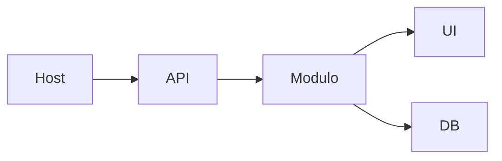

Esta página mostra **onde e como** criar um módulo de automação no BFF.  
Cada automação vive em **`apps/bff/app/automations/{slug}.py`** e expõe um **APIRouter** com o **contrato padrão** de endpoints (schema/ui/submit/submissions/download). A UI é um **HTML simples** servido pelo próprio BFF e **embutido** no Host via `<iframe>`.

> Referências no repositório:  
> `apps/bff/app/automations/*.py`, `apps/bff/app/automations/templates/*/ui.html`, `apps/bff/app/db.py`, `apps/bff/app/main.py`

---

## 1) Estrutura de arquivos (mínima)

```text
apps/bff/app/automations/
├─ {slug}.py
└─ templates/
   └─ {slug}/
      └─ ui.html
````

**Regras**

* O arquivo **`{slug}.py`** registra um `router = APIRouter()`.
* O HTML em **`templates/{slug}/ui.html`** é **sem build** (HTML/JS/CSS puros).

---

## 2) Contrato de endpoints do módulo

| Método | Caminho                                             | Finalidade                                       |
| -----: | --------------------------------------------------- | ------------------------------------------------ |
|    GET | `/api/automations/{slug}/schema`                    | (Opcional) esquema/metadata para o front         |
|    GET | `/api/automations/{slug}/ui`                        | UI HTML para `<iframe>` no Host                  |
|   POST | `/api/automations/{slug}/submit`                    | Cria **submission** e aciona **BackgroundTasks** |
|    GET | `/api/automations/{slug}/submissions`               | Lista submissões                                 |
|    GET | `/api/automations/{slug}/submissions/{id}`          | Detalhe da submissão                             |
|   POST | `/api/automations/{slug}/submissions/{id}/download` | Gera/retorna artefato (ex.: PDF/DOCX/ZIP)        |



---

## 3) Esqueleto de um módulo `{slug}.py`

> Inclui Pydantic v2 com `ConfigDict(populate_by_name=True, extra="ignore")`, normalização leve e mapeamento de erros (400/422).

```python
# apps/bff/app/automations/example.py
from fastapi import APIRouter, HTTPException, BackgroundTasks, Request
from pydantic import BaseModel, Field, ConfigDict, field_validator
from fastapi.responses import HTMLResponse
from pathlib import Path

router = APIRouter()
SLUG = "example"
TEMPLATES = Path(__file__).parent / "templates" / SLUG

# --- Schema de entrada ---
class SubmitBody(BaseModel):
    model_config = ConfigDict(populate_by_name=True, extra="ignore")
    full_name: str = Field(alias="fullName", min_length=1)
    email: str | None = None

    @field_validator("full_name")
    @classmethod
    def _norm_name(cls, v: str) -> str:
        v = v.strip()
        if not v:
            raise ValueError("nome vazio")
        return " ".join(p.capitalize() for p in v.split())

# --- Rotas do contrato ---
@router.get(f"/{SLUG}/schema")
def schema():
    return {"fields": {"fullName": "string", "email": "string?"}}

@router.get(f"/{SLUG}/ui", response_class=HTMLResponse)
def ui():
    html = (TEMPLATES / "ui.html").read_text(encoding="utf-8")
    return HTMLResponse(html)

@router.post(f"/{SLUG}/submit")
def submit(body: SubmitBody, tasks: BackgroundTasks, request: Request):
    # TODO: persistir submission (db.py) e acionar tarefa
    # Exemplo simplificado:
    submission_id = "s_" + SLUG
    tasks.add_task(lambda: None)  # substitua por processamento real
    return {"id": submission_id, "status": "queued"}

@router.get(f"/{SLUG}/submissions")
def list_submissions():
    # TODO: ler do banco
    return {"items": []}

@router.get(f"/{SLUG}/submissions/{{id}}")
def get_submission(id: str):
    # TODO: ler do banco
    if id != "s_example":
        raise HTTPException(status_code=404, detail={"error": "submission not found", "code": 404})
    return {"id": id, "status": "done", "result": {}}

@router.post(f"/{SLUG}/submissions/{{id}}/download")
def download(id: str):
    # TODO: gerar/servir arquivo (FileResponse) ou link assinado
    return {"ok": True, "file": f"/downloads/{id}.zip"}
```

**Dicas**

* Para servir arquivos reais, use `FileResponse` (defina `media_type` correto).
* Em processamento pesado, mova para fila/worker; aqui usamos `BackgroundTasks` apenas como exemplo.

---

## 4) Template da UI (`templates/{slug}/ui.html`)

HTML simples, sem frameworks. Evite dependências externas quando possível.

```html
<!doctype html>
<html>
  <head>
    <meta charset="utf-8" />
    <title>Example UI</title>
    <meta name="viewport" content="width=device-width, initial-scale=1" />
    <style>
      body { font-family: system-ui, sans-serif; margin: 0; padding: 16px; }
      form, .card { border: 1px solid #e5e7eb; border-radius: 12px; padding: 12px; }
      label { display:block; margin-top:8px; }
      button { margin-top:12px; padding: 8px 12px; border-radius: 8px; }
      .ok { background:#ecfdf5; }
    </style>
  </head>
  <body>
    <h1>Example</h1>
    <form id="f">
      <label>Nome completo
        <input name="fullName" required />
      </label>
      <label>E-mail
        <input name="email" type="email" />
      </label>
      <button type="submit">Enviar</button>
    </form>
    <pre id="out" class="card ok" hidden></pre>
    <script>
      const f = document.getElementById("f");
      const out = document.getElementById("out");
      f.addEventListener("submit", async (e) => {
        e.preventDefault();
        const payload = Object.fromEntries(new FormData(f));
        const res = await fetch(`/api/automations/example/submit`, {
          method: "POST",
          headers: { "Content-Type": "application/json" },
          credentials: "include",
          body: JSON.stringify(payload),
        });
        const data = await res.json();
        out.hidden = false;
        out.textContent = JSON.stringify(data, null, 2);
      });
    </script>
  </body>
</html>
```

---

## 5) Registro do módulo no app

No `main.py`, **importe** e **registre** o router com o prefixo comum:

```python
# apps/bff/app/main.py (trecho)
from .automations.example import router as example_router

app.include_router(example_router, prefix="/api/automations", tags=["automations"])
```

---

## 6) Persistência e auditoria (integração com `db.py`)

> O projeto define tabelas de **submissions** e **audits**.
> No `submit`, salve `{payload, status, result, error}`; nas mudanças de estado, **audite** o evento.

Pseudocódigo:

```python
from .db import create_submission, set_submission_status, add_audit

sid = create_submission(kind=SLUG, payload=body.model_dump(by_alias=True))
set_submission_status(sid, "queued")
add_audit(kind=SLUG, submission_id=sid, event="queued", meta={"by": "user"})
```

---

## 7) cURLs de sanidade do módulo

```bash
# UI (HTML) — para o Host embutir
curl -i http://localhost:8000/api/automations/example/ui

# Schema (opcional)
curl -s http://localhost:8000/api/automations/example/schema | jq .

# Submit
curl -s -X POST http://localhost:8000/api/automations/example/submit \
  -H "Content-Type: application/json" \
  -d '{"fullName":"Alice","email":"a@example.com"}' | jq .

# Lista
curl -s http://localhost:8000/api/automations/example/submissions | jq .

# Detalhe
curl -s http://localhost:8000/api/automations/example/submissions/s_example | jq .

# Download
curl -s -X POST http://localhost:8000/api/automations/example/submissions/s_example/download | jq .
```

> Via Host (proxy Vite): troque `8000` por `5173`.

---

## 8) Boas práticas do módulo

* **Validar/normalizar** entrada com Pydantic v2 (`extra="ignore"`, aliases).
* **Mapear erros** com envelope `{error, code, details}` (422/400/401/403/404/409).
* **Logar** eventos chave (INFO/ERROR) com contexto (`submission_id`, `req_id`).
* **UI simples** e resiliente (sem dependências pesadas).
* **Isolamento**: cada automação deve ser **independente** (router + UI + regras).

---

## 9) Checklist ao criar uma nova automação

* [ ] Criou `apps/bff/app/automations/{slug}.py`.
* [ ] Adicionou `templates/{slug}/ui.html`.
* [ ] Implementou **schema/ui/submit/submissions/download**.
* [ ] Persistiu em **submissions** e auditou eventos.
* [ ] Tratou **Pydantic v2** (aliases, extra ignore, normalização).
* [ ] Registrou no `main.py` com `prefix="/api/automations"`.
* [ ] **Catálogo**: adicionou bloco com `ui.url: "/api/automations/{slug}/ui"`.
* [ ] Testou cURLs e o **iframe** no Host.

---

## 10) Integração com o Catálogo (/catalog/dev)

Adicione um **bloco** apontando para a UI:

```json
{
  "categoryId": "compras",
  "ui": { "type": "iframe", "url": "/api/automations/example/ui" },
  "description": "Exemplo de automação"
}
```

A navbar do Host exibirá a categoria se houver **ao menos um bloco visível** (RBAC/hidden aplicados).

---

> _Criado em 2025-11-18_