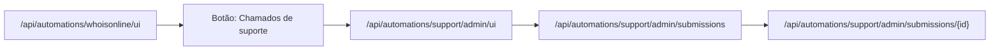

O módulo `apps/bff/app/automations/support.py` concentra hoje **três experiências**
diferentes sob o mesmo `kind="support"`:

- abertura de chamado **padrão**;
- abertura de chamado **técnico**;
- leitura administrativa de chamados em um **painel** próprio.

Isso faz do `support` um caso útil para entender como o portal combina:

- múltiplas UIs HTML no mesmo módulo;
- persistência em `submissions`;
- RBAC por contexto;
- downloads administrativos em JSON e PDF.

> Referências principais no repositório:
>
> - `apps/bff/app/automations/support.py`
> - `apps/bff/app/automations/templates/support/padrao.html`
> - `apps/bff/app/automations/templates/support/ui.html`
> - `apps/bff/app/automations/templates/support/admin.html`
> - `apps/bff/app/automations/templates/whoisonline/ui.html`
> - `catalog/catalog.dev.json`

---

## 1) Três entradas de UI no mesmo módulo

### 1.1. UI padrão

A entrada padrão do catálogo aponta para:

- `GET /api/automations/support/padrao.html`

É a experiência mais simples, pensada para relatos rápidos. O payload enviado por
essa tela já força:

- `ticket_type = "padrao"`
- `module = "support"` (ou suporte geral)
- severidade e reprodutibilidade em valores padrão quando o usuário não preenche contexto técnico.

### 1.2. UI técnica

A UI técnica fica em:

- `GET /api/automations/support/ui`
- `GET /api/automations/support/ui.html`

Ela coleta informações mais estruturadas, como:

- módulo afetado;
- severidade;
- reprodutibilidade;
- passos para reproduzir;
- resultado esperado;
- resultado obtido;
- ambiente.

Essa tela envia `ticket_type = "tecnico"`.

### 1.3. Painel administrativo

A leitura administrativa dos chamados fica em:

- `GET /api/automations/support/admin/ui`

A navegação visível para esse painel nasce hoje no botão **Chamados de suporte**
dentro da UI de `whoisonline`.

---

## 2) Persistência: um único `kind`, dois tipos de chamado

Independentemente da UI usada, o backend persiste tudo como:

- `kind = "support"`

A diferenciação entre chamado padrão e técnico fica no `payload`, via campo:

- `ticket_type = "padrao" | "tecnico"`

### Compatibilidade com histórico

Para registros antigos que ainda não têm `ticket_type`, o backend aplica inferência:

- se `module = "support"` e não houver contexto técnico estruturado, o item é tratado como `padrao`;
- nos demais casos, o item é tratado como `tecnico`.

Isso permite que a UI administrativa trate histórico e novos registros com a mesma
apresentação visual.

---

## 3) Endpoints mais importantes

### 3.1. Envio

- `POST /api/automations/support/submit`

Cria a submission, registra auditoria e conclui o fluxo com `status="done"` após o
registro inicial.

### 3.2. Consulta pelo próprio autor

- `GET /api/automations/support/submissions`
- `GET /api/automations/support/submissions/{id}`

Esses endpoints filtram por ownership (`actor_cpf` / `actor_email`), então servem
para o próprio autor consultar seus relatos.

### 3.3. Painel administrativo

- `GET /api/automations/support/admin/submissions`
- `GET /api/automations/support/admin/submissions/{id}`

O painel administrativo usa esses endpoints para:

- listar os chamados;
- calcular KPIs;
- filtrar por texto, tipo, módulo, severidade e consentimento de contato;
- abrir o detalhe lateral de cada item.

### 3.4. Downloads

- `POST /api/automations/support/submissions/{id}/download`
- `POST /api/automations/support/submissions/{id}/document?fmt=pdf`

Esses downloads continuam restritos a perfis administrativos/auditoria.

---

## 4) RBAC do fluxo

O fluxo atual combina duas camadas de autorização:

### Camada 1 — ponto de entrada visual

O botão que leva ao painel administrativo mora em `whoisonline`, que continua com
`superuserOnly` no catálogo e com dependência de `require_superuser` no BFF.

### Camada 2 — API administrativa do suporte

Os endpoints `support/admin/*` usam RBAC próprio:

- `admin`
- `controle`
- `auditor`

Isso significa que o painel está:

- visualmente ancorado em uma área altamente restrita;
- tecnicamente protegido também por regras próprias do módulo `support`.

---

## 5) O que a UI administrativa mostra

A página `support/admin.html` organiza os chamados com:

- cards de KPI;
- filtros no topo;
- lista de cards por chamado;
- drawer lateral com detalhe completo;
- ações de download JSON/PDF.

Os filtros atuais cobrem:

- busca textual;
- tipo do chamado;
- módulo;
- severidade;
- consentimento para contato.

A lista já distingue visualmente:

- `Padrão`
- `Técnico`

e usa badges para severidade e permissão de contato.

---

## 6) Relação com `whoisonline`

`whoisonline` não lê os chamados diretamente. Ele funciona como **ponto de entrada**
para o painel administrativo de suporte.

Na prática, o fluxo de navegação ficou assim:

Esse arranjo mantém a tela de sessões separada da fila de chamados, mas preserva
o contexto administrativo já existente.

---

## 7) Leitura recomendada em conjunto

- `./10-inventário-de-automações-e-blocos-do-estado-atual`
- `../06-bff-fastapi/03-rotas-gerais-api-e-api-automations-kind`
- `../08-banco-de-dados-persistência/03-campos-payload-status-result-error`
- `../12-testes/03-testes-manuais-rbac-navegação-proxy-de-docs`
