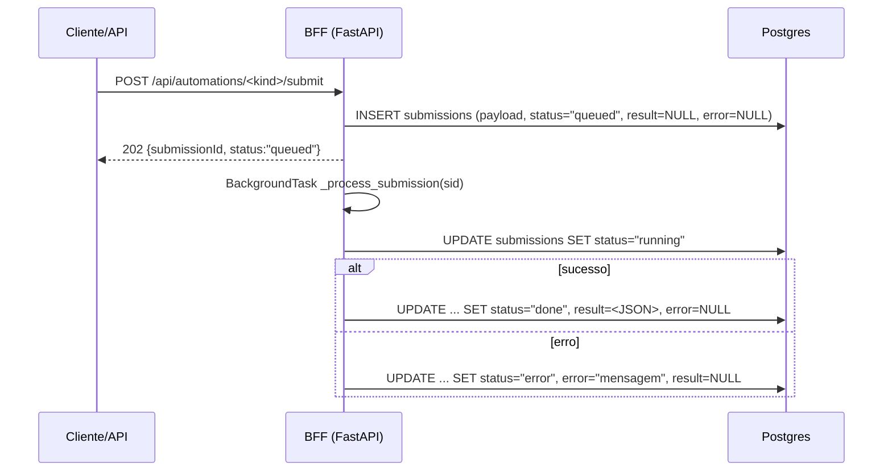
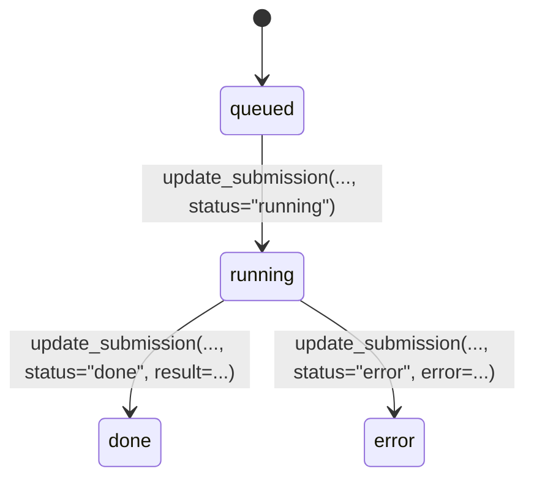

Na tabela `submissions`, quatro campos aparecem em praticamente **todas** as automações:

- `payload`
- `status`
- `result`
- `error`

Eles formam o “coração” do modelo de execução do Portal AGEPAR: **entrada normalizada**, **estado da execução**, **saída final** e **motivo de falha**.

> Referências principais no repositório:  
> `apps/bff/app/db.py`  
> `apps/bff/app/automations/form2json.py`  
> `apps/bff/app/automations/dfd.py`  
> `apps/bff/app/automations/ferias.py`  
> `apps/bff/app/automations/accounts.py`  

---

## 1) Visão geral: como esses campos se encaixam

Dentro de `submissions` (ver página anterior), temos:

```sql title="Esquema simplificado de submissions"
CREATE TABLE submissions (
  id           TEXT PRIMARY KEY,
  kind         TEXT NOT NULL,
  version      TEXT NOT NULL,
  actor_cpf    TEXT,
  actor_nome   TEXT,
  actor_email  TEXT,
  payload      JSONB NOT NULL,
  status       TEXT NOT NULL,
  result       JSONB,
  error        TEXT,
  created_at   TIMESTAMPTZ NOT NULL DEFAULT now(),
  updated_at   TIMESTAMPTZ NOT NULL DEFAULT now()
);
````

Sem entrar em todos os detalhes de índices, o papel de cada um é:

* **`payload`** → tudo o que entrou na automação, já **validado/normalizado** (Pydantic v2).
* **`status`** → em que fase a submissão está: `queued`, `running`, `done`, `error`.
* **`result`** → o que a automação produziu (JSONB), quando conclui com sucesso.
* **`error`** → mensagem human-readable quando algo deu errado.

Fluxo típico:



Esses campos aparecem também em logs, respostas de API e auditoria, então vale ter uma semântica bem clara.

---

## 2) `payload` — entrada normalizada da automação

### 2.1. Origem: Pydantic v2 + `extra="ignore"`

Cada automação define um modelo Pydantic de entrada. Exemplo (DFD):

```python title="Exemplo de modelo de entrada (DFD)" showLineNumbers
class DfdIn(BaseModel):
    """
    Modelo de entrada do DFD, alinhado à UI atual.
    """
    model_config = ConfigDict(populate_by_name=True, extra="ignore")

    modelo_slug: str = Field(..., alias="modeloSlug")
    numero: str
    assunto: str = Field(..., min_length=1, max_length=MAX_ASSUNTO_LEN)
    pca_ano: str = Field(..., alias="pcaAno", pattern=r"^\d{4}$")
    protocolo: str = Field(..., min_length=1, max_length=MAX_PROTOCOLO_LEN)
    # ...
```

Pontos importantes:

* `extra="ignore"` → campos extras enviados pelo front **não** quebram com 422; são simplesmente descartados.
* `populate_by_name=True` → aceita tanto alias (`modeloSlug`) quanto nome Python (`modelo_slug`).
* Os dados chegam como `dict` cru, são limpos/stripados, virarão um `BaseModel` e **só depois** são gravados.

### 2.2. Gravação em `submissions.payload`

O helper `insert_submission` em `app/db.py` normaliza tudo para JSONB:

```python title="Normalização de payload em insert_submission" showLineNumbers
def insert_submission(sub: Dict[str, Any]) -> None:
    # ...
    with _pg() as conn, conn.cursor() as cur:
        cur.execute(
            """
            INSERT INTO submissions
              (id, kind, version, actor_cpf, actor_nome, actor_email, payload, status, result, error)
            VALUES
              (%(id)s, %(kind)s, %(version)s, %(actor_cpf)s, %(actor_nome)s, %(actor_email)s,
               %(payload)s, %(status)s, %(result)s, %(error)s)
            """,
            {
                **sub,
                "payload": _to_json_value(sub.get("payload") or {}),
                "result": _to_json_value(sub.get("result")),
            },
        )
```

E `_to_json_value` garante que:

* `dict`/`list` → `Json(obj)` (JSONB de verdade),
* `str` → tenta `json.loads` e cai para string se não conseguir,
* `None` → `NULL`.

Em vários módulos (`dfd`, `ferias`, `form2json`) o fluxo é:

1. Recebe JSON cru via `request.json()` ou body tipado.
2. Limpa strings (`strip()`), converte datas, valores booleanos.
3. Valida com Pydantic.
4. Converte de volta para um dicionário “bonitinho” **e usa isso como `payload`**.

Exemplo simplificado (DFD):

```python title="Trecho simplificado de submit (DFD)" showLineNumbers
payload = DfdIn(**raw)

sid = str(uuid4())
insert_submission(
    {
        "id": sid,
        "kind": KIND,
        "version": DFD_VERSION,
        "actor_cpf": user.get("cpf"),
        "actor_nome": user.get("nome"),
        "actor_email": user.get("email"),
        "payload": payload.model_dump(mode="json"),
        "status": "queued",
        "result": None,
        "error": None,
    }
)
```

### 2.3. Uso de `payload` em consultas (deduplicação, filtros)

O módulo `db.py` expõe `exists_submission_payload_value`:

```python title="Consulta por campo de payload" showLineNumbers
def exists_submission_payload_value(kind: str, field: str, value: str) -> bool:
    """
    Verifica se existe submissão do `kind` cujo `payload[field] == value`.
    """
    # ...
    cur.execute(
        "SELECT 1 FROM submissions WHERE kind = %s AND payload ->> %s = %s LIMIT 1",
        (kind, field, value),
    )
```

Isso é usado, por exemplo, em `dfd.py` para checar duplicidade de `numero` e `protocolo` antes de aceitar uma nova submissão.

Resumo de invariantes de **payload**:

* Sempre JSONB válido.
* Representa **entrada de negócio** já validada (não é o raw da requisição).
* Pode ser usado em filtros e índices (ex.: `numero`, `protocolo`).

---

## 3) `status` — estado da submissão

### 3.1. Valores permitidos

O schema adiciona uma constraint para o campo:

```sql title="Constraint de status" showLineNumbers
ALTER TABLE submissions
  ADD CONSTRAINT chk_submissions_status
  CHECK (status IN ('queued','running','done','error'));
```

Ou seja, status é sempre um destes:

* `queued` — registro criado, aguardando processamento.
* `running` — processamento em andamento (background task).
* `done` — finalizado com sucesso.
* `error` — finalizado com falha.

### 3.2. Fluxos típicos

**Automations assíncronas** (DFD, Férias, form2json):



**Automations “rápidas”/sincrônicas** (accounts):

Em `accounts.py`, algumas operações apenas registram submissão como “log estruturado”:

```python title="Exemplo (accounts) marcando direto como done" showLineNumbers
insert_submission(
    {
        "kind": "accounts",
        "version": "1.0.0",
        "actor_cpf": actor.get("cpf"),
        "actor_nome": actor.get("name") or actor.get("nome"),
        "actor_email": actor.get("email"),
        "payload": {
            "action": "update_user",
            "user_id": user_id,
            "fields": [f.split("=")[0].strip() for f in fields],
        },
        "status": "done",
        "result": {"updated": True},
        "error": None,
    }
)
```

Aqui, não há fila/background task — mas continuamos usando o mesmo modelo de dados.

### 3.3. Boas práticas para `status`

* **Sempre** passar por `queued → running → done/error` em automações que de fato processam algo “pesado”.
* Em caso de falha em qualquer etapa de IO (banco, DOCX, fileshare):

  * atualizar para `status="error"`,
  * registrar uma mensagem razoável em `error`,
  * adicionar evento em `automation_audits`.
* Em automações “log-only” (como algumas de `accounts`), faz sentido gravar direto como `done`, sem status intermediários.

---

## 4) `result` — saída da automação

### 4.1. Semântica geral

`result` é um `JSONB` que representa a **visão final da automação**:

* Pode ser:

  * o próprio payload normalizado (caso `form2json`),
  * manifestos de arquivos (caso `ferias`, `dfd`),
  * flags/sumários de operação (caso `accounts`),
  * ou qualquer estrutura que faça sentido para logs/relatórios.

Exemplos:

**form2json** (resultado é o próprio JSON normalizado):

```python title="form2json — result = payload normalizado" showLineNumbers
payload = _build_payload(body, actor)
result = payload
update_submission(
    sid,
    status="done",
    result=json.dumps(result, ensure_ascii=False),
    error=None,
)
add_audit(KIND, "completed", actor, {"sid": sid})
```

**DFD** (resultado é um “manifest” do documento gerado):

```python title="dfd — result com metadados de artefatos" showLineNumbers
result = {
    "sid": sid,
    "kind": KIND,
    "version": DFD_VERSION,
    "protocolo": body.protocolo,
    "numero": body.numero,
    "files": [
        {"kind": "dfd_docx", "file_path": docx_path, "filename": filename_docx},
        {"kind": "dfd_pdf", "file_path": pdf_path, "filename": filename_pdf},
    ],
    "generated_at": datetime.utcnow().isoformat() + "Z",
    "engine": f"{KIND}@{DFD_VERSION}",
    "assunto": assunto_final,
}
update_submission(sid, status="done", result=result, error=None)
```

**Férias** (manifesto de múltiplos PDFs):

```python title="ferias — result com vários arquivos" showLineNumbers
manifest = {
    "sid": sid,
    "kind": KIND,
    "version": FERIAS_VERSION,
    "protocolo": protocolo,
    "files": [
        {"kind": "requerimento", "file_path": req_out, "filename": f"requerimento_{sid}.pdf"},
        {"kind": "substituicao", "file_path": sub_out, "filename": f"substituicao_{sid}.pdf"},
    ],
}
update_submission(sid, status="done", result=manifest, error=None)
```

### 4.2. Serialização para JSONB

Tanto em `insert_submission` quanto em `update_submission`, o campo `result` passa por `_to_json_value`:

* se for `dict`/`list`: grava direto como JSONB,
* se for `str`: tenta interpretar como JSON (útil quando fizemos `json.dumps` na camada da automação),
* se for outro tipo: envelopa como JSON.

Consequência prática: é possível evoluir o formato de `result` sem precisar mexer no schema, desde que mantida a compatibilidade de leitura no frontend.

### 4.3. Exemplo de submissão completa (JSON)

Resposta típica de `GET /api/automations/dfd/submissions/{sid}` (esquemática):

```json title="Exemplo de submissão" showLineNumbers
{
  "id": "a1b2c3...",
  "kind": "dfd",
  "version": "2.4.0",
  "actor_cpf": "00000000000",
  "actor_nome": "Fulana Exemplo",
  "actor_email": "fulana@example.org",
  "payload": {
    "modeloSlug": "padrao",
    "numero": "2025-001",
    "protocolo": "12345/2025",
    "assunto": "Aquisição de serviço X",
    "...": "..."
  },
  "status": "done",
  "result": {
    "sid": "a1b2c3...",
    "protocolo": "12345/2025",
    "files": [
      {"kind": "dfd_docx", "filename": "dfd_2025-001.docx"},
      {"kind": "dfd_pdf", "filename": "dfd_2025-001.pdf"}
    ]
  },
  "error": null,
  "created_at": "2025-11-20T10:00:00Z",
  "updated_at": "2025-11-20T10:01:30Z"
}
```

---

## 5) `error` — mensagem de falha (campo de DB)

### 5.1. Diferença entre “error” no DB e “error” na resposta HTTP

Vários módulos expõem uma função `err_json(...)` que retorna **respostas HTTP** de erro com estrutura:

```json
{
  "error": "storage_error",
  "message": "Falha ao consultar submissões.",
  "details": "...",
  "hint": "..."
}
```

Esse `error` é um **código de erro da API**, usado pelo frontend.

Já o campo **`submissions.error`** é:

* um texto curto ou mediano,
* geralmente em português,
* voltado a explicar por que aquela **execução específica** falhou.

Exemplos de preenchimento em automations:

* `update_submission(sid, status="error", error=f"storage: {e}")`
* `update_submission(sid, status="error", error=str(e))`

### 5.2. Uso em logs e observabilidade

O campo `error` costuma aparecer em:

* logs de nível `ERROR` (quando uma automação falha),
* telas de histórico de submissões (UI de DFD/Férias),
* inspeções manuais de banco.

Boas práticas:

* Não guardar stack trace completo; usar uma mensagem **resumida**, mas útil.
* Evitar dados sensíveis (tokens, senhas, dados pessoais além do necessário).
* Quando possível, correlacionar com `automation_audits.meta.error` para mais contexto.

---

## 6) Guidelines para novas automações

Ao criar uma nova automação seguindo o padrão do BFF:

1. **Sempre** grave um `payload` já validado por Pydantic:

   * modelo com `ConfigDict(populate_by_name=True, extra="ignore")`,
   * normalização de campos (strings limpas, datas ISO, booleanos coerentes).

2. **Use `status` de forma consistente**:

   * `queued` na criação,
   * `running` no início do processamento,
   * `done` com `result` preenchido,
   * `error` com mensagem explicativa.

3. **Modele `result` pensando em consumo**:

   * não replique o `payload` inteiro se não agregar nada,
   * crie manifests e flags que facilitem a vida do frontend e de relatórios.

4. **`error` é para humanos, não para máquinas**:

   * mantenha curto e compreensível,
   * use códigos independentes (`error`/`code` nas respostas HTTP) para tratamento automático.

5. **Sempre passe pelos helpers de DB** (`insert_submission`, `update_submission`):

   * eles já cuidam de JSONB, timestamps e consistência.

---

> _Criado em 2025-12-01_