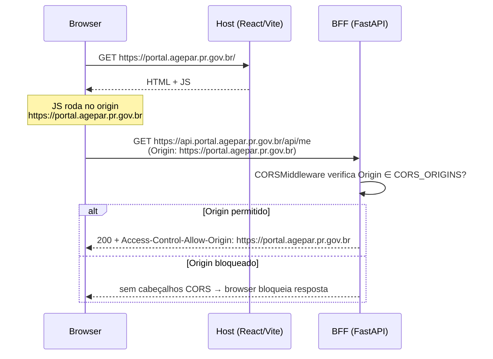

O Portal AGEPAR expõe o BFF em `/api` e o catálogo em `/catalog`, ambos **com CORS controlado por configuração**, nunca com `"*"`:

- a lista de origens permitidas vem de `CORS_ORIGINS` (variável de ambiente),
- o middleware de CORS é aplicado **no BFF inteiro**,
- `allow_credentials=True` (para cookies de sessão),
- métodos e headers são liberados (`["*"]`), mas **origens não**.

> Referências principais no repositório:  
> `apps/bff/app/main.py`  
> `infra/docker-compose.dev.yml`  
> `README.md`

---

## 1) Configuração de CORS no BFF

Toda a configuração de CORS está em `apps/bff/app/main.py`.

### 1.1. Variável de ambiente `CORS_ORIGINS`

Trecho relevante:

```python title="apps/bff/app/main.py" showLineNumbers
ENV = os.getenv("ENV", "dev")
LOG_LEVEL = os.getenv("LOG_LEVEL", "INFO").upper()
AUTH_MODE = os.getenv("AUTH_MODE", "local")
AUTH_LEGACY_MOCK = os.getenv("AUTH_LEGACY_MOCK", "0").lower() in ("1", "true", "yes")
EP_MODE = os.getenv("EP_MODE", "mock")
SESSION_SECRET = os.getenv("SESSION_SECRET", "dev-secret")

CORS_ORIGINS = [
    o.strip()
    for o in os.getenv("CORS_ORIGINS", "http://localhost:5173").split(",")
    if o.strip()
]
CATALOG_FILE = Path(os.getenv("CATALOG_FILE", "/catalog/catalog.dev.json"))
````

Características:

* O default em ambientes sem configuração é **apenas** `http://localhost:5173`.
* Quando `CORS_ORIGINS` é definido (ex.: em `docker-compose`), a string é quebrada por vírgula e `strip()` em cada item.
* Qualquer origem vazia é descartada.

Em **dev com Docker**, o compose já define:

```yaml title="infra/docker-compose.dev.yml (trecho)" showLineNumbers
services:
  bff:
    environment:
      ENV: dev
      AUTH_MODE: mock
      SESSION_SECRET: dev-secret
      CORS_ORIGINS: http://localhost:5173,http://127.0.0.1:5173
      CATALOG_FILE: /catalog/catalog.dev.json
      LOG_LEVEL: INFO
```

Ou seja:

* O BFF aceita requisições cross-origin **apenas** de:

  * `http://localhost:5173`
  * `http://127.0.0.1:5173`
* Qualquer outro origin (ex.: `http://localhost:3000`, `http://evil.local`) não recebe cabeçalhos CORS válidos.

O próprio `main.py` loga, no startup:

```python title="apps/bff/app/main.py — log de CORS" showLineNumbers
logger.info(
    "ENV=%s | AUTH_MODE=%s | AUTH_LEGACY_MOCK=%s | LOG_LEVEL=%s | EP_MODE=%s",
    ENV, AUTH_MODE, AUTH_LEGACY_MOCK, LOG_LEVEL, EP_MODE,
)
logger.info("CORS_ORIGINS=%s | CATALOG_FILE=%s", ",".join(CORS_ORIGINS), str(CATALOG_FILE))
```

Isso ajuda a verificar, nos logs, se a configuração de CORS em produção condiz com o esperado.

---

## 2) Middleware de CORS (FastAPI/Starlette)

O middleware é configurado logo após a criação da app FastAPI:

```python title="apps/bff/app/main.py — middleware de CORS" showLineNumbers
APP = FastAPI(
    title="Portal AGEPAR BFF",
    version="0.3.0",
    docs_url="/api/docs",
    redoc_url="/api/redoc",
)

APP.add_middleware(
    CORSMiddleware,
    allow_origins=CORS_ORIGINS,
    allow_credentials=True,
    allow_methods=["*"],
    allow_headers=["*"],
)

APP.add_middleware(DbSessionMiddleware)
APP.add_middleware(
    SessionMiddleware,
    secret_key=SESSION_SECRET,
    same_site="lax",
)
```

Significado:

* `allow_origins=CORS_ORIGINS`
  → **lista explícita** de origens confiáveis (configurada por ambiente).
* `allow_credentials=True`
  → permite enviar **cookies de sessão** (e headers de auth) em requisições cross-origin:

  * exige que o browser envie `withCredentials: true` (JS) ou `credentials: "include"` (fetch).
  * **não é compatível com `"*"`** (`Access-Control-Allow-Origin: *`), então não há risco de cair nesse anti-pattern.
* `allow_methods=["*"]`, `allow_headers=["*"]`
  → qualquer método/headers são aceitos **desde que a origem seja permitida**:

  * simplifica o dia a dia do frontend,
  * a segurança continua centralizada em **origem + autenticação + RBAC**, não em filtrar verbo.

Em termos práticos, o CORSMiddleware:

* responde preflight `OPTIONS` com os cabeçalhos adequados,
* injeta `Access-Control-Allow-Origin` **apenas** quando a origem bate com `CORS_ORIGINS`,
* injeta `Access-Control-Allow-Credentials: true` para permitir cookies.

---

## 3) Como isso se encaixa com o Host e o catálogo

O Host (SPA React/Vite) é servido em:

* dev: `http://localhost:5173` (e proxies internos para `/api`, `/catalog`, `/devdocs`),
* ambientes futuros: domínios reais (ex.: `https://portal-dev.agepar.pr.gov.br`).

### 3.1. Cenário “tudo via proxy” (preferido)

Em dev, o Vite já proxia `/api` e `/catalog` para o BFF, então:

* o **browser enxerga tudo como mesmo origin** (`http://localhost:5173`),
* o CORS quase não “aparece” na prática (porque não há cross-origin),
* mas ainda é importante:

  * garante que, se alguém tentar falar direto com `http://localhost:8000` de outra origem, o CORS vai bloquear.

### 3.2. Cenário “front separado do BFF”

O design de CORS permite cenários como:

* BFF em `https://api.portal.agepar.pr.gov.br`,
* Host em `https://portal.agepar.pr.gov.br`.

Basta configurar em produção:

```bash
CORS_ORIGINS="https://portal.agepar.pr.gov.br"
```

Ou, se houver múltiplos frontends oficiais:

```bash
CORS_ORIGINS="https://portal.agepar.pr.gov.br,https://painel.agepar.pr.gov.br"
```

> **Regra de ouro:**
> Apenas domínios oficialmente controlados pela AGEPAR devem entrar em `CORS_ORIGINS`.
> Qualquer ferramenta de terceiros deve passar por avaliação de segurança.

---

## 4) Fluxo resumido — Browser, Host e BFF



---

## 5) Boas práticas e armadilhas evitadas

### 5.1. O que o projeto **já faz certo**

* ❌ **Não** usa `allow_origins=["*"]`.
  👉 sempre lista explícita via `CORS_ORIGINS`.
* ✅ Habilita `allow_credentials=True` desde o começo:

  * alinhado com o uso de **cookies de sessão** no BFF.
* ✅ Configuração por ambiente (dev vs prod) via variáveis:

  * dev: `http://localhost:5173`, `http://127.0.0.1:5173`,
  * prod: domínios oficiais.
* ✅ Loga `CORS_ORIGINS` no startup:

  * fácil auditar se o cluster está com configuração incorreta.

### 5.2. O que **não** fazer em novas configs

Quando formos evoluir a infra:

* **Não** adicionar ferramentas de terceiros direto em `CORS_ORIGINS` sem avaliação
  (ex.: `https://*.ngrok.io`, `https://*.vercel.app`).
* **Não** misturar `localhost` de dev com domínios de produção na mesma configuração
  de cluster.
* **Não** usar hostnames IP-only em produção (`http://10.x.x.x`) para frontends que
  rodam em browsers de usuários finais.

---

## 6) Exemplos práticos

### 6.1. Checar CORS por logs

Ao subir o stack dev:

```bash title="Subindo stack dev" showLineNumbers
cd infra
./scripts/dev_up.sh
```

Nos logs do BFF você deve ver algo como:

```text title="Log do BFF (resumido)"
INFO ... ENV=dev | AUTH_MODE=mock | AUTH_LEGACY_MOCK=False | LOG_LEVEL=INFO | EP_MODE=mock
INFO ... CORS_ORIGINS=http://localhost:5173,http://127.0.0.1:5173 | CATALOG_FILE=/catalog/catalog.dev.json
```

Se em produção o log mostrar um domínio inesperado, é um primeiro alerta.

### 6.2. Teste rápido de CORS com `curl` + `Origin`

```bash title="Teste de CORS (Origin permitido)" showLineNumbers
curl -i \
  -H "Origin: http://localhost:5173" \
  -H "Cookie: session=<cookie-valido>" \
  http://localhost:8000/api/me
```

Resposta (trecho):

```text
HTTP/1.1 200 OK
access-control-allow-origin: http://localhost:5173
access-control-allow-credentials: true
...
```

Agora com uma origem **não permitida**:

```bash title="Teste de CORS (Origin não permitido)" showLineNumbers
curl -i \
  -H "Origin: http://malicious.local" \
  http://localhost:8000/api/me
```

Você verá **resposta 200 no curl**, mas:

* sem `Access-Control-Allow-Origin`,
* sem `Access-Control-Allow-Credentials`.

Do ponto de vista do browser:

* a resposta é **bloqueada** pela política de CORS,
* o JS recebe um erro de rede genérico (não acessa o corpo).

---

> _Criado em 2025-12-01_