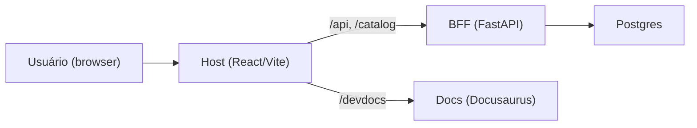

Além dos testes de API e (futuros) testes automatizados do Host, o Portal AGEPAR
depende bastante de **testes manuais guiados**, especialmente para:

- conferir se o **RBAC** está se comportando como esperado (BFF + Host),
- validar a **navegação pelo catálogo** (categorias, cards, rotas),
- checar o **proxy de docs** (`/devdocs`) em ambiente de desenvolvimento.

Esta página descreve **roteiros práticos** de testes manuais que podem ser repetidos
após mudanças de código ou atualizações de ambiente.

> Referências principais
>
> - `apps/host/src/types.ts` → RBAC de UI (`userCanSeeBlock`, `visibleBlocks`, etc.)
> - `apps/host/src/App.tsx` / `src/pages/*` → navegação e roteamento
> - `apps/host/vite.config.ts` → proxy de `/api`, `/catalog`, `/devdocs`
> - `apps/bff/app/main.py` → `require_password_changed`, routers de automations
> - `apps/bff/app/auth/rbac.py` → RBAC no BFF
> - `infra/docker-compose.dev.yml` → serviços `host`, `bff` e `docs`

---

## 1) Visão geral dos testes manuais



Os testes manuais normalmente envolvem:

* abrir o Host (`http://localhost:5173` em dev),
* autenticar com um usuário de teste,
* navegar por categorias e blocos,
* forçar cenários de permissão (RBAC),
* abrir `/devdocs` para conferir o proxy de docs.

---

## 2) Testes manuais de RBAC (Host + BFF)

### 2.1. Conceito: RBAC em duas camadas

1. **BFF** (camada *realmente* autorizadora)

   * Usa `require_password_changed` e `require_roles_any`/`require_roles_all`.
   * Bloqueia acesso à automação mesmo se o usuário “gambiarrear” a UI.

2. **Host** (RBAC de vitrine)

   * Usa `userCanSeeBlock` e `visibleBlocks` (em `src/types.ts`).
   * Só mostra cards/blocos se o usuário tiver roles adequadas (ANY-of).

> Resultado esperado:
>
> * Se o usuário **não tiver role**, **não vê** o card no Host.
> * Se ele tentar acessar uma rota manualmente, o **BFF devolve 403**.

### 2.2. Preparação

* Subir ambiente dev com Docker Compose:

  ```bash
  cd infra
  docker compose -f docker-compose.dev.yml up --build
  ```

* Confirmar:

  * Host em `http://localhost:5173`,
  * BFF em `http://localhost:8000`,
  * Docs em `http://localhost:5173/devdocs` (via proxy).

* Ter pelo menos **dois usuários de teste** configurados no auth mock:

  * `user_compras` (role `compras`),
  * `user_sem_role` (sem as roles da automação escolhida).

> Se os usuários ainda não existirem de fato, usar o login mock padrão
> (`dev@example.com`) e ajustar mentalmente os cenários; quando o auth real
> estiver integrado, repetir com usuários reais.

### 2.3. Roteiro 1 — RBAC para automação DFD (exemplo)

**Objetivo:** garantir que apenas usuários com certas roles veem e acessam a automação DFD.

1. **Login com usuário autorizado**

   * No navegador, abrir `http://localhost:5173`.
   * Fazer login como usuário com role `compras` (ou equivalente configurado).
   * Ir para a tela inicial (`HomeDashboard`).

2. **Verificar que o card DFD está visível**

   * Localizar a categoria (ex.: “Compras”) no dashboard.
   * Verificar que existe um card “DFD” (ou nome configurado no catálogo).

   Resultado esperado:

   * Card DFD aparece.
   * Ao clicar, a navegação leva para a rota da automação (ex.: `/automations/dfd`),
     e o iframe `/api/automations/dfd/ui` carrega normalmente.

3. **Verificar que consegue usar a automação**

   * Preencher um formulário simples e enviar.
   * Acompanhar se não há erros de permissão (`403 forbidden`).
   * (Opcional) confirmar via DevTools → Network que:

     * chamadas em `/api/automations/dfd/*` retornam 200/2xx (ou 4xx esperados de validação),
     * nunca 403 por falta de role.

4. **Login com usuário *sem* role adequada**

   * Abrir outra janela anônima ou deslogar.
   * Fazer login com usuário **sem role `compras`**.

5. **Verificar que o card DFD NÃO aparece**

   * Na `HomeDashboard`, conferir que a categoria “Compras”:

     * ou não aparece,
     * ou aparece sem o card DFD (dependendo da config de catálogo).

   Resultado esperado:

   * `userCanSeeBlock` avalia falso, logo o card não é renderizado.

6. **Tentar burlar a UI via URL**

   * Na barra de endereço, navegar manualmente para a rota da automação (ex.):

     * `http://localhost:5173/automations/dfd`

   * Ver o que acontece:

     * a UI pode:

       * redirecionar para “Acesso negado”,
       * mostrar um erro fetch 403 em overlay,
       * ou não conseguir carregar o iframe.

   * Abrir DevTools → Network e ver a chamada:

     * `/api/automations/dfd/ui` ou `/api/automations/dfd/submissions`.

   Resultado esperado (BFF):

   * Resposta HTTP 403 com JSON:

     ```json
     {
       "code": "forbidden",
       "message": "Você não tem permissão para acessar esta submissão."
     }
     ```
   * Confirma que o RBAC não depende só do Host.

### 2.4. Roteiro 2 — RBAC em automação administrativa (ex.: `usuarios` ou `accounts`)

**Objetivo:** garantir que telas administrativas só abrem para usuários admin.

1. **Login como não-admin**

   * Entrar com usuário sem role de admin.
   * Tentar acessar a rota manualmente (ex.: `/admin/usuarios`, ajustando ao que o Host expõe).
   * Verificar:

     * se o Host esconde o card da automação,
     * se a chamada `/api/automations/usuarios/*` retorna 403.

2. **Login como admin/superuser**

   * Entrar com usuário com role `admin` ou `is_superuser=true`.
   * Verificar que:

     * cards/admin aparecem,
     * operações funcionam (`list`, `create`, `update` via UI),
     * qualquer 4xx seja de validação/negócio, não de permissão.

---

## 3) Testes manuais de navegação (categorias, cards, rotas)

A navegação do Host é dirigida pelo **catálogo** (`/catalog/dev`) e pelos helpers em
`src/types.ts` (`visibleCategories`, `visibleBlocks`, etc.).

### 3.1. Roteiro 3 — Coerência entre catálogo e UI

1. **Inspecionar o catálogo**

   * `curl -s http://localhost:8000/catalog/dev | jq '.categories, .blocks[0:5]'`
   * Confirmar alguns campos:

     * `categories[].id` / `label`,
     * `blocks[].name`, `displayName`, `categoryId`, `requiredRoles`, `routes`, `ui.url`.

2. **Ver se categorias aparecem na navbar/home**

   * Abrir `http://localhost:5173`.
   * Conferir se os **labels** de categoria aparecem como seções ou itens de navegação.
   * A ordem deve respeitar o catálogo (`order` ou ordem do arquivo, conforme implementado).

3. **Clicar em uma categoria**

   * Selecionar uma categoria com 2+ blocos.
   * Ver os cards renderizados:

     * cada card corresponde a um `block` visível (RBAC) daquela categoria.

4. **Validar links dos cards**

   * Clicar em um card e observar a URL:

     * normalmente algo como `/automations/{slug}` ou a rota declarada em `block.routes[0]`.
   * Conferir se:

     * a rota funciona,
     * o título da página condiz com `displayName` do bloco,
     * o iframe aponta para a `ui.url` do catálogo.

5. **Simular catálogo quebrado**

   * Opção A: (em dev) desligar o BFF (`docker stop portal-agepar-bff`).
   * Opção B: renomear temporariamente o arquivo de catálogo no volume (com cuidado).
   * Abrir o Host e ver comportamento:

     * idealmente: mensagem de erro amigável (“Não foi possível carregar o catálogo”),
     * evitar tela branca sem feedback.

> Esse teste garante que o Host lida bem com falhas em `/catalog/dev` e
> não quebra completamente a navegação.

### 3.2. Roteiro 4 — Navegação por rota direta

**Objetivo:** garantir que a navegação direta via URL bate com o catálogo.

1. Copiar uma rota de bloco do catálogo (ex.:

   ```json
   {
     "name": "dfd",
     "routes": ["/automations/dfd"],
     "ui": { "type": "iframe", "url": "/api/automations/dfd/ui" }
   }
   ```

2. No navegador, ir direto para:

   * `http://localhost:5173/automations/dfd`

3. Verificar:

   * se a página renderiza corretamente,
   * se o iframe aponta para `/api/automations/dfd/ui`,
   * se o RBAC visual (mensagem de acesso negado ou redirecionamento) condiz com as roles.

---

## 4) Testes manuais do proxy de docs (`/devdocs`)

O Host proxyia o site de docs (Docusaurus) na rota `/devdocs`:

* `apps/host/vite.config.ts`:

  ```ts
  server: {
    host: "0.0.0.0",
    port: 5173,
    proxy: {
      "/api":     { target: "http://bff:8000", changeOrigin: true },
      "/catalog": { target: "http://bff:8000", changeOrigin: true },
      "/devdocs": { target: "http://docs:8000", changeOrigin: true },
    },
  },
  ```

* `infra/docker-compose.dev.yml`: serviço `docs` na porta interna `8000`.

### 4.1. Roteiro 5 — Validar proxy em dev

1. **Abrir docs via Host**

   * No navegador, acessar:

     * `http://localhost:5173/devdocs`
   * Resultado esperado:

     * carrega a home do Docusaurus,
     * título semelhante a “Plataforma AGEPAR — Dev Docs”.

2. **Navegar dentro dos docs**

   * Clicar em algumas seções (BFF, Host, Automations, etc.).
   * Verificar se:

     * a URL continua com prefixo `/devdocs/...`,
     * não há CORS ou erros de rede.

3. **Verificar o servidor de docs direto (opcional)**

   * Se `infra/docker-compose.dev.yml` expuser porta (ex.: `9000:8000`):

     * acessar `http://localhost:9000/` e conferir se o mesmo site abre.
   * Isso ajuda a diferenciar problemas:

     * se `/devdocs` falhar, mas `9000` funcionar → problema no proxy do Host.
     * se ambos falharem → problema no container `docs`.

4. **Simular docs offline**

   * Parar o container `docs`:

     ```bash
     docker stop portal-agepar-docs
     ```
   * Acessar `http://localhost:5173/devdocs`.
   * Resultado esperado:

     * o Host deve exibir um erro HTTP (502/504) ou uma página de fallback,
     * **não** quebrar o resto da SPA (dashboard, etc.).

> Esses testes garantem que mudanças no `vite.config.ts` ou no compose não
> quebrem o consumo interno dos Dev Docs.

---

## 5) Resumo: checklist de testes manuais por release

Antes de considerar um deploy “ok” (especialmente em ambientes internos), é útil
passar por este checklist:

### RBAC

* [ ] Usuário sem role específica **não vê** cards de automations restritas.
* [ ] Usuário com role adequada vê e usa a automação sem 403 inesperado.
* [ ] Acessos diretos por URL sem permissão retornam **403 do BFF** (`code=forbidden`).

### Navegação

* [ ] Todas as categorias definidas no catálogo aparecem como seções/aba na UI.
* [ ] Cards de blocos visíveis (RBAC) aparecem na categoria certa.
* [ ] Rotas manuais (`/automations/{slug}`) funcionam (ou falham com mensagem clara).
* [ ] Falha no `/catalog/dev` não derruba a SPA inteira; usuário vê uma mensagem clara.

### Proxy de Docs

* [ ] `http://localhost:5173/devdocs` abre o site de Dev Docs.
* [ ] Navegação interna dos docs funciona mantendo o prefixo `/devdocs`.
* [ ] Se o container `docs` cair, `/devdocs` falha de forma previsível, sem quebrar o Host.

---

> _Criado em 2025-12-02_