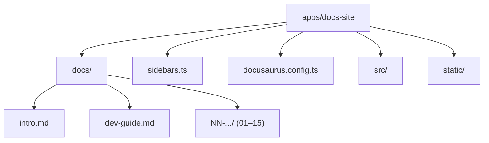

A documentação de dev da Plataforma AGEPAR fica em um projeto **Docusaurus v2**
isolado dentro do monorepo, em `apps/docs-site/`.  
Aqui vamos detalhar:

- como o conteúdo está organizado em `docs/` (MD/MDX),
- como o `sidebars.ts` monta a navegação,
- e os pontos principais de `docusaurus.config.ts` (URL, baseUrl, temas, plugins).

> Referência rápida: `apps/docs-site/README.md`

---

## 1) Visão geral da pasta `apps/docs-site`

Estrutura principal:

```text
apps/docs-site/
  docs/               # conteúdo em seções (01–15)
  blog/               # (opcional) posts técnicos
  sidebars.ts         # definição de sidebars (techSidebar)
  docusaurus.config.ts# config do site
  src/                # CSS, páginas extras, componentes MDX
  static/             # assets estáticos (img, favicons, etc.)
  package.json        # scripts npm (dev, build, serve)
```

O próprio `README` do projeto resume:

```md title="apps/docs-site/README.md"
- `docs/` — Conteúdo em seções (00–..), com `index.md`, tópicos e `99-referencias.mdx`
- `sidebars.ts` — Sidebar mapeando seções
- `docusaurus.config.ts` — Configuração do site
- `src/` — CSS e páginas extras
```

Diagrama geral:



---

## 2) Estrutura de `docs/`: seções 01–15 + intro/dev-guide

Dentro de `apps/docs-site/docs/` temos:

```text
docs/
  intro.md
  dev-guide.md
  01-visão-geral-e-arquitetura/
  02-ambiente-dev-setup/
  03-build-run-deploy/
  04-frontend-host-react-vite-ts/
  05-catálogo-catalog-dev/
  06-bff-fastapi/
  07-automations-padrão-de-módulos/
  08-banco-de-dados-persistência/
  09-segurança/
  10-observabilidade/
  11-padrões-de-erro-dx/
  12-testes/
  13-documentação-docusaurus/
  14-guias-de-produto-fluxo-compras-público/
  15-apêndices/
```

Padrão de cada seção `NN-*`:

* `index.md` → página principal da seção (id `index`, `sidebar_position: 0`).
* Vários arquivos `.md` com tópicos (como os que estamos escrevendo).
* Um `99-referencias.mdx` com os arquivos de código mapeados no monorepo.

Exemplo (trecho):

```md title="docs/08-banco-de-dados-persistência/99-referencias.mdx"
---
title: "Referências — Banco de Dados & Persistência"
sidebar_position: 99
---

## Arquivos mapeados do repositório

### Referências a submissions
- `portal-agepar-main/apps/bff/app/automations/dfd.py`
- `portal-agepar-main/apps/bff/app/db.py`
- ...
```

> Convenção: páginas de referência terminam com `99-referencias.mdx`
> e usam `sidebar_position: 99` para aparecerem no final da categoria.

### 2.1. Frontmatter padrão dos tópicos

Todos os arquivos `.md` de tópicos usam frontmatter YAML:

```md
---
id: cors-restrito
title: "CORS restrito"
sidebar_position: 1
---
```

* `id` → anchor interna da página (usada nos links).
* `title` → título visível na documentação.
* `sidebar_position` → ordenação dentro da seção/categoria:

  * `0` → índice,
  * `1..98` → conteúdo,
  * `99` → referências.

---

## 3) Uso de `.mdx` (Tabs, live code, apêndices)

Para páginas que precisam de **React/JSX ou componentes do tema**, usamos `.mdx`.

Exemplos em `docs/15-apêndices/`:

* `estilo-de-codigo.mdx` → guia de estilo de snippets (Tabs/TabItem).
* `playground-react.mdx` → exemplos `live` de React/TSX.

Trecho de `estilo-de-codigo.mdx`:

```md title="docs/15-apêndices/estilo-de-codigo.mdx"
---
id: estilo-de-codigo
title: Guia de Estilo — Exemplos de Código
---

import Tabs from '@theme/Tabs';
import TabItem from '@theme/TabItem';

Este guia define **como** escrever exemplos de código de forma consistente.

## Padrões
- Sempre usar `title="..."` nos blocos que representam arquivos ou comandos importantes.
- Preferir `showLineNumbers` quando o snippet tiver mais de ~10 linhas.
- ...
```

Trecho de playground React:

````md title="docs/15-apêndices/playground-react.mdx"
---
id: playground-react
title: Playground ao vivo (React/TSX)
---

```tsx live title="ButtonDemo.tsx"
function ButtonDemo() {
  const handleClick = () => alert('Funcionou!');
  return <button onClick={handleClick}>Clique</button>;
}
```

````

> Regra prática:
> - use **`.md`** para texto puro com snippets,
> - use **`.mdx`** quando precisar importar componentes (`Tabs`, `TabItem`, playgrounds `live`, etc.).

---

## 4) `sidebars.ts`: organização por seções (1–15)

O arquivo `apps/docs-site/sidebars.ts` define a **sidebar principal** (`techSidebar`)
como uma lista de categorias auto-geradas a partir das pastas `docs/NN-*`.

Trecho (abreviado):

```ts title="apps/docs-site/sidebars.ts"
export default {
  techSidebar: [
    'intro',
    'dev-guide',
    {
      type: 'category',
      label: '01 — Visão Geral e Arquitetura',
      link: { type: 'generated-index', title: 'Visão Geral e Arquitetura' },
      items: [{ type: 'autogenerated', dirName: '01-visão-geral-e-arquitetura' }],
    },
    {
      type: 'category',
      label: '02 — Ambiente & Dev Setup',
      link: { type: 'generated-index', title: 'Ambiente & Dev Setup' },
      items: [{ type: 'autogenerated', dirName: '02-ambiente-dev-setup' }],
    },
    // ...
    {
      type: 'category',
      label: '15 — Apêndices',
      link: { type: 'generated-index', title: 'Apêndices' },
      items: [{ type: 'autogenerated', dirName: '15-apêndices' }],
    },
  ],
};
````

Pontos importantes:

* `techSidebar` é usada como **sidebar principal** das docs (ver `docusaurus.config.ts`).
* `intro` e `dev-guide` aparecem no topo, acima das seções numeradas.
* Cada seção `NN-...` é um `category` com:

  * `link: { type: "generated-index" }` → Docusaurus gera uma página índice daquela pasta.
  * `items: [{ type: "autogenerated", dirName: "NN-..." }]` → que inclui **automaticamente**:

    * `index.md` (com `sidebar_position: 0`),
    * todos os demais `.md`/`.mdx` ordenados por `sidebar_position`.

> **Impacto na manutenção:**
>
> * Criar/renomear arquivos dentro de `docs/NN-*` **não exige** mexer no `sidebars.ts`
>   (desde que a pasta continue com o mesmo nome).
> * Para adicionar uma nova “seção grande” (16, 17, …), aí sim é preciso
>   acrescentar um novo bloco `category` em `sidebars.ts`.

---

## 5) `docusaurus.config.ts`: URL, baseUrl, presets e temas

Config principal em `apps/docs-site/docusaurus.config.ts`:

```ts title="apps/docs-site/docusaurus.config.ts (trecho)"
// @ts-check
import { themes as prismThemes } from 'prism-react-renderer';
import type { Config } from '@docusaurus/types';

const config: Config = {
  title: 'Plataforma AGEPAR — Dev Docs',
  tagline: 'Documentação para desenvolvedores da Plataforma AGEPAR',
  favicon: 'img/favicon.ico',

  url: 'http://localhost',
  baseUrl: '/devdocs/',

  organizationName: 'oBaldon',
  projectName: 'portal-agepar',

  future: {
    v4: true,
  },

  presets: [
    [
      'classic',
      {
        docs: {
          // Resolve path do sidebar no Node
          sidebarPath: require.resolve('./sidebars.ts'),
          // Link "editar esta página" apontando pro monorepo
          editUrl: 'https://github.com/oBaldon/portal-agepar/tree/main/apps/docs-site/',
        },
        blog: {
          showReadingTime: true,
          routeBasePath: '/blog',
          include: ['**/*.{md,mdx}'],
          exclude: ['**/_*.{md,mdx}', '**/README.{md,mdx}'],
          editUrl: 'https://github.com/oBaldon/portal-agepar/tree/main/apps/docs-site/',
        },
        theme: {
          customCss: require.resolve('./src/css/custom.css'),
        },
      },
    ],
  ],

  themes: ['@docusaurus/theme-mermaid', '@docusaurus/theme-live-codeblock'],
  markdown: {
    mermaid: true,
    hooks: {
      onBrokenMarkdownLinks: 'warn',
    },
  },

  themeConfig: {
    navbar: {
      title: 'Plataforma AGEPAR',
      items: [
        { type: 'docSidebar', sidebarId: 'techSidebar', position: 'left', label: 'Docs' },
        // ...
      ],
    },
    prism: {
      theme: prismThemes.github,
      darkTheme: prismThemes.dracula,
      additionalLanguages: ['tsx', 'typescript', 'jsx', 'bash', 'json', 'diff'],
    },
  },
};

export default config;
```

### 5.1. `url` e `baseUrl`

* `url: 'http://localhost'` → URL base usada para gerar links absolutos.
* `baseUrl: '/devdocs/'` → prefixo de rota do site de docs.

No ambiente do Portal AGEPAR:

* o Host (Vite) faz proxy de `/devdocs` para o container `docs`:

  ```ts title="apps/host/vite.config.ts (trecho)"
  server: {
    proxy: {
      "/api":     { target: "http://bff:8000", changeOrigin: true },
      "/catalog": { target: "http://bff:8000", changeOrigin: true },
      "/devdocs": { target: "http://docs:8000", changeOrigin: true },
    },
  },
  ```

* ou seja, a doc fica acessível via:
  `http://localhost:5173/devdocs/` (em dev, através do Host).

### 5.2. Plugins `docs` e `blog`

Preset `'classic'`:

* `docs`:

  * usa `sidebarPath: './sidebars.ts'` → o `techSidebar` descrito acima,
  * `editUrl` aponta exatamente para o diretório `apps/docs-site/` no GitHub.

* `blog`:

  * `routeBasePath: '/blog'` → blog acessível em `/devdocs/blog`,
  * `exclude` pula arquivos `README` e com prefixo `_`,
  * `editUrl` também aponta para `apps/docs-site/`.

Mesmo que o blog ainda não seja muito usado, ele já está configurado para
postagens técnicas (“changelogs”, deep-dives etc.).

### 5.3. Temas e extras

* **Mermaid**:

  * `themes: ['@docusaurus/theme-mermaid', ...]`
  * `markdown.mermaid = true`
    → diagramas com blocos ` ```mermaid ... ``` ` funcionam nativamente.

* **Live codeblock**:

  * `@docusaurus/theme-live-codeblock`
    → permite blocos ` ```tsx live ... ``` ` (como no `playground-react.mdx`).

* **Prism (syntax highlight)**:

  * temas: `github` (claro) e `dracula` (escuro),
  * linguagens extras: `tsx`, `typescript`, `jsx`, `bash`, `json`, `diff`.

> Isso explica por que usamos ` ```ts`, ` ```tsx`, ` ```bash title="..." showLineNumbers` etc.
> em todos os snippets; o highlight já está preparado.

---

## 6) Conclusão e boas práticas de estrutura

Resumo do que manter daqui pra frente:

1. **Seções numeradas em `docs/`**

   * Cada grande tema em uma pasta `NN-nome-da-secao/`.
   * Sempre com:

     * `index.md` (id `index`, `sidebar_position: 0`),
     * tópicos `01-...`, `02-...` com `sidebar_position` crescente,
     * `99-referencias.mdx` para mapeamento de arquivos do monorepo.

2. **Sidebar autogerada**

   * Não é preciso registrar páginas individualmente.
   * Apenas garantir que:

     * o diretório existe em `docs/`,
     * a entrada correspondente existe em `sidebars.ts` (para novas seções grandes).

3. **MD vs MDX**

   * `.md` para docs que só precisam de markdown + code blocks.
   * `.mdx` para:

     * Tabs/TabItem,
     * playgrounds `live`,
     * componentes React específicos.

4. **Config centralizada em `docusaurus.config.ts`**

   * Não alterar `baseUrl` sem alinhar com o Host (proxy `/devdocs`).
   * Usar `editUrl` para linkar sempre para `apps/docs-site/` no GitHub.

---

> _Criado em 2025-12-02_