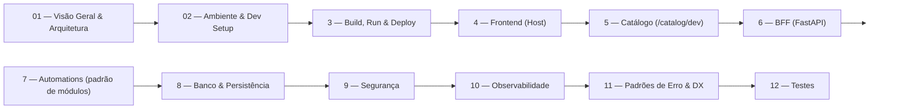

A doc de dev do Portal AGEPAR foi pensada como um **livro linear** sobre a
plataforma, dividido em 12 seções principais (01–12). Juntas, elas contam a
história completa:

> da visão geral → setup de dev → build/run → frontend → catálogo → BFF →  
> automations → banco → segurança → observabilidade → erros/DX → testes.

Cada seção:

- corresponde a uma pasta `NN-*` em `apps/docs-site/docs/`,
- segue o mesmo padrão de `index.md` + tópicos + `99-referencias.mdx`,
- cobre um “pedaço” bem definido da arquitetura.

---

## 1) Visão macro: o que as seções 1–12 cobrem



Lendo na ordem, você:

1. entende **o que é** a plataforma (01),
2. sobe o ambiente de dev (02),
3. aprende a **rodar, buildar e publicar** (03),
4. vê como o **Host** funciona (04),
5. entende o **catálogo** que dirige o Host (05),
6. mergulha no **BFF** (06),
7. aprende o **padrão de automations** (07),
8. vê onde tudo é persistido (08),
9. entende as decisões de **segurança** (09),
10. vê como **observamos** o sistema (10),
11. como padronizamos **erros e DX** (11),
12. e como **testar** tudo isso (12).

---

## 2) Padrão estrutural de cada seção

Cada pasta `NN-*` segue a mesma receita:

* `index.md`

  * id `index`, `sidebar_position: 0`;
  * sempre com:

    * objetivos da seção,
    * sumário rápido,
    * link mental com o “plano” original.

* Tópicos numerados (ex.: `01-...`, `02-...`, …)

  * cada um com:

    * frontmatter (`id`, `title`, `sidebar_position`),
    * corpo explicando o recorte (conceito + exemplos + trechos de código).

* `99-referencias.mdx`

  * lista de arquivos do monorepo relacionados àquela seção;
  * facilita “voltar do doc para o código”.

Exemplo genérico de frontmatter de tópico:

```md
---
id: cors-restrito
title: "CORS restrito"
sidebar_position: 1
---
```

---

## 3) Seção 01 — Visão Geral & Arquitetura

**Pasta:** `docs/01-visão-geral-e-arquitetura/`

Foco:

* contexto do **Portal AGEPAR** (para que existe, quem usa),
* visão de alto nível dos **três serviços**:

  * Host (React/Vite/TS),
  * BFF (FastAPI),
  * Docs (Docusaurus),
* diagramas de arquitetura (fluxo entre navegador, Host, BFF, Postgres, docs),
* visão dos **fluxos de compras públicos** (DFD → PCA → ETP → TR → …).

Esta seção é ideal para:

* onboarding de novos devs,
* stakeholders técnicos que querem entender “como tudo se encaixa”.

---

## 4) Seção 02 — Ambiente & Dev Setup

**Pasta:** `docs/02-ambiente-dev-setup/`

Foco:

* preparar o ambiente de desenvolvimento:

  * requisitos (Docker, Node, Python),
  * `infra/docker-compose.dev.yml`,
  * serviços `bff`, `host`, `docs`, `postgres`,
* comandos de subida:

  * `docker compose up` (dev),
  * como acessar Host (`:5173`), BFF (`:8000`), docs (`/devdocs`),
* dicas de produtividade:

  * hot reload no Host/BFF,
  * como ver logs.

É aqui que ficam:

* os **cURLs mínimos** para checar se tudo subiu (`/health`, `/version`),
* a relação entre variáveis de ambiente e comportamento (ex.: `AUTH_MODE`, `EP_MODE`).

---

## 5) Seção 03 — Build, Run & Deploy

**Pasta:** `docs/03-build-run-deploy/`

Foco:

* como **buildar** o Host (Vite) e o BFF (imagem/container),
* como rodar localmente fora do Docker (se necessário),
* como pensar um **pipeline de deploy**:

  * build de imagens,
  * migrações (quando existirem),
  * publicação da doc (ou via proxy `/devdocs` ou como site dedicado).

Aqui entram:

* scripts de build,
* variáveis de ambiente específicas de produção,
* boas práticas de rollout/rollback.

---

## 6) Seção 04 — Frontend Host (React/Vite/TS)

**Pasta:** `docs/04-frontend-host-react-vite-ts/`

Foco:

* arquitetura do **Host**:

  * entrypoint (`main.tsx`, `App.tsx`),
  * rotas/páginas (`src/pages/*`),
  * componentes compartilhados,
* como o Host:

  * lê o **catálogo**,
  * monta a navbar por categorias,
  * renderiza cards/blocos (iframe).

Também documenta:

* uso de TypeScript (`types.ts`),
* estratégias de RBAC de UI (`userCanSeeBlock`, `visibleBlocks`),
* padrão de chamadas para o BFF (`fetch`, `jsonOrThrow`, etc.).

---

## 7) Seção 05 — Catálogo (/catalog/dev)

**Pasta:** `docs/05-catálogo-catalog-dev/`

Foco:

* formato do **catálogo dev** (`/catalog/dev`):

  * `categories[]`: `{ id, label, icon, order? }`,
  * `blocks[]`: `{ categoryId, ui, navigation, routes, requiredRoles?, ... }`,
* como o Host usa esse catálogo para:

  * montar categorias e cards,
  * decidir quais blocos mostrar (RBAC ANY-of),
  * rotear para as páginas certas.

Esta seção também explica:

* onde o arquivo do catálogo fica no ambiente (`CATALOG_FILE`),
* como adicionar uma **nova automação** só mexendo no catálogo + BFF (Host “descobre” sozinho).

---

## 8) Seção 06 — BFF (FastAPI)

**Pasta:** `docs/06-bff-fastapi/`

Foco:

* estrutura do projeto `apps/bff`:

  * `app/main.py` (FastAPI principal),
  * routers (`automations`, `auth`, etc.),
  * `db.py`, `auth/`, `games/` (snake),
* **Pydantic v2 + ConfigDict**:

  * `populate_by_name=True`,
  * `extra="ignore"`,
  * normalização de payloads para evitar 422 triviais,
* endpoints globais:

  * `/health`, `/version`, `/api/me`,
  * ping do eProtocolo (`/api/eprotocolo/ping`).

É a base para entender:

* como os routers são incluídos (automations, auth, etc.),
* como `require_password_changed` e RBAC se encaixam no BFF.

---

## 9) Seção 07 — Automations (padrão de módulos)

**Pasta:** `docs/07-automations-padrão-de-módulos/`

Foco:

* **padrão de automação** no BFF:

  * arquivo em `app/automations/{slug}.py`,
  * endpoints padrão:

    * `GET /schema` (opcional),
    * `GET /ui`,
    * `POST /submit`,
    * `GET /submissions`,
    * `GET /submissions/{id}`,
    * `POST /submissions/{id}/download`,
* exemplo de automations existentes:

  * `dfd`, `ferias`, `form2json`, `fileshare`, `controle`, `usuarios`, etc.

Também traz o **checklist de criação de automação**:

* router com endpoints padrão,
* UI HTML própria (`/ui`) em iframe,
* validação Pydantic + normalização,
* persistência em `submissions` + auditoria em `automation_audits`,
* entrada no catálogo,
* docs desta própria seção,
* e testes (cURLs + manuais).

---

## 10) Seção 08 — Banco de Dados & Persistência

**Pasta:** `docs/08-banco-de-dados-persistência/`

Foco:

* como o BFF lida com persistência (hoje, principalmente **Postgres**):

  * inicialização (`init_db`),
  * conexão (`_pg()`),
* tabelas principais:

  * `submissions` (payload, status, result, error),
  * `automation_audits` (auditoria de eventos),
  * auth logs (arquivos SQL em `infra/sql/*.sql`),
* como submissions/audits são usados:

  * para rastrear automations,
  * para logs de negócios (downloads, delete, erro, etc.).

Também cobre:

* campos `payload`, `status`, `result`, `error`,
* estratégias de backup/migração (quando existirem),
* limites práticos (tamanho de payloads, retenção).

---

## 11) Seção 09 — Segurança

**Pasta:** `docs/09-segurança/`

Foco:

* **CORS restrito**:

  * origens autorizadas (`CORS_ORIGINS`),
  * relação com Host/BFF em dev/prod,
* **Sessão & cookies**:

  * cookies HTTP-only,
  * `SESSION_SECRET`, TTLs, etc.,
* **Sem segredos no repo**:

  * uso de variáveis de ambiente,
  * `AUTH_MODE`, `EP_MODE`, secrets externos,
* **RBAC no Host (ANY-of)**:

  * `requiredRoles` no catálogo,
  * `userCanSeeBlock` no Host,
* **Validações e saneamento** (Pydantic) como defesa:

  * normalização, patterns, limites de tamanho,
* **Superfícies públicas**:

  * `/api`, `/catalog`, `/devdocs`,
  * mitigação em cada endpoint (auth, CORS, RBAC, tokens HMAC em fileshare).

É a seção para:

* revisões de segurança,
* novos devs entenderem o “modelo mental” de trust da plataforma.

---

## 12) Seção 10 — Observabilidade

**Pasta:** `docs/10-observabilidade/`

Foco:

* **padrões de log**:

  * trilha feliz em `INFO`,
  * erros em `ERROR` / `logger.exception`,
* **Contexto em exceptions/audits**:

  * como `sid`, `cpf`, `kind` aparecem em logs e `automation_audits`,
* **Healthchecks**:

  * `/health`, `/version`,
  * health de Postgres no Compose (`pg_isready`),
  * ping lógico do eProtocolo.

Ela conecta:

* logs de app,
* tabelas de auditoria,
* endpoints de saúde,
* e mostra como tudo isso ajuda a entender o que está acontecendo em produção.

---

## 13) Seção 11 — Padrões de Erro & DX

**Pasta:** `docs/11-padrões-de-erro-dx/`

Foco:

* **Contratos de erro** das automations:

  * `{ code, message, details?, hint? }`,
  * mapeamento consistente com HTTP (400/403/404/409/410/422/500),
* **Exemplos de 4xx/5xx por cenário** (DFD, Férias):

  * `validation_error`, `bad_request`, `forbidden`, `duplicate`, `not_ready`, etc.,
* **Regras de normalização para evitar 422 bobos**:

  * `populate_by_name`, `extra="ignore"`,
  * alias, normalização de strings/números,
* **Boas práticas para novos endpoints**:

  * como escolher `code`,
  * como estruturar `details`,
  * como alinhar com Host e auditoria.

Ideal para:

* qualquer dev que vá criar/alterar endpoints no BFF,
* devs do Host que precisam saber o que esperar de erros.

---

## 14) Seção 12 — Testes

**Pasta:** `docs/12-testes/`

Foco:

* **Testes de API**:

  * cURLs de fumaça (README),
  * exemplos de `pytest` para modelos/normalização,
  * sugestão de estrutura para testes de API (`apps/bff/tests/*`),
* **Testes do Host**:

  * situação atual (sem Vitest),
  * stack recomendada (Vitest + Testing Library),
  * exemplos de testes para helpers (`types.ts`) e componentes,
* **Testes manuais**:

  * roteiros de RBAC (Host + BFF),
  * navegação por categorias/blocos,
  * proxy de docs (`/devdocs`).

É o “fechamento” da história:

> agora que você sabe construir e entender tudo, **como garantir que continua funcionando**?

---

## 15) Como usar a organização 1–12 na prática

Dicas de leitura/trabalho:

* **Onboarding de dev novo**

  1. 01 — Visão Geral & Arquitetura
  2. 02 — Ambiente & Dev Setup
  3. 06 — BFF (FastAPI) e 04 — Host
  4. 07 — Automations

* **Trabalhar em uma nova automação**

  * 05 — Catálogo,
  * 06 — BFF (modelos/routers),
  * 07 — Automations,
  * 08 — Banco & Persistência,
  * 09 — Segurança,
  * 11 — Padrões de Erro & DX,
  * 12 — Testes.

* **Revisão de arquitetura/segurança**

  * 01, 08, 09, 10, 11.

---

> _Criado em 2025-12-02_