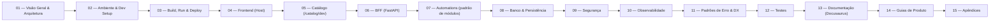

A doc de dev do Portal AGEPAR foi pensada como um **livro linear** sobre a
plataforma, dividido hoje em **15 seções principais (01–15)**.

As seções 01–12 cobrem a plataforma em si, enquanto as seções 13–15 consolidam:

- o padrão editorial da própria documentação;
- os guias de produto do fluxo de compras;
- os apêndices e materiais de apoio.

Cada seção:

- corresponde a uma pasta `NN-*` em `apps/docs-site/docs/`,
- segue o mesmo padrão de `index.md` + tópicos + `99-referencias.mdx`,
- cobre um “pedaço” bem definido da arquitetura ou da documentação.

---

## 1) Visão macro: o que as seções 01–15 cobrem


```mermaid
flowchart LR
  S1["01 — Visão Geral & Arquitetura"]
  S2["02 — Ambiente & Dev Setup"]
  S3["03 — Build, Run & Deploy"]
  S4["04 — Frontend (Host)"]
  S5["05 — Catálogo (/catalog/dev)"]
  S6["06 — BFF (FastAPI)"]
  S7["07 — Automations (padrão de módulos)"]
  S8["08 — Banco & Persistência"]
  S9["09 — Segurança"]
  S10["10 — Observabilidade"]
  S11["11 — Padrões de Erro & DX"]
  S12["12 — Testes"]
  S13["13 — Documentação (Docusaurus)"]
  S14["14 — Guias de Produto"]
  S15["15 — Apêndices"]

  S1 --> S2 --> S3 --> S4 --> S5 --> S6 --> S7 --> S8
  S8 --> S9 --> S10 --> S11 --> S12 --> S13 --> S14 --> S15
```

Lendo na ordem, você:

1. entende **o que é** a plataforma (01),
2. sobe o ambiente de dev (02),
3. aprende a **rodar, buildar e publicar** (03),
4. vê como o **Host** funciona (04),
5. entende o **catálogo** que dirige o Host (05),
6. mergulha no **BFF** (06),
7. aprende o **padrão de automations** (07),
8. vê onde tudo é persistido (08),
9. entende as decisões de **segurança** (09),
10. vê como **observamos** o sistema (10),
11. como padronizamos **erros e DX** (11),
12. e como **testar** tudo isso (12),
13. como a **própria documentação** é organizada (13),
14. como o **fluxo de produto** é mapeado no portal (14),
15. e onde ficam os **apêndices** reutilizáveis (15).

---

## 2) Padrão estrutural de cada seção

Cada pasta `NN-*` segue a mesma receita:

- `index.md`
  - `sidebar_position: 0`;
  - objetivos da seção;
  - sumário rápido;
  - ligação com as outras seções.

- tópicos numerados (ex.: `01-...`, `02-...`, …)
  - frontmatter completo (`id`, `title`, `sidebar_position`);
  - corpo explicando o recorte com exemplos reais do repositório.

- `99-referencias.mdx`
  - lista curada de arquivos do monorepo relacionados àquela seção;
  - facilita “voltar do doc para o código”.

Exemplo genérico de frontmatter de tópico:

```md
---
id: cors-restrito
title: "CORS restrito"
sidebar_position: 1
---
```

---

## 3) Convenção editorial importante

As seções novas não devem nascer fora do padrão mínimo. O checklist editorial é:

- frontmatter completo;
- links relativos funcionando;
- referência explícita ao **estado atual** quando o assunto for sensível a drift;
- observação curta quando o arquivo tiver nome histórico que ainda não foi renomeado.
