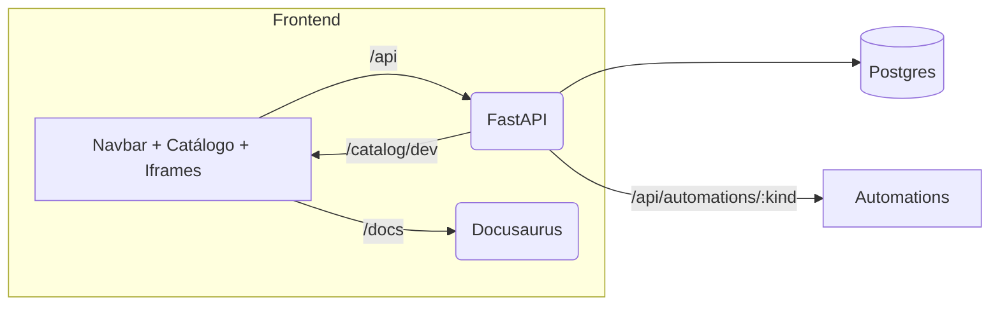
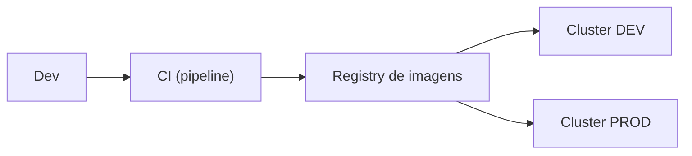
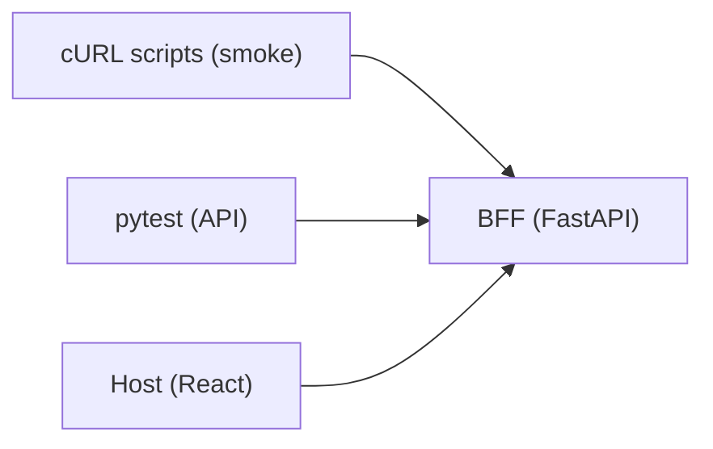

A doc de dev do Portal AGEPAR usa **Mermaid** para diagramas e a pasta `static/`
do Docusaurus para **assets estáticos** (imagens, favicons, social card).

Esta página explica:

- como o Mermaid está habilitado no Docusaurus,
- padrões de desenho (fluxos, arquitetura, etc.),
- cuidados para evitar erros de parsing,
- como organizar e referenciar imagens em `static/img`.

---

## 1) Mermaid no Docusaurus: como está habilitado

O suporte a Mermaid vem da configuração em `apps/docs-site/docusaurus.config.ts`:

```ts title="apps/docs-site/docusaurus.config.ts (trecho)" showLineNumbers
const config: Config = {
  // ...
  themes: ['@docusaurus/theme-mermaid', '@docusaurus/theme-live-codeblock'],
  markdown: {
    mermaid: true,
    hooks: {
      // substitui o antigo onBrokenMarkdownLinks na raiz do config
      onBrokenMarkdownLinks: 'warn',
    },
  },
  // ...
};
````

Com isso:

* qualquer bloco com:

  ```mermaid
  flowchart LR
    A --> B
  ```

  é renderizado automaticamente;

* não é preciso importar nada nas páginas (`.md`/`.mdx`);

* `@docusaurus/theme-live-codeblock` continua funcionando normalmente para snippets
  de código (`tsx live`, etc.).

---

## 2) Padrões de diagramas Mermaid usados no projeto

### 2.1. Diagramas de fluxo (`flowchart`)

O tipo de diagrama mais usado nos docs é o **`flowchart`**, por exemplo em `docs/intro.md`:



Padrões adotados:

* **`flowchart LR`** (left → right) para fluxos de arquitetura.
* `subgraph` para agrupar:

  * Frontend (Host),
  * BFF,
  * serviços externos, etc.
* Formas:

  * `Name[...]` → “blocos” externos/visuais,
  * `Name(...)` → serviços,
  * `Name[(...)]` → bancos/armazenamento.

### 2.2. Fluxos de desenvolvimento / CI

Em outras páginas (ex.: build/deploy, automations), o padrão é o mesmo:

* nós representando:

  * Dev,
  * CI,
  * Registry (imagens),
  * Ambientes (dev, homolog, prod),
* setas com labels curtos (`build`, `deploy`, `tests`).

Exemplo simplificado:



---

## 3) Boas práticas e “armadilhas” com Mermaid

### 3.1. Evitar quebras de linha dentro de labels

Erros comuns de renderização (como `Parse error on line ...`) quase sempre vêm de:

* colocar `\n` direto dentro do label do nó:

  ```text
  %% NÃO FAZER (exemplo de Mermaid inválido – não use assim)
  flowchart LR
    CURL[cURL scripts\n(manual/smoke)]
  ```

* ou usar caracteres estranhos fora de aspas/colchetes.

**Padrão recomendado:**

* usar labels **em uma linha só**;
* se precisar de mais texto, colocar no parágrafo acima/abaixo do diagrama.



### 3.2. Dicas gerais

* Manter nomes curtos para os nós (ex.: `HOST`, `BFF`, `DB`, `DOCS`).
* Usar descrições humanas nos labels: `"Host (React/Vite)"`, `"BFF (FastAPI)"`.
* Usar `|label|` nas setas **apenas quando ajuda** (`|/api|`, `|build|`).
* Quando o diagrama ficar muito grande:

  * considerar quebrar em dois;
  * ou simplificar o nível de detalhe.

---

## 4) Organização de assets (`static/img`)

Docusaurus serve arquivos estáticos a partir da pasta `static/`.

No projeto:

```text
apps/docs-site/
  static/
    img/
      favicon.ico
      logo.png
      docusaurus-social-card.jpg
      ...
```

No `docusaurus.config.ts`:

```ts title="apps/docs-site/docusaurus.config.ts — favicon/logo/imagem" showLineNumbers
const config: Config = {
  // ...
  favicon: 'img/favicon.ico',
  themeConfig: {
    navbar: {
      title: 'Plataforma AGEPAR',
      logo: {
        alt: 'Logo da Plataforma AGEPAR',
        src: 'img/logo.png',
      },
      // ...
    },
    image: 'img/docusaurus-social-card.jpg',
  },
};
```

Regras adotadas:

* **Imagens compartilhadas** (logo, social card, ilustrações gerais):

  * sempre em `static/img/`,
  * referenciadas como `'img/arquivo.ext'` em `docusaurus.config.ts`.
* **Outros assets** (ícones específicos, capturas de tela):

  * também em `static/img/`,
  * referenciados nas docs como `/img/arquivo.ext`.

### 4.1. Referenciando imagens nas páginas

Para usar uma imagem em uma doc:

```md title="Exemplo de uso de imagem estática"

```

* O caminho sempre começa com `/img/...` (raiz do site, respeitando o `baseUrl`).
* Em dev, abrindo o site em `/devdocs/`, o link real será `/devdocs/img/...`.

> Mesmo que hoje as docs usem poucas imagens, esse padrão já está pronto
> para adicionar diagramas exportados ou capturas de tela no futuro.

---

## 5) Quando usar Mermaid vs imagem

Critérios sugeridos:

**Use Mermaid quando:**

* o diagrama é **estrutural** ou **de fluxo** e pode mudar com frequência:

  * arquitetura (Host/BFF/DB/docs),
  * fluxo de automations,
  * sequência de chamadas (cURL → Host → BFF → DB).
* você quer que o diagrama seja **editável no próprio Markdown**.

**Use imagem (PNG/SVG) quando:**

* o diagrama foi feito em outra ferramenta (Figma, draw.io, etc.),
* a forma/estilo é importante (mock de tela, UI),
* há muitos detalhes gráficos difíceis de expressar em Mermaid.

---

## 6) Checklist para novos diagramas/assets

Antes de subir um PR mexendo com diagramas ou imagens:

### Mermaid

* [ ] Usei ` ```mermaid` com `flowchart` ou outro tipo suportado.
* [ ] Não coloquei `\n` dentro de labels de nós.
* [ ] Labels são curtos e claros (`"Host (React/Vite)"`, `"BFF (FastAPI)"`).
* [ ] O diagrama realmente **ajuda** a entender o texto (não é enfeite gratuito).

### Assets

* [ ] Coloquei arquivos em `apps/docs-site/static/img/`.
* [ ] Usei nomes em `kebab-case` (`fluxo-compras.png`, `logo-agepar.svg`).
* [ ] Referenciei imagens como `/img/nome-do-arquivo.ext`.
* [ ] Se alterei `favicon`, `logo` ou `image`, atualizei `docusaurus.config.ts`.

---

> _Criado em 2025-12-02_