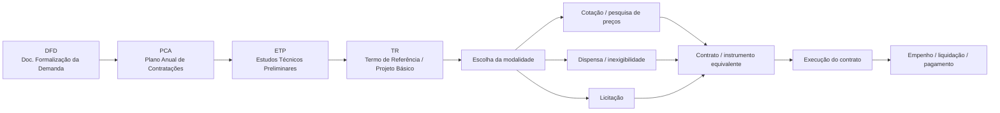
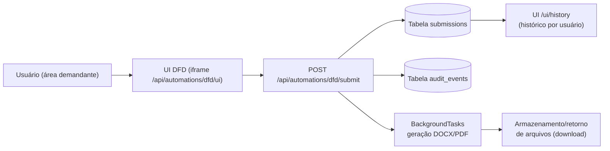

Esta página amarra a **visão de produto** do Portal AGEPAR para o fluxo completo de
compras públicas:

> DFD → PCA → ETP → TR → Cotação/Dispensa/Licitação → Contrato → Execução/Empenho/Pagamento,

mostrando **o que já existe hoje (MVP de DFD)** e o que ainda está em **desenho de produto**
para próximas automações.

> Referências no repositório:  
> `apps/bff/app/automations/dfd.py`  
> `apps/bff/app/automations/templates/dfd/ui.html`  
> `apps/bff/app/utils/docx_tools.py`  
> `catalog/catalog.dev.json`  
> `apps/docs-site/docs/07-automations-padrão-de-módulos/*`  

---

## 1) Visão geral do fluxo de compras público (produto)

De forma simplificada, o fluxo alvo que a plataforma quer cobrir é:

1. **DFD — Documento de Formalização da Demanda**  
   A área demandante formaliza a necessidade (objeto, justificativa, prioridade,
   estimativa de valor, alinhamento com o planejamento).

2. **PCA — Plano Anual de Contratações**  
   A demanda é mapeada para o **PCA** do exercício (ano de referência, agrupamento
   por tipo de objeto, priorização macro da organização).

3. **ETP — Estudos Técnicos Preliminares**  
   Análise da solução pretendida, alternativas tecnológicas, dimensionamento,
   riscos, justificativa de custo/benefício.

4. **TR — Termo de Referência / Projeto Básico**  
   Consolida o escopo técnico, critérios de medição e de aceitação, requisitos
   mínimos de qualidade, obrigações da contratada/contratante.

5. **Cotação / Dispensa / Licitação**  
   Escolha da **modalidade de contratação**, a partir do valor, objeto e
   enquadramento legal:
   - **Cotação / pesquisa de preços**,  
   - **Dispensa / inexigibilidade**,  
   - **Procedimento licitatório** (pregão, concorrência etc.).

6. **Contrato / instrumento equivalente**  
   Formalização jurídica da contratação (contrato, ata de registro de preços
   ou instrumento simplificado).

7. **Execução / Empenho / Pagamento**  
   Acompanhamento da execução contratual, emissão de notas fiscais, atesto,
   empenho, liquidação e pagamento.

No Portal AGEPAR, a ideia é **amarrar tudo isso em trilhas de auditoria**
(`submissions` + `audits`) e em **automações modulares** (um módulo por etapa
ou grupo de etapas), sem engessar as particularidades de cada órgão/projeto.

---

## 2) Diagrama de alto nível do fluxo



A automação **DFD** já existe e está **em produção no BFF** (MVP).
As demais etapas aparecem como **visão de produto** (e exemplos no catálogo),
mas ainda não possuem módulos dedicados no código.

---

## 3) O que o Portal AGEPAR cobre hoje (MVP)

> ⚠️ Estado atual: até o monorepo desta doc, **somente a etapa DFD** está
> implementada como automação (`apps/bff/app/automations/dfd.py`).
> As demais etapas são **planejamento/visão** descritos aqui para orientar
> o desenho dos próximos módulos.

### 3.1 Quadro-resumo por etapa

| Etapa                                  | No Portal AGEPAR hoje                                                      | Observações                                                                                 |
| -------------------------------------- | -------------------------------------------------------------------------- | ------------------------------------------------------------------------------------------- |
| **DFD**                                | Automação `dfd` (BFF + UI em iframe, geração DOCX/PDF, submissions/audits) | MVP já funcional; valida payload com `DfdIn`, gera artefatos e audita toda a linha do tempo |
| **PCA**                                | Campo `pcaAno` dentro do DFD                                               | Ainda **sem automação própria**; planejamento é ter módulo `pca` específico                 |
| **ETP**                                | Apenas como etapa conceitual                                               | A ser estruturada como automação dedicada (modelos DOCX, validação e trilha de auditoria)   |
| **TR**                                 | Apenas como etapa conceitual                                               | Planejado como módulo separado (`tr`) gerando Termo de Referência / Projeto Básico          |
| **Cotação / Dispensa / Licitação**     | Não há módulos específicos ainda                                           | Exemplos de catálogo já citam rotas de automations futuras (`pca`, `tr` etc.)               |
| **Contrato / instrumento equivalente** | Não há automação dedicada                                                  | Visão de produto: geração de minutas com base em DFD/ETP/TR e dados consolidados            |
| **Execução / Empenho / Pagamento**     | Fora do escopo do MVP de software                                          | Podem ser integradas futuramente (via integrações externas e/ou módulos de acompanhamento)  |

A ideia central é: **DFD já é a “porta de entrada” digital** de todo o fluxo.
As próximas automações vão **reaproveitar dados do DFD** e construir em cima
da mesma base de `submissions` + `audits`.

---

## 4) DFD: porta de entrada do fluxo de compras

### 4.1 Objetivo do DFD no Portal

A automação `dfd` tem como objetivo:

* Garantir que **toda demanda** de compras comece com um DFD formalizado;
* Amarrar o DFD a um **ano de PCA** (`pcaAno`), reduzindo ruído de planejamento;
* Estruturar os **itens de aquisição** (quantidade, unidade, valor estimado,
  dependências), calculando automaticamente o valor total;
* Gerar artefatos padronizados (DOCX e, quando possível, PDF) a partir de
  **modelos parametrizados** (`MODELS_DIR`);
* Criar **submissions** e **audits** de forma consistente para permitir trilha
  de auditoria e reprocessamentos.

### 4.2 Campos principais (modelo de entrada)

O modelo de entrada (`DfdIn`) segue o padrão Pydantic v2 com:

```python title="apps/bff/app/automations/dfd.py — modelo simplificado" showLineNumbers
class DfdIn(BaseModel):
    model_config = ConfigDict(populate_by_name=True, extra="ignore")

    modelo_slug: str = Field(..., alias="modeloSlug")
    numero: str
    assunto: str
    pca_ano: str = Field(..., alias="pcaAno", pattern=r"^\d{4}$")
    protocolo: str
    diretoria_demandante: str = Field(..., alias="diretoriaDemandante")

    alinhamento_pe: Optional[str] = Field("", alias="alinhamentoPE")
    justificativa_necessidade: Optional[str] = Field("", alias="justificativaNecessidade")
    objeto: str
    consequencia_nao_aquisicao: Optional[str] = Field("", alias="consequenciaNaoAquisicao")
    grau_prioridade: Optional[str] = Field(None, alias="grauPrioridade")

    items: List[Item]
```

E cada **item de aquisição** (classe `Item`) inclui:

* descrição,
* flags de dependência (`haDependencia`, `dependenciaQual`),
* indicação de renovação de contrato anterior,
* `quantidade`, `unidadeMedida`, `valorUnitario`,
* cálculo automático de `valorTotal` (validação de negócios).

Pontos importantes:

* `model_config.extra = "ignore"` evita 422 triviais por campos extras;
* `pca_ano` força um **ano de PCA válido** (4 dígitos);
* validators normalizam strings (`strip()`, conversões básicas) e consolidam
  números antes de salvar.

### 4.3 Fluxo técnico da automação DFD

Em alto nível, o `POST /submit` da automação `dfd` faz:

1. **Normalização do payload bruto** (campos obrigatórios, trims, defaults);
2. Validação via `DfdIn` (Pydantic v2) e formatação de erros em pt-BR;
3. Checagem de **duplicidade** (por `numero` + `protocolo`);
4. Criação de uma **submission** com status `queued` em `submissions`;
5. Registro de **audit** (`event_type="dfd_submitted"` / similares);
6. Agendamento de `BackgroundTasks` para gerar o DOCX/PDF;
7. Atualização da submissão (`status`, `result`, `error`) conforme o processamento.

Diagrama resumido:



RBAC (hoje, em `dfd.py`):

* Criação/listagem: **papel `compras`** (mínimo);
* Downloads: `compras`, `coordenador`, `admin` (papeis elevados).

---

## 5) Como as próximas etapas se conectam ao DFD

Embora só o DFD esteja implementado, o desenho de produto prevê:

1. **PCA**

   * O campo `pcaAno` do DFD já “cola” a demanda ao PCA.
   * Futuramente, um módulo `pca` poderia:

     * consolidar itens por ano e diretoria,
     * gerar relatórios/visões sintéticas do plano anual,
     * expor APIs de consulta/relação DFD ↔ PCA.

2. **ETP**

   * Poderá consumir os dados do DFD (objeto, justificativa, valor estimado)
     para pré-preencher o ETP.
   * Automação dedicada deve gerar modelos de ETP (DOCX/PDF) e manter uma
     trilha própria em `submissions`/`audits`.

3. **TR**

   * Deve aproveitar ETP + DFD para montar o **escopo consolidado**.
   * A automação `tr` seguiria o mesmo padrão:

     * `GET /schema`, `GET /ui`, `POST /submit`, `GET /submissions`, etc.,
     * templates em `apps/bff/app/automations/templates/tr/ui.html`.

4. **Cotação / Dispensa / Licitação**

   * Podem ser uma ou mais automations (ex.: `cotacao`, `dispensa`, `licitacao`)
     com templates específicos, mas sempre:

     * consumindo os dados consolidados do DFD/ETP/TR,
     * gerando peças próprias e registrando cada decisão em `audits`.

5. **Contrato e Execução**

   * Devem ser vistos como **blocos finais** do fluxo:

     * geração do contrato a partir de parâmetros de TR + resultado da contratação,
     * registro de marcos de execução (ordens de serviço, notas fiscais, atestos),
     * eventualmente integrando com sistemas externos para empenho/pagamento.

A regra é: **toda etapa importante deve virar uma automação modular**, seguindo o
padrão descrito em `07-automations-padrão-de-módulos`.

---

## 6) Exemplos de uso da automação DFD (cURL / TS / Python)

### 6.1 cURL — enviar um DFD mínimo

```bash title="cURL — POST /api/automations/dfd/submit" showLineNumbers
# Pré-requisito: já ter feito login mock/real e ter o cookie de sessão.

curl -i -X POST http://localhost:8000/api/automations/dfd/submit \
  -H "Content-Type: application/json" \
  -H "Cookie: session=<valor-do-cookie-de-sessao>" \
  -d '{
    "modeloSlug": "padrao",
    "numero": "2025-001",
    "assunto": "Aquisição de serviços de manutenção",
    "pcaAno": "2025",
    "protocolo": "12345-000001/2025",
    "diretoriaDemandante": "Diretoria de Operações",
    "objeto": "Contratação de empresa especializada para manutenção preventiva.",
    "items": [
      {
        "descricao": "Manutenção preventiva mensal",
        "haDependencia": "Não",
        "renovacaoContrato": "Não",
        "quantidade": 12,
        "unidadeMedida": "mês",
        "valorUnitario": 1000.0
      }
    ]
  }'
```

Resposta esperada (resumo):

* `201` ou `200` com JSON contendo `sid` (ID da submission) e `status` inicial
  (`queued`), ou mensagem de erro padronizada (`code`, `message`, `details`).

### 6.2 TypeScript — chamada a partir do Host

Trecho baseado no guia de snippets:

```ts title="apps/host/src/lib/api-dfd.ts — submitDfd" showLineNumbers
export async function submitDfd(body: unknown) {
  const res = await fetch("/api/automations/dfd/submit", {
    method: "POST",
    credentials: "include",
    headers: { "Content-Type": "application/json" },
    body: JSON.stringify(body),
  });

  if (!res.ok) {
    // lidar com erros 4xx/5xx usando padrão global de erros
    throw new Error(`Falha ao enviar DFD: ${res.status}`);
  }

  return (await res.json()) as { sid: string; status: string };
}
```

### 6.3 Python — estrutura básica do endpoint (BFF)

Trecho simplificado da automação:

```python title="apps/bff/app/automations/dfd.py — POST /submit (resumido)" showLineNumbers
@router.post("/submit")
async def submit_dfd(
    request: Request,
    body: Dict[str, Any],
    background: BackgroundTasks,
    user: Dict[str, Any] = Depends(require_roles_any(*REQUIRED_ROLES)),
):
    raw = _normalize_raw_body(body)
    if not raw["modeloSlug"]:
        return err_json(422, code="validation_error", message="Timbre é obrigatório.")

    try:
        payload = DfdIn(**raw)
    except ValidationError as ve:
        friendly = _format_validation_errors(ve)
        return err_json(422, code="validation_error", message="Erro de validação.", details=friendly)

    sid = await create_submission(kind=KIND, payload=payload.model_dump(), user=user)
    background.add_task(_process_submission, sid=sid, user=user)
    return {"sid": sid, "status": "queued"}
```

Esse padrão deve ser **reutilizado** nas futuras automations (PCA, ETP, TR, etc.),
mantendo consistência de validação, auditoria e estrutura de respostas.

---

## Próximos passos

* [ ] Criar uma página específica para a automação **DFD** detalhando UI, schema e modelos DOCX.
* [ ] Formalizar o desenho das automations **PCA**, **ETP** e **TR** (slugs, campos, artefatos).
* [ ] Definir a estratégia de automations para **Cotação/Dispensa/Licitação** (módulos separados ou unificados).
* [ ] Modelar a automação de **Contrato** com base nos dados consolidados das etapas anteriores.
* [ ] Especificar (ou decidir manter fora de escopo) integrações para **Execução/Empenho/Pagamento**.

---

> _Criado em 2025-12-03_