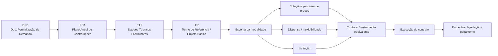

Esta página amarra a **visão de produto** do Portal AGEPAR para o fluxo completo de
compras públicas:

> DFD → PCA → ETP → TR → Cotação/Dispensa/Licitação → Contrato → Execução/Empenho/Pagamento

mostrando **o que já existe hoje no código** e o que ainda está em **desenho de produto**
para próximas automações.

> Referências no repositório:
> `apps/bff/app/automations/dfd.py`
> `apps/bff/app/automations/etp.py`
> `catalog/catalog.dev.json`
> `apps/docs-site/docs/07-automations-padrão-de-módulos/*`

---

## 1) Visão geral do fluxo de compras público

De forma simplificada, o fluxo alvo que a plataforma quer cobrir é:

1. **DFD — Documento de Formalização da Demanda**
   A área demandante formaliza a necessidade (objeto, justificativa, prioridade,
   estimativa de valor, alinhamento com o planejamento).

2. **PCA — Plano Anual de Contratações**
   A demanda é mapeada para o PCA do exercício, com visão anual e agrupamentos.

3. **ETP — Estudos Técnicos Preliminares**
   Análise da solução pretendida, alternativas, riscos, justificativa e critérios
   que antecedem o detalhamento contratual.

4. **TR — Termo de Referência / Projeto Básico**
   Consolida o escopo técnico, critérios de medição e de aceitação, requisitos
   mínimos de qualidade e obrigações das partes.

5. **Cotação / Dispensa / Licitação**
   Escolha da modalidade de contratação conforme valor, objeto e enquadramento legal.

6. **Contrato / instrumento equivalente**
   Formalização jurídica da contratação.

7. **Execução / Empenho / Pagamento**
   Acompanhamento da execução contratual, atesto, liquidação e pagamento.

No Portal AGEPAR, a ideia é amarrar esse fluxo em **automações modulares** e em
**trilhas de persistência/auditoria** adequadas a cada camada:

- `submissions` + `automation_audits` para automações;
- `audit_events` para eventos mais amplos da plataforma.

---

## 2) Diagrama de alto nível do fluxo

```mermaid
flowchart LR
  DFD["DFD<br/>Doc. Formalização da Demanda"]
    --> PCA["PCA<br/>Plano Anual de Contratações"]

  PCA --> ETP["ETP<br/>Estudos Técnicos Preliminares"]
  ETP --> TR["TR<br/>Termo de Referência / Projeto Básico"]

  TR --> MODAL["Escolha da modalidade"]

  MODAL --> COT["Cotação / pesquisa de preços"]
  MODAL --> DISP["Dispensa / inexigibilidade"]
  MODAL --> LIC["Licitação"]

  COT --> CONTR["Contrato / instrumento equivalente"]
  DISP --> CONTR
  LIC --> CONTR

  CONTR --> EXEC["Execução do contrato"]
  EXEC --> EMP["Empenho / liquidação / pagamento"]
```

---

## 3) O que o Portal AGEPAR cobre hoje

### 3.1 Quadro-resumo por etapa

| Etapa | No Portal AGEPAR hoje | Observações |
| --- | --- | --- |
| **DFD** | Automação `dfd` (BFF + UI em iframe, schema, submit e downloads) | Módulo consolidado em `apps/bff/app/automations/dfd.py` e bloco real em `catalog/catalog.dev.json` |
| **PCA** | Bloco `pca` em modo demo | Hoje aponta para `/api/demo?view=pca`; ainda sem `pca.py` dedicado |
| **ETP** | Automação `etp` real | Implementada em `apps/bff/app/automations/etp.py` e exposta no catálogo como bloco `etp` |
| **TR** | Ainda sem módulo dedicado | Mantido como backlog de produto/documentação |
| **Cotação / Dispensa / Licitação** | Ainda sem módulos dedicados | Mantidos como backlog; podem virar 1–3 automações futuras |
| **Contrato / instrumento equivalente** | Ainda sem módulo dedicado | Backlog |
| **Execução / Empenho / Pagamento** | Fora do escopo atual do código | Pode depender de integrações e novas automações |

### 3.2 Módulos transversais que já ajudam o fluxo

Além dos módulos específicos de compras, o portal já possui blocos que apoiam o
fluxo de forma transversal:

- `form2json` — apoio para normalização/experimentos de payload;
- `fileshare` — compartilhamento de arquivos;
- `controle` — painéis administrativos e auditoria;
- `support` — suporte;
- `tasks` e `avisos` — coordenação operacional.

---

## 4) O que isso significa para o backlog

A prioridade documental correta, a partir deste snapshot, é:

1. tratar **DFD** e **ETP** como módulos já existentes;
2. tratar **PCA** como bloco demo, não como automação consolidada;
3. desenhar **TR** e etapas posteriores em cima de contratos já usados por DFD/ETP;
4. conectar futuras automações a `submissions`, `automation_audits`, catálogo e RBAC.

---

## 5) Observação de consistência

A categoria de catálogo usada para o fluxo de compras é **`compras`**.

Documentação que ainda falar em `cat1` para compras está refletindo um estado
anterior do projeto e deve ser corrigida.
