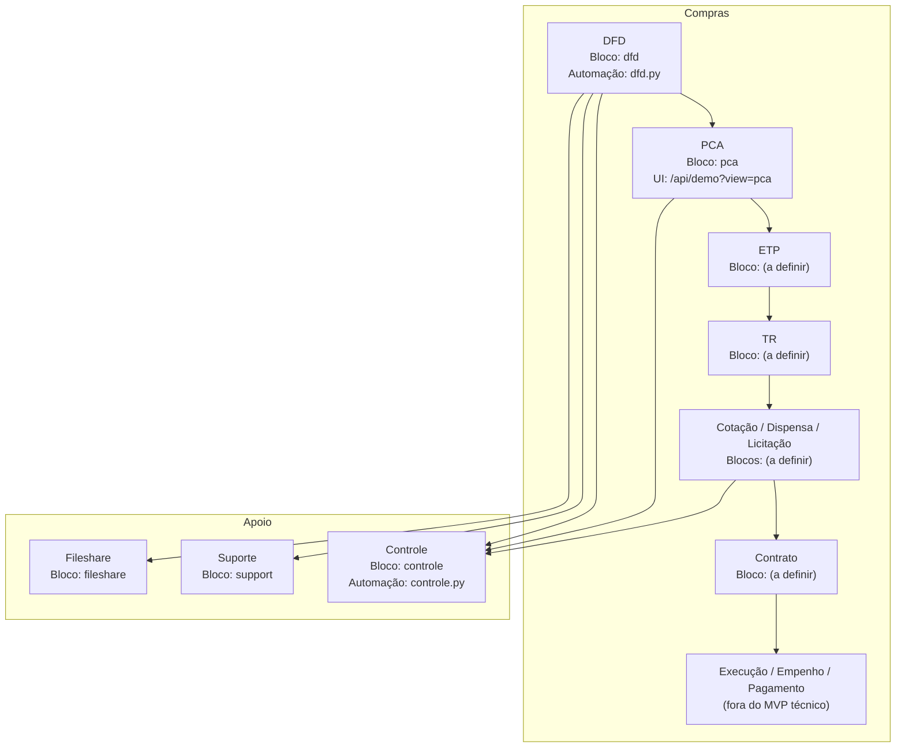

Esta página mostra **como o fluxo de compras público** (DFD → PCA → ETP → TR → Cotação/Dispensa/Licitação → Contrato → Execução/Empenho/Pagamento) é mapeado para:

- **categorias/blocos** do catálogo (`catalog/catalog.dev.json`) e  
- **módulos de automação** no BFF (`apps/bff/app/automations/*.py`).

A ideia é servir como **“tabela de verdade”** entre visão de produto e implementação técnica, indicando o que já existe, o que é protótipo e o que ainda é só plano.

> Referências no repositório:  
> `catalog/catalog.dev.json`  
> `apps/bff/app/main.py`  
> `apps/bff/app/automations/dfd.py`  
> `apps/bff/app/automations/form2json.py`  
> `apps/bff/app/automations/controle.py`  
> `apps/bff/app/automations/support.py`  
> `apps/bff/app/automations/fileshare.py`  
> `apps/docs-site/docs/05-catálogo-catalog-dev/*`  
> `apps/docs-site/docs/07-automations-padrão-de-módulos/*`  

---

## 1) Conceitos rápidos: etapa, bloco e automação

- **Etapa do fluxo**  
  Uma fase de negócio do processo de compras público  
  (ex.: *DFD*, *PCA*, *ETP*, *TR*, *Cotação*, *Contrato*, *Execução*).

- **Bloco no catálogo** (`catalog/catalog.dev.json`)  
  Um item da lista `blocks[]`, com:
  - `name` (slug), `displayName`, `categoryId`,
  - `ui` (normalmente `type: "iframe"`),
  - `navigation[]` (como aparece no Host),
  - `routes[]` (rotas internas do Host),
  - `requiredRoles`, `tags`, `order`, `hidden` etc.

- **Automação no BFF**  
  Um módulo FastAPI em `apps/bff/app/automations/{slug}.py`, com o padrão:

  ```python
  router = APIRouter(prefix="/api/automations/dfd", tags=["automations:dfd"])

  @router.get("/ui")
  async def ui(...): ...
  
  @router.post("/submit")
  async def submit(...): ...
    ```

Cada automação:

* valida entrada com **Pydantic v2** (ConfigDict extra="ignore"),
* cria registros em `submissions` + `audit_events`,
* gera artefatos (DOCX/PDF/JSON) e expõe downloads.

---

## 2) Quadro-resumo: etapas x blocos x automations

Mapa de alto nível do fluxo de compras para o estado atual do projeto:

| Etapa do fluxo                                               | Bloco no catálogo (`name`)                      | Categoria (`categoryId / label`) | Automação BFF (arquivo)                                     | Status no produto                                      |
| ------------------------------------------------------------ | ----------------------------------------------- | -------------------------------- | ----------------------------------------------------------- | ------------------------------------------------------ |
| **DFD — Documento de Formalização da Demanda**               | `dfd`                                           | `cat1` / Compras                 | `apps/bff/app/automations/dfd.py`                           | ✅ **Implementado (MVP)**                               |
| **PCA — Plano Anual de Contratações**                        | `pca`                                           | `cat1` / Compras                 | **Não há** `pca.py`; UI aponta para `/api/demo`             | 🧪 **Protótipo / demo** (bloco fake, sem automação)    |
| **ETP — Estudos Técnicos Preliminares**                      | *(a definir)*                                   | `cat1` / Compras                 | —                                                           | 📝 **Planejado**, sem bloco nem automação              |
| **TR — Termo de Referência / Projeto Básico**                | *(a definir, ex.: `tr`)*                        | `cat1` / Compras                 | —                                                           | 📝 **Planejado**, sem bloco nem automação              |
| **Cotação / Dispensa / Licitação**                           | *(a definir)*                                   | `cat1` / Compras                 | —                                                           | 📝 **Planejado**, possivelmente como 1–3 automations   |
| **Contrato / instrumento equivalente**                       | *(a definir)*                                   | `cat1` / Compras                 | —                                                           | 📝 **Planejado**, sem bloco nem automação              |
| **Execução / Empenho / Pagamento**                           | *(fora do MVP técnico)*                         | *(a definir)*                    | —                                                           | ⚪ Fora do escopo do MVP (pode depender de integrações) |
| **Apoio ao fluxo (Form → JSON, anexos, auditoria, suporte)** | `form2json`, `fileshare`, `controle`, `support` | `cat1`, `util`, `governanca`     | `form2json.py`, `fileshare.py`, `controle.py`, `support.py` | 🔧 Blocos **transversais** que ajudam o fluxo          |

> Em resumo: hoje **apenas o DFD** está implementado como automação de compras.
> O PCA existe como **bloco de catálogo de demonstração**, e as demais etapas são **visão de produto**.

---

## 3) Compras (cat1): DFD, PCA e utilitários

### 3.1 Categoria `cat1` — Compras

Trecho simplificado do catálogo:

```json title="catalog/catalog.dev.json — categoria Compras (cat1)"
{
  "categories": [
    { "id": "cat1", "label": "Compras", "icon": "ShoppingCart" },
    ...
  ],
  "blocks": [
    {
      "name": "dfd",
      "displayName": "DFD — Documento de Formalização da Demanda",
      "categoryId": "cat1",
      "ui": { "type": "iframe", "url": "/api/automations/dfd/ui" },
      "routes": [{ "path": "/dfd", "kind": "iframe" }],
      "requiredRoles": ["compras"],
      "order": 10
    },
    {
      "name": "pca",
      "displayName": "Plano de Contratações Anual",
      "categoryId": "cat1",
      "ui": { "type": "iframe", "url": "/api/demo?view=pca" },
      "routes": [{ "path": "/pca", "kind": "iframe" }],
      "requiredRoles": ["coordenador", "admin"]
    },
    {
      "name": "form2json",
      "displayName": "Formulário para JSON",
      "categoryId": "cat1",
      "ui": { "type": "iframe", "url": "/api/automations/form2json/ui" },
      "routes": [{ "path": "/form2json", "kind": "iframe" }],
      "requiredRoles": ["automations.form2json"],
      "hidden": true
    }
  ]
}
```

Pontos-chave:

* DFD (`dfd`) é o **bloco canônico** da etapa de formalização de demanda.
* PCA (`pca`) está mapeado, mas hoje é apenas um **iframe de demo** (`/api/demo?view=pca`).
* `form2json` é um **utilitário** para converter formulários em JSON (apoia outros fluxos).

### 3.2 DFD → bloco `dfd` → automação `dfd.py`

* **Etapa de negócio**: criação do Documento de Formalização da Demanda.

* **Bloco**: `name: "dfd"` em `categoryId: "cat1"`.

* **Automação BFF**: `apps/bff/app/automations/dfd.py`, com:

  ```python title="apps/bff/app/automations/dfd.py — trechos relevantes" showLineNumbers
  KIND = "dfd"
  DFD_VERSION = "2.4.0"
  REQUIRED_ROLES = ("compras",)
  ELEVATED_ROLES = ("admin", "coordenador")
  ```

  ```python
  router = APIRouter(
      prefix="/api/automations/dfd",
      tags=["automations:dfd"],
  )
  ```

* **UI**: `GET /api/automations/dfd/ui` (embutido via `<iframe>` pelo Host).

* **Submissão**: `POST /api/automations/dfd/submit` → cria `submissions.kind = "dfd"`.

* **Histórico**: o painel de controle (`controle.py`) consegue filtrar e auditar submissões `dfd`.

Ou seja: sempre que falamos em “etapa DFD” no fluxo de compras, estamos falando do **bloco `dfd` + automação `dfd.py`**.

### 3.3 PCA → bloco `pca` (demo por enquanto)

* **Etapa de negócio**: planejamento anual das contratações (PCA).
* **Bloco**: `name: "pca"`, `categoryId: "cat1"`.
* **UI atual**: iframe para `/api/demo?view=pca`.

Não existe (nesta versão do monorepo) um módulo `apps/bff/app/automations/pca.py`.
O PCA ainda **não é uma automação** — é apenas um **placeholder no catálogo** para:

* testar navegação,
* reservar `name: "pca"` e rota `/pca`,
* servir de lembrete para o futuro módulo de PCA.

Quando o módulo de PCA existir, o esperado é:

* `ui.url` trocar para `/api/automations/pca/ui`;
* `routes` continuarem em `/pca`;
* ser criado `apps/bff/app/automations/pca.py` seguindo o padrão dos módulos.

### 3.4 `form2json` como utilitário de fluxo

O bloco `form2json` (também em `cat1`) é um **utilitário transversal**:

* pode ser usado por equipes de compras para:

  * digitar formulários antigos e gerar JSON,
  * fazer testes rápidos de payloads que depois serão usados como base em automations.
* Não é uma **etapa formal do fluxo** (não corresponde a DFD, PCA, ETP etc.),
  mas é útil para **migrações e protótipos**.

---

## 4) Blocos de apoio que impactam o fluxo de compras

Além dos blocos diretamente em `cat1`, o fluxo de compras se apoia em automations de outras categorias.

### 4.1 Governança & Controle

| Bloco         | Categoria / arquivo                         | Papel em relação ao fluxo de compras                                  |
| ------------- | ------------------------------------------- | --------------------------------------------------------------------- |
| `controle`    | `governanca` / `automations/controle.py`    | Painel de auditoria de `submissions` e `audit_events` (inclui DFD)    |
| `accounts`    | `governanca` / `automations/accounts.py`    | Administração de contas e roles (quem pode acessar blocos de compras) |
| `usuarios`    | `governanca` / `automations/usuarios.py`    | Gestão de usuários em nível de aplicação                              |
| `whoisonline` | `governanca` / `automations/whoisonline.py` | Monitoramento de sessões (inclusive de usuários de compras)           |

Efeitos práticos:

* O fluxo de compras **depende de RBAC** correto:

  * `compras` para uso do DFD,
  * `coordenador`, `admin` para PCA, controle, etc.
* O **Painel de Controle (`controle`)** é o lugar onde:

  * um coordenador consegue ver as submissões `KIND="dfd"`,
  * auditar quem enviou, quando e qual foi o resultado (artefato gerado).

### 4.2 Suporte, anexos e arquivos temporários

| Bloco       | Categoria / arquivo                     | Papel em relação ao fluxo de compras                                   |
| ----------- | --------------------------------------- | ---------------------------------------------------------------------- |
| `support`   | `governanca` / `automations/support.py` | Canal de suporte/feedback; usado para relatos sobre fluxo de compras   |
| `fileshare` | `util` / `automations/fileshare.py`     | Upload de arquivos temporários (ex.: planilhas, anexos complementares) |

Exemplos de uso típico:

* Um servidor de compras encontra um problema na automação DFD → abre um chamado via `support`.
* Anexos volumosos (ex.: planilhas de composição de preços) podem ser:

  * enviados via `fileshare`,
  * mencionados no DFD (link),
  * e depois limpos automaticamente (TTL).

---

## 5) Diagrama: etapas do fluxo x blocos atuais

Este diagrama une as etapas de negócio com os blocos existentes hoje:



Leitura:

* Em **negrito** está o que já existe como automação (DFD, Controle, Support, Fileshare).
* Nós cinzas (ETP, TR, etc.) são **slots de produto** ainda não implementados.

---

## 6) Exemplos práticos (cURL / TS / Python)

### 6.1 cURL — ver blocos de compras no catálogo

```bash title="GET /catalog/dev — filtrando categoria Compras (cat1)" showLineNumbers
curl -s http://localhost:8000/catalog/dev \
  | jq '.blocks[] | select(.categoryId == "cat1")'
```

Saída esperada (resumo):

* um objeto para `dfd`,
* um para `pca`,
* um para `form2json` (hidden).

### 6.2 TypeScript — filtrar blocos do fluxo de compras no Host

```ts title="Exemplo — obtendo blocos de compras no Host" showLineNumbers
import type { CatalogBlock } from "@/types";

export function getPurchaseFlowBlocks(blocks: CatalogBlock[]) {
  const fluxoEtapas = new Set(["dfd", "pca"]); // etapas mapeadas hoje
  return blocks.filter(
    (b) => b.categoryId === "cat1" && fluxoEtapas.has(b.name)
  );
}
```

Uso típico:

* Carregar `/catalog/dev` no Host,
* filtrar blocos de compras,
* montar uma área “Fluxo de Compras” específica na UI.

### 6.3 Python — exemplo de como identificar submissions DFD no BFF

```python title="Exemplo conceitual — listar submissions KIND='dfd'" showLineNumbers
from app.db import list_submissions

def listar_submissoes_dfd(limit: int = 50):
    # Em produção, esse filtro costuma ser feito dentro da própria automação/controle.
    rows = list_submissions(kind="dfd", limit=limit)
    return [
        {
            "sid": r["id"],
            "created_at": r["created_at"],
            "status": r["status"],
            "actor": r["actor"],
        }
        for r in rows
    ]
```

> Observação: o painel de controle (`controle.py`) já faz esse tipo de listagem,
> mas este exemplo mostra como o **KIND** de cada automação é o ponto de ligação
> entre “etapa do fluxo” e “tipo de submission” no banco.

---

## Próximos passos

* [ ] Atualizar o bloco `pca` para apontar para uma automação real (`/api/automations/pca/ui`).
* [ ] Definir slugs e estrutura de blocos/automations para **ETP**, **TR** e **Contratos**.
* [ ] Documentar, em páginas próprias, o desenho de cada automação futura (campos, validações, artefatos).
* [ ] Conectar a automação de **Controle** a uma visão específica de “Fluxo de Compras” (filtros prontos para KINDs de compras).
* [ ] Decidir se **Execução/Empenho/Pagamento** ficará fora do portal ou ganhará integrações/módulos dedicados.

---

> _Criado em 2025-12-03_