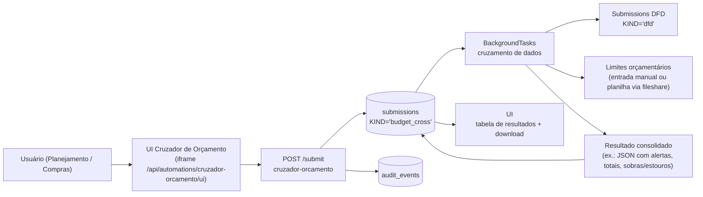

Esta página descreve a **ideia de produto** da automação paralela **“cruzador de
orçamento”**: um módulo que cruza informações de demandas (DFDs) com limites
orçamentários/planejamento (ex.: PCA, centros de custo, naturezas de despesa),
para apontar riscos de **estouro de orçamento**, **duplicidade** e **inconsistências**.

> Referências no repositório (estado atual):  
> `docusaurus-timeline.json` (seção "Guias de Produto — Fluxo Compras Público")  
> `catalog/catalog.dev.json`  
> `apps/bff/app/automations/dfd.py`  
> `apps/bff/app/automations/controle.py`  
> `apps/bff/app/automations/fileshare.py`  
> `apps/bff/app/db.py`  
> `apps/docs-site/docs/07-automations-padrão-de-módulos/*`  
> `apps/docs-site/docs/14-guias-de-produto-fluxo-compras-público/01-dfd---pca---etp---tr---cotação-dispensa-licitação---contrato---execução-empenho-pagamento.md`  

> ⚠️ Importante: nesta versão do monorepo, **não existe ainda** uma automação
> implementada para o cruzador de orçamento (nenhum `cruzador_orcamento.py`,
> nenhum bloco dedicado no catálogo).  
> Esta página documenta **o desenho de produto** e como essa automação deve se
> encaixar na arquitetura existente.

---

## 1) O que é o “cruzador de orçamento” no contexto do Portal

No fluxo de compras público, várias decisões dependem de **limites orçamentários**:

- quanto cada diretoria pode gastar em determinado tipo de objeto,
- limites por **fonte de recurso**, **natureza de despesa**, **UG/gestão**,
- teto anual de determinadas linhas do PCA.

O Portal AGEPAR já tem:

- **DFD** como porta de entrada das demandas (`KIND="dfd"` no banco);
- trilha de auditoria (`submissions` + `audit_events`);
- automações de apoio (ex.: `controle`, `fileshare`).

O **cruzador de orçamento** é pensado como uma **automação paralela** que:

- **não substitui** DFD, PCA, ETP, TR, etc.,
- mas cruza os dados das demandas **já cadastradas** (DFDs) com:
  - planilhas ou bases de limites orçamentários,
  - parâmetros de corte (ano, diretoria, natureza de despesa),
- e devolve um **relatório consolidado** com:
  - sobras e estouros de orçamento,
  - demandas concorrendo pelo mesmo “pedaço” de orçamento,
  - alertas para revisão/negociação de prioridades.

Em resumo: é uma ferramenta de **análise transversal** sobre o que as automações
de compras já produziram.

---

## 2) Cenários de uso (produto)

Alguns cenários típicos para essa automação:

1. **Antes de fechar o PCA do ano**
   - As diretorias já cadastraram DFDs com `pcaAno = 2025`, por exemplo;
   - A área de planejamento importa/define:
     - limites por diretoria/centro de custo,
     - teto por tipo de gasto,
   - O cruzador:
     - soma os valores estimados dos DFDs,
     - aponta onde há **demanda maior que o orçamento**,
     - sugere onde cortar/postergar/ajustar.

2. **Ao priorizar demandas dentro de uma diretoria**
   - Diretoria X tem 10 DFDs para o mesmo exercício;
   - Orçamento só comporta 6;
   - O cruzador ajuda a:
     - aplicar regras de prioridade (campo `grauPrioridade` do DFD),
     - identificar quais DFDs “cabem” no orçamento e quais precisariam de ajuste.

3. **Monitorar impacto de novas demandas**
   - Um novo DFD é cadastrado no meio do ano;
   - O cruzador simula o impacto dessa nova demanda no orçamento:
     - “Se aprovado, sua diretoria passa a 110% do limite desta natureza de despesa”.

4. **Auditoria e transparência**
   - A área de governança pode extrair relatórios:
     - “quanto já está comprometido do orçamento X?”,
     - “quais DFDs foram aprovados em contexto de estouro de orçamento?”.

---

## 3) Status atual no repositório

Até o snapshot deste monorepo:

- Não há **arquivo de automação** (ex.: `apps/bff/app/automations/cruzador_orcamento.py`);
- Não há **bloco dedicado** no catálogo (ex.: `name: "cruzador-orcamento"`);
- Não há **UI HTML** em `apps/bff/app/automations/templates/...` para esse tema.

O que existe é:

- a **menção de produto** em `docusaurus-timeline.json` (seção 14, tópico
  “Automação paralela: cruzador de orçamento”);
- a **infraestrutura genérica** para:
  - automations (`/api/automations/{slug}/...`),
  - `submissions`/`audit_events`,
  - catálogo (`catalog/catalog.dev.json`),
  - UI em iframe pelo Host.

Esta página, portanto, funciona como **especificação inicial** para:

- o desenho do bloco de catálogo,
- o módulo de automação no BFF,
- o tipo de artefato/relatório a ser gerado.

---

## 4) Encaixe na arquitetura: proposta de slug, bloco e automação

### 4.1 Slug e nomes sugeridos

Sugestão de convenções (ainda a validar, mas já alinhadas com o resto do projeto):

- **Slug do módulo**: `cruzador-orcamento`
- **KIND em `submissions`**: `budget_cross` (ou `cruzador_orcamento`)
- **Arquivo BFF** (quando implementado):  
  `apps/bff/app/automations/cruzador_orcamento.py`
- **Templates de UI**:  
  `apps/bff/app/automations/templates/cruzador_orcamento/ui.html`

### 4.2 Proposta de bloco no catálogo

Exemplo de bloco a ser adicionado futuramente em `catalog/catalog.dev.json`:

```jsonc
{
  "name": "cruzador-orcamento",
  "displayName": "Cruzador de orçamento",
  "version": "0.1.0",
  "categoryId": "cat1", // Compras
  "ui": {
    "type": "iframe",
    "url": "/api/automations/cruzador-orcamento/ui"
  },
  "navigation": [
    {
      "label": "Cruzador de orçamento",
      "path": "/cruzador-orcamento",
      "icon": "Sigma"
    }
  ],
  "routes": [
    { "path": "/cruzador-orcamento", "kind": "iframe" }
  ],
  "requiredRoles": ["compras", "planejamento"],
  "tags": ["análise", "orçamento", "compras"],
  "order": 40
}
```

> Observação: essa definição **ainda não está no catálogo** — é um modelo a
> ser aplicado quando a automação for implementada.

### 4.3 Proposta de automação BFF

Seguindo o padrão de módulos:

* prefixo: `/api/automations/cruzador-orcamento`
* endpoints:

  * `GET /schema` — descreve o formato de entrada/saída;
  * `GET /ui` — serve o HTML simples (iframe) com formulário + tabela de resultados;
  * `POST /submit` — cria uma `submission` e dispara o cruzamento de dados (background);
  * `GET /submissions` — lista cruzamentos anteriores;
  * `GET /submissions/{id}` — retorna o resultado de um cruzamento;
  * `POST /submissions/{id}/download` — exporta relatório (CSV, XLSX, PDF).

---

## 5) Fluxo de dados da automação (desenho proposto)

### 5.1 Entrada de dados

A automação deve aceitar como entrada (exemplo conceitual):

* **Parâmetros de contexto**:

  * `anoPca` (ex.: 2025),
  * `diretorias` (lista opcional, para filtrar),
  * `naturezasDespesa` (opcional),
  * `cenarios` (ex.: “otimista”, “conservador”).

* **Fontes de orçamento**:

  * limites por diretoria/centro de custo,
  * limites por natureza de despesa,
  * eventualmente upload de uma planilha (via `fileshare`).

* **Regra de corte**:

  * priorizar por `grauPrioridade` do DFD,
  * escolher se o cruzador “corta” ou apenas “avisa”.

### 5.2 Diagrama de alto nível



### 5.3 Estrutura de saída (conceitual)

Saída esperada em `result` da submission:

```jsonc
{
  "anoPca": "2025",
  "totalLimite": 1000000.0,
  "totalDemandado": 1250000.0,
  "saldo": -250000.0,
  "porDiretoria": [
    {
      "diretoria": "Diretoria de Operações",
      "limite": 400000.0,
      "demandado": 550000.0,
      "saldo": -150000.0,
      "dfds": [
        { "numero": "2025-001", "valor": 200000.0, "grauPrioridade": "Alta" },
        { "numero": "2025-007", "valor": 350000.0, "grauPrioridade": "Média" }
      ]
    }
  ],
  "alertas": [
    {
      "tipo": "ESTOURO_DIRETORIA",
      "diretoria": "Diretoria de Operações",
      "mensagem": "Demandas excedem o limite em R$ 150.000,00."
    }
  ]
}
```

---

## 6) Exemplos de API (propostos)

> ⚠️ Estes exemplos são **propostas de interface** — os endpoints ainda não
> existem no BFF. Servem de base para implementação futura.

### 6.1 cURL — submeter um cruzamento simples

```bash title="cURL — POST /api/automations/cruzador-orcamento/submit (proposto)" showLineNumbers
curl -i -X POST http://localhost:8000/api/automations/cruzador-orcamento/submit \
  -H "Content-Type: application/json" \
  -H "Cookie: session=<valor-do-cookie-de-sessao>" \
  -d '{
    "anoPca": "2025",
    "diretorias": ["Diretoria de Operações"],
    "limites": [
      { "diretoria": "Diretoria de Operações", "limite": 400000.0 }
    ],
    "filtros": {
      "naturezasDespesa": ["339039", "449052"]
    },
    "regraCorte": {
      "usarPrioridade": true,
      "campoPrioridade": "grauPrioridade"
    }
  }'
```

Resposta esperada (conceitual):

```jsonc
{
  "sid": "budget_cross_2025_001",
  "status": "queued"
}
```

### 6.2 TypeScript — chamada a partir do Host (modelo)

```ts title="Exemplo — submitCruzadorOrcamento (Host)" showLineNumbers
export async function submitCruzadorOrcamento(body: unknown) {
  const res = await fetch("/api/automations/cruzador-orcamento/submit", {
    method: "POST",
    credentials: "include",
    headers: { "Content-Type": "application/json" },
    body: JSON.stringify(body),
  });

  if (!res.ok) {
    throw new Error(`Falha ao enviar cruzador de orçamento: ${res.status}`);
  }

  return (await res.json()) as { sid: string; status: string };
}
```

### 6.3 Python — esqueleto de endpoint no BFF (exemplo conceitual)

```python title="apps/bff/app/automations/cruzador_orcamento.py — POST /submit (proposta)" showLineNumbers
from fastapi import APIRouter, Depends, Request, BackgroundTasks
from pydantic import BaseModel, ConfigDict
from typing import List, Dict, Any

from app.db import create_submission
from app.rbac import require_roles_any

router = APIRouter(
    prefix="/api/automations/cruzador-orcamento",
    tags=["automations:cruzador-orcamento"],
)

KIND = "budget_cross"
REQUIRED_ROLES = ("compras", "planejamento")


class Limite(BaseModel):
    model_config = ConfigDict(populate_by_name=True, extra="ignore")
    diretoria: str
    limite: float


class CruzadorIn(BaseModel):
    model_config = ConfigDict(populate_by_name=True, extra="ignore")

    ano_pca: str = "2025"
    diretorias: List[str] = []
    limites: List[Limite] = []
    filtros: Dict[str, Any] = {}
    regra_corte: Dict[str, Any] = {}


@router.post("/submit")
async def submit_cruzador(
    request: Request,
    body: Dict[str, Any],
    background: BackgroundTasks,
    user: Dict[str, Any] = Depends(require_roles_any(*REQUIRED_ROLES)),
):
    payload = CruzadorIn(**body)
    sid = await create_submission(kind=KIND, payload=payload.model_dump(), user=user)
    # background.add_task(processar_cruzamento, sid=sid, user=user)
    return {"sid": sid, "status": "queued"}
```

> Quando implementado de fato, esse módulo deve seguir **todos os padrões já
> descritos** em `07-automations-padrão-de-módulos` (schema, UI, erros claros,
> auditoria, downloads, etc.).

---

## 7) Erros e mensagens esperadas (produto)

Alguns tipos de erro que a automação deve tratar bem:

* **Erro de entrada** (`422 validation_error`)

  * limites sem diretoria,
  * ano de PCA inválido,
  * listas em formato inesperado.

* **Erro de consistência de dados** (`400 invalid_state`)

  * DFDs referenciando um ano PCA diferente do informado,
  * ausência total de DFDs para os filtros fornecidos.

* **Estouro de orçamento** (não é erro HTTP, mas resultado de negócio)

  * retorno normal (`200`), porém com:

    * `alertas[]` apontando estouros,
    * status da submission marcado como `"completed_with_alerts"`.

---

## Próximos passos

* [ ] Definir e registrar oficialmente o **slug** (`cruzador-orcamento`) e o `KIND` de submissão.
* [ ] Criar o **bloco** correspondente no `catalog/catalog.dev.json` (categoria Compras).
* [ ] Implementar o módulo `apps/bff/app/automations/cruzador_orcamento.py` seguindo o padrão de automations.
* [ ] Definir o formato oficial de entrada (campos de limites, filtros, fontes de dados).
* [ ] Implementar UI HTML simples (`/ui`) com:

  * formulário de parâmetros,
  * tabela de resultados,
  * botão de exportação (CSV/XLSX/PDF).
* [ ] Conectar o painel de **Controle** para exibir submissões `KIND="budget_cross"`.

---

> _Criado em 2025-12-03_
