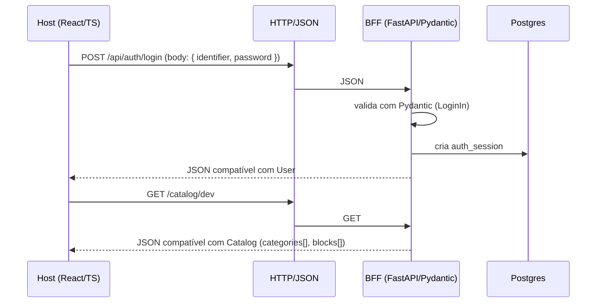

Esta página descreve como o **Host (React/TypeScript)** e o **BFF (FastAPI/Pydantic)**
modelam os mesmos conceitos usando tipos diferentes, mas mantendo um **contrato JSON estável**
entre frontend e backend.

> Referências principais no repositório  
> - `apps/host/src/types.ts`  
> - `apps/host/src/lib/api.ts`  
> - `apps/bff/app/auth/schemas.py`  
> - `apps/bff/app/automations/form2json.py`  
> - `apps/bff/app/automations/dfd.py`  

---

## 1) Visão geral — TS ↔ Pydantic

O Portal AGEPAR segue a ideia de **“contrato único em JSON”**:

- O Host trabalha com **tipos TypeScript** (`User`, `Catalog`, `Block`, etc.).
- O BFF trabalha com **modelos Pydantic** (`LoginUser`, `Form2JsonIn`, etc.).
- Ambos convergem para **estruturas JSON compartilhadas**, retornadas/recebidas via HTTP.

Fluxo simplificado:



Pontos importantes:

* **Nomes de campos** são estáveis (ex.: `cpf`, `roles`, `must_change_password`).
* **Tipos TS** representam o que o frontend espera receber/enviar.
* **Modelos Pydantic** garantem validação, normalização e mensagens de erro legíveis.

---

## 2) Tipos centrais em TypeScript (Host)

### 2.1) Usuário autenticado (`User`)

O tipo `User` é o “espelho” no frontend do que o BFF devolve em `/api/auth/login` e `/api/me`.

```ts title="apps/host/src/types.ts — tipo User" showLineNumbers
export type AuthMode =
  | "local"
  | "oidc"
  | "mock";

/** Usuário autenticado (via sessão). */
export type User = {
  cpf: string | null;
  nome: string;
  email: string | null;
  roles: string[];
  unidades: string[];
  /** Mecanismo de auth atual ("mock" apenas em DEV). */
  auth_mode?: AuthMode;
  is_superuser?: boolean;
  /**
   * Quando true, o servidor exige troca de senha antes de permitir navegação.
   * Retornado por /api/auth/login e /api/me.
   */
  must_change_password?: boolean;
};
```

Exemplo de JSON compatível:

```json title="Exemplo de resposta de /api/me" showLineNumbers
{
  "cpf": "12345678901",
  "nome": "Servidor(a) Exemplo",
  "email": "exemplo@agepar.pr.gov.br",
  "roles": ["compras", "coordenador"],
  "unidades": ["AGEPAR"],
  "auth_mode": "local",
  "is_superuser": false,
  "must_change_password": false
}
```

---

### 2.2) Catálogo — `Catalog`, `Category`, `Block`

O catálogo vem de `/catalog/dev` e é tipado no Host via `Catalog`, `Category` e `Block`.

```ts title="apps/host/src/types.ts — catálogo e blocos" showLineNumbers
/** Link de navegação gerado por um bloco. */
export type NavigationLink = {
  /** Texto exibido no menu/rotas. */
  label: string;
  /** Caminho SPA (ex.: "/form2json"). */
  path: string;
  /** Nome de ícone (ex.: "Home", "FileJson"). */
  icon?: string;
};

/** Rotas expostas pelo bloco. */
export type BlockRoute =
  | { path: string; kind: "iframe" }
  | { path: string; kind: "react" };

/** UI do bloco: iframe externo ou componente React hospedado. */
export type BlockUI =
  | { type: "iframe"; url: string }
  | { type: "react"; component?: string };

/** Categoria para agrupar blocos (navbar e /categoria/:id). */
export type Category = {
  /** Identificador estável (slug), ex.: "compras". */
  id: string;
  /** Rótulo exibido, ex.: "Compras". */
  label: string;
  /** Nome de ícone (opcional), ex.: "ShoppingCart". */
  icon?: string;
  /** Ordenação (menor = primeiro). */
  order?: number;
  /** Esconde a categoria na navegação. */
  hidden?: boolean;
  /** RBAC ANY-of para a categoria (além do RBAC por bloco). */
  requiredRoles?: string[];
};

/** Metadados e definição de um bloco/automação. */
export type Block = {
  /** Nome técnico único, ex.: "form2json". */
  name: string;
  /** Nome amigável (retrocompat). */
  displayName?: string;
  /** Versão do bloco. */
  version: string;

  /** Modo de exibição. */
  ui: BlockUI;
  /** Links de navegação (retrocompat). */
  navigation?: NavigationLink[];
  /** Rotas reais do bloco (retrocompat). */
  routes?: BlockRoute[];

  /** Categoria (Category.id). */
  categoryId?: string;
  /** Rótulos livres. */
  tags?: string[];
  /** Descrição curta para cards. */
  description?: string;
  /** Se true, esconde da lista/menus (rotas continuam válidas). */
  hidden?: boolean;
  /** Ordenação dentro da categoria (menor = primeiro). */
  order?: number;

  /**
   * RBAC ANY-of: se definido, o usuário precisa ter pelo menos um dos roles.
   * A checagem é feita na UI.
   */
  requiredRoles?: string[];
  /** Se true, apenas superusers visualizam (admin não basta). */
  superuserOnly?: boolean;
};

/** Catálogo entregue pelo BFF e consumido pelo host. */
export type Catalog = {
  /** ISO de geração do catálogo (retrocompat). */
  generatedAt?: string;
  /** Metadados do host. */
  host: { version: string; minBlockEngine: string };
  /** Categorias disponíveis (opcional para retrocompatibilidade). */
  categories?: Category[];
  /** Lista de blocos/automações registradas. */
  blocks: Block[];
};
```

Trecho equivalente em JSON:

```json title="Trecho de catalog/catalog.dev.json (exemplo)" showLineNumbers
{
  "generatedAt": "2025-01-01T12:00:00Z",
  "host": {
    "version": "0.1.0",
    "minBlockEngine": "1.0.0"
  },
  "categories": [
    { "id": "compras", "label": "Compras", "icon": "ShoppingCart" }
  ],
  "blocks": [
    {
      "name": "dfd",
      "displayName": "DFD — Documento de Formalização da Demanda",
      "version": "0.1.0",
      "categoryId": "compras",
      "ui": { "type": "iframe", "url": "/api/automations/dfd/ui" },
      "requiredRoles": ["compras"],
      "order": 10
    }
  ]
}
```

---

### 2.3) Helper de RBAC no Host (`userCanSeeBlock`)

O Host aplica RBAC simples (ANY-of) com base em `User.roles` e nos campos
`requiredRoles` / `superuserOnly` de cada bloco.

```ts title="apps/host/src/types.ts — userCanSeeBlock" showLineNumbers
export function userCanSeeBlock(user: User | null, block: Block): boolean {
  if (block.hidden) return false;
  if (block.superuserOnly) {
    return !!(user && user.is_superuser === true);
  }
  const required = block.requiredRoles ?? [];
  if (required.length === 0) return true;
  if (!user) return false;

  const userRoles = new Set((user.roles || []).map((r) => r.trim().toLowerCase()));
  if (user.is_superuser || userRoles.has("admin")) return true;

  return required.some((r) => userRoles.has(r.trim().toLowerCase()));
}
```

Essa função é importante porque define **como o Host interpreta `roles`** vindos
do BFF e do catálogo.

---

## 3) Modelos centrais em Pydantic (BFF)

### 3.1) Auth — `LoginIn`, `LoginUser`, `LoginOut`

No BFF, o módulo `apps/bff/app/auth/schemas.py` define os modelos Pydantic que
representam os mesmos campos usados pelo Host.

```py title="apps/bff/app/auth/schemas.py — LoginIn/LoginUser" showLineNumbers
from typing import List, Optional

from pydantic import BaseModel, ConfigDict, EmailStr, Field


class LoginIn(BaseModel):
    """Entrada para login: usuário/senha ou CPF/email."""

    model_config = ConfigDict(populate_by_name=True, extra="ignore")

    identifier: str = Field(min_length=1, description="CPF ou e-mail")
    password: str = Field(min_length=1, max_length=128)
    remember_me: bool = False


class LoginUser(BaseModel):
    """Estrutura do usuário autenticado retornada ao frontend."""

    cpf: Optional[str] = None
    nome: str
    email: Optional[str] = None
    roles: List[str] = Field(default_factory=list)
    unidades: List[str] = Field(default_factory=list)
    auth_mode: str
    is_superuser: bool = False
    must_change_password: bool = False
```

Esse modelo é usado em `LoginOut`, que é a resposta efetiva de `/api/auth/login`
e de alguns fluxos de troca de senha, mantendo o formato **“flat”** esperado
pelo Host.

---

### 3.2) Payloads de automações (ex.: `Form2JsonIn`)

Cada automação define modelos próprios de entrada/saída, mas segue o mesmo padrão:

* Herda de `BaseModel`.
* Usa `ConfigDict(populate_by_name=True, extra="ignore")` para entradas.
* Usa `Field(...)` para limites, obrigatoriedade e aliases.

Exemplo simplificado da automação `form2json`:

```py title="apps/bff/app/automations/form2json.py — modelo de entrada" showLineNumbers
from typing import List, Optional, Literal
from pydantic import BaseModel, ConfigDict, EmailStr, Field


class FormItem(BaseModel):
    """Item do formulário, com descrição e quantidade."""

    descricao: str = Field("", max_length=500)
    quantidade: int = Field(1, ge=0)


class Form2JsonIn(BaseModel):
    """Modelo de entrada do formulário."""

    model_config = ConfigDict(populate_by_name=True, extra="ignore")

    nome: Optional[str] = None
    email: Optional[EmailStr] = None
    departamento: Optional[str] = None
    prioridade: Literal["baixa", "media", "alta"] = "baixa"
    data: Optional[str] = None
    aceita_termos: bool = Field(False, alias="aceitaTermos")
    itens: List[FormItem] = Field(default_factory=list)
```

Padrões importantes:

* Tipos explícitos (`EmailStr`, `Literal`, etc.) para reforçar validação.
* `Optional[...]` onde o formulário permite ausência.
* `extra="ignore"` evita 422 por causa de campos extras enviados pela UI.

---

## 4) Mapeamento TS ↔ Pydantic (contratos principais)

A tabela abaixo resume alguns pares TS ↔ Pydantic no Portal:

| Conceito            | Tipo TS (Host)                     | Modelo Pydantic (BFF)        | Endpoints principais                    |
| ------------------- | ---------------------------------- | ---------------------------- | --------------------------------------- |
| Usuário autenticado | `User`                             | `LoginUser` / `LoginOut`     | `/api/auth/login`, `/api/me`            |
| Sessão de login     | — (metadados usados indiretamente) | `LoginSession`               | `/api/auth/login`, `/api/auth/sessions` |
| Catálogo            | `Catalog`                          | (lido de `catalog.dev.json`) | `/catalog/dev`                          |
| Categoria           | `Category`                         | — (modelo lógico na doc)     | `/catalog/dev`                          |
| Bloco/automação     | `Block`                            | — (modelo lógico na doc)     | `/catalog/dev`                          |
| Formulário genérico | UI (iframe da automação)           | `Form2JsonIn`, `DfdIn`, etc. | `/api/automations/{slug}/submit`        |

> Observação: hoje o BFF lê o catálogo de um arquivo JSON (`catalog/catalog.dev.json`).
> Os modelos Pydantic para catálogo aparecem principalmente como **modelos de referência**
> na documentação, para facilitar validação estática ou futuras migrações.

---

## 5) Exemplo ponta a ponta (login)

### 5.1) Chamada HTTP (cURL)

```bash title="Login com senha (cURL)" showLineNumbers
curl -i \
  -X POST http://localhost:8000/api/auth/login \
  -H "Content-Type: application/json" \
  -d '{
    "identifier": "dev@example.com",
    "password": "dev",
    "remember_me": true
  }'
```

Resposta resumida:

```json title="Resposta JSON (formato flat)" showLineNumbers
{
  "cpf": null,
  "nome": "Usuário Dev",
  "email": "dev@example.com",
  "roles": ["admin"],
  "unidades": [],
  "auth_mode": "local",
  "is_superuser": true,
  "must_change_password": false
}
```

### 5.2) Consumo no Host (TS)

```ts title="apps/host/src/lib/api.ts — loginWithPassword" showLineNumbers
import type { User } from "@/types";

const API_BASE = import.meta.env.VITE_API_BASE || "/api";

export async function loginWithPassword(params: {
  identifier: string;
  password: string;
  remember_me?: boolean;
}): Promise<User> {
  const res = await fetch(`${API_BASE}/auth/login`, {
    method: "POST",
    credentials: "include",
    headers: { "Content-Type": "application/json" },
    body: JSON.stringify({
      identifier: params.identifier,
      password: params.password,
      remember_me: !!params.remember_me,
    }),
  });

  if (!res.ok) {
    // Tratamento padrão de erro (detalhado em "Padrões de erro & DX").
    throw new Error("Falha no login");
  }

  return (await res.json()) as User;
}
```

Aqui fica clara a relação:

* A função retorna um `User` (TS).
* Quem constrói esse JSON é o modelo `LoginOut` (que estende `LoginUser`) no BFF.

---

## 6) Boas práticas para evoluir tipos e modelos

Para manter o contrato TS ↔ Pydantic saudável ao longo do tempo:

1. **Adicionar campos como opcionais**

   * Em TS: `campo?: tipo | null`.
   * Em Pydantic: `campo: Optional[tipo] = None` (ou com `Field(default=None, ...)`).

2. **Evitar renomear campos já existentes**

   * Se precisar mudar o nome, considere aliases em Pydantic:
     `campo_novo: str = Field(alias="campoAntigo")`.
   * Planeje janelas de compatibilidade (ex.: manter ambos por um tempo).

3. **Usar `extra="ignore"` em modelos de entrada**

   * Ganho: a UI pode enviar campos extras sem quebrar o backend.
   * Cuidado: valide explicitamente o que é realmente usado.

4. **Documentar contratos importantes**

   * Campos críticos (ex.: `roles`, `categoryId`, `ui`) devem estar:

     * nos tipos TS (`apps/host/src/types.ts`),
     * e nesta seção de Apêndices (com exemplos concretos).

5. **Escrever exemplos completos (TS + Python + cURL)**

   * Para novas automações, siga o padrão:

     * snippet cURL (`/submit`),
     * modelo Pydantic de entrada/saída,
     * tipo TS correspondente (quando houver helper no Host).

6. **Reaproveitar helpers**

   * No Host, preferir helpers em `lib/api.ts` com tipos fortes.
   * No BFF, reaproveitar validadores de CPF, e-mail e helpers de auditoria (`add_audit`).

---

> _Criado em 2025-12-03_