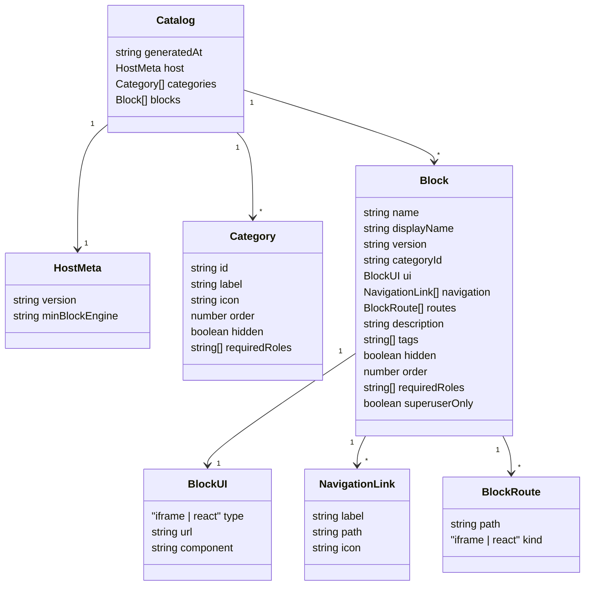

Esta página documenta o **esquema formal do catálogo** do Portal AGEPAR em formato
**JSON Schema**, cobrindo o objeto raiz e suas principais entidades:

- `host` (metadados da versão do host)
- `categories[]` (categorias do catálogo)
- `blocks[]` (blocos/automações)

> Fonte principal: `catalog/catalog.dev.json`  
> Complementar a: seção **“Catálogo (catalog.dev)”** e à descrição informal de
> `categories[]` e `blocks[]` já existente na documentação.

---

## 1) Objetivo e escopo

O objetivo deste esquema é:

- Servir de **referência única** para o formato de `catalog.dev.json`.
- Ajudar em **validações automáticas** (lint em CI/CD, testes de contrato).
- Explicitar **campos obrigatórios** e **tipos** do catálogo.
- Documentar **regras semânticas** que não cabem diretamente no JSON Schema
  (ex.: unicidade de `name` e `id`, relacionamento `categoryId → categories[].id`).

Algumas observações importantes:

- O BFF é tolerante a campos extras em `blocks` e `categories` — eles são **ignorados** em tempo de execução.
- O JSON Schema abaixo é pensado como **documento de referência**; times podem
  copiar/adaptar (por exemplo, endurecendo `additionalProperties`).

---

## 2) Visão geral (Catalog → Categories → Blocks)

Relação entre as estruturas principais:



---

## 3) JSON Schema — objeto raiz (`Catalog`)

Abaixo um JSON Schema de referência para o **objeto raiz** do catálogo.

> Sugestão de nome de arquivo: `catalog.schema.json` (por exemplo em `infra/schemas/`).

```json title="catalog.schema.json — esquema de alto nível" showLineNumbers
{
  "$schema": "https://json-schema.org/draft/2020-12/schema",
  "$id": "https://portal.agepar.pr.gov.br/schemas/catalog.schema.json",
  "title": "Portal AGEPAR — Catálogo de blocos",
  "type": "object",
  "additionalProperties": false,
  "required": ["host", "blocks"],
  "properties": {
    "generatedAt": {
      "type": "string",
      "format": "date-time",
      "description": "Data/hora de geração do catálogo em ISO 8601."
    },
    "host": {
      "type": "object",
      "additionalProperties": false,
      "required": ["version", "minBlockEngine"],
      "properties": {
        "version": {
          "type": "string",
          "description": "Versão do host que gerou o catálogo (ex.: 1.0.0)."
        },
        "minBlockEngine": {
          "type": "string",
          "description": "Versão mínima do engine de blocos suportada."
        }
      }
    },
    "categories": {
      "type": "array",
      "description": "Lista de categorias exibidas na UI.",
      "items": { "$ref": "#/$defs/Category" }
    },
    "blocks": {
      "type": "array",
      "description": "Lista de blocos/automações disponíveis.",
      "minItems": 1,
      "items": { "$ref": "#/$defs/Block" }
    }
  },

  "$defs": {
    "Category": {
      "type": "object",
      "description": "Categoria de blocos (navbar, agrupamento).",
      "additionalProperties": true,
      "required": ["id", "label"],
      "properties": {
        "id": {
          "type": "string",
          "description": "Identificador único (slug), ex.: \"compras\" ou \"ferias\"."
        },
        "label": {
          "type": "string",
          "description": "Texto exibido para o usuário final."
        },
        "icon": {
          "type": "string",
          "description": "Nome do ícone (ex.: ShoppingCart, CalendarDays)."
        },
        "order": {
          "type": "number",
          "description": "Ordenação explícita (menor = primeiro)."
        },
        "hidden": {
          "type": "boolean",
          "description": "Quando true, oculta a categoria da navegação."
        },
        "requiredRoles": {
          "type": "array",
          "description": "RBAC ANY-of aplicado à categoria.",
          "items": { "type": "string" }
        }
      }
    },

    "Block": {
      "type": "object",
      "description": "Bloco/automação do catálogo.",
      "additionalProperties": true,
      "required": ["name", "version", "ui", "categoryId"],
      "properties": {
        "name": {
          "type": "string",
          "description": "Nome técnico único do bloco, ex.: \"dfd\", \"ferias\"."
        },
        "displayName": {
          "type": "string",
          "description": "Nome amigável exibido na UI."
        },
        "version": {
          "type": "string",
          "description": "Versão do bloco, ex.: \"0.1.0\"."
        },
        "categoryId": {
          "type": "string",
          "description": "Identificador da categoria (deve existir em categories[].id)."
        },
        "description": {
          "type": "string",
          "description": "Descrição curta para cards e tooltips."
        },
        "tags": {
          "type": "array",
          "description": "Tags livres para buscas/agrupamentos.",
          "items": { "type": "string" }
        },
        "order": {
          "type": "number",
          "description": "Ordenação dentro da categoria (menor = primeiro)."
        },
        "hidden": {
          "type": "boolean",
          "description": "Quando true, oculta o bloco da navegação (rota continua válida)."
        },
        "requiredRoles": {
          "type": "array",
          "description": "RBAC ANY-of: qualquer papel presente já habilita o bloco.",
          "items": { "type": "string" }
        },
        "superuserOnly": {
          "type": "boolean",
          "description": "Quando true, somente superusers visualizam o bloco."
        },
        "ui": {
          "$ref": "#/$defs/BlockUI"
        },
        "navigation": {
          "type": "array",
          "description": "Links auxiliares (docs, atalhos, etc.).",
          "items": { "$ref": "#/$defs/NavigationLink" }
        },
        "routes": {
          "type": "array",
          "description": "Rotas internas do Host para deep-linking.",
          "items": { "$ref": "#/$defs/BlockRoute" }
        }
      }
    },

    "BlockUI": {
      "type": "object",
      "description": "Definição de como o bloco é renderizado.",
      "additionalProperties": true,
      "required": ["type"],
      "properties": {
        "type": {
          "type": "string",
          "enum": ["iframe", "react"],
          "description": "Modo de renderização: iframe (atual) ou react (futuro)."
        },
        "url": {
          "type": "string",
          "description": "URL a ser embutida quando type = \"iframe\"."
        },
        "component": {
          "type": "string",
          "description": "Nome do componente React quando type = \"react\"."
        }
      }
    },

    "NavigationLink": {
      "type": "object",
      "description": "Link de navegação auxiliar gerado pelo bloco.",
      "additionalProperties": true,
      "required": ["label", "path"],
      "properties": {
        "label": {
          "type": "string",
          "description": "Texto exibido no menu/atalho."
        },
        "path": {
          "type": "string",
          "description": "Caminho SPA (ex.: \"/dfd\", \"/ferias\")."
        },
        "icon": {
          "type": "string",
          "description": "Nome do ícone (opcional)."
        }
      }
    },

    "BlockRoute": {
      "type": "object",
      "description": "Rota mapeada pelo bloco dentro do Host.",
      "additionalProperties": true,
      "required": ["path", "kind"],
      "properties": {
        "path": {
          "type": "string",
          "description": "Caminho SPA (ex.: \"/dfd\")."
        },
        "kind": {
          "type": "string",
          "enum": ["iframe", "react"],
          "description": "Tipo de rota (compatível com BlockUI.type)."
        }
      }
    }
  }
}
```

Notas:

* `additionalProperties: true` em `Category`, `Block` e derivados reflete o comportamento atual do BFF (campos extras são ignorados).
* Para validação mais rígida em CI, é possível **copiar este schema** e trocar para
  `additionalProperties: false` nas entidades desejadas.

---

## 4) Regras semânticas fora do JSON Schema

O JSON Schema acima foca em **estrutura**; algumas regras de negócio exigem validação adicional:

1. **Unicidade de identificadores**

   * `Category.id` deve ser único dentro de `categories[]`.
   * `Block.name` deve ser único dentro de `blocks[]`.

2. **Referencial `categoryId → categories[].id`**

   * Todo `block.categoryId` deve apontar para uma categoria existente.
   * Em caso de erro, o Host pode:

     * Ignorar o bloco órfão, ou
     * Exibir o bloco em uma categoria “técnica” (ex.: “*Desacoplados*”), dependendo da política.

3. **RBAC**

   * `requiredRoles` em `Category` e `Block` seguem o modelo **ANY-of**:

     * Usuário precisa ter **pelo menos um** dos papéis listados.
     * Superuser e papel `"admin"` têm **bypass** em muitas situações.
   * A lógica de checagem é implementada no Host (helpers em `src/types.ts`)
     e no BFF (módulo `auth/rbac.py`).

4. **Ordenação**

   * Ordem padrão: **a ordem física do arquivo JSON** (tanto para categorias quanto para blocos).
   * Campo `order` é opcional; quando presente, pode ser usado para ordenar explicitamente
     dentro da categoria.

---

## 5) Exemplo mínimo de catálogo válido

Exemplo reduzido que valida contra o schema proposto:

```json title="Exemplo mínimo de catálogo" showLineNumbers
{
  "generatedAt": "2025-08-29T12:00:00Z",
  "host": {
    "version": "1.0.0",
    "minBlockEngine": "1.0.0"
  },
  "categories": [
    {
      "id": "util",
      "label": "Utilidades",
      "icon": "Upload"
    }
  ],
  "blocks": [
    {
      "name": "form2json",
      "displayName": "Form → JSON",
      "version": "0.1.0",
      "categoryId": "util",
      "description": "Recebe um formulário simples e devolve JSON normalizado.",
      "ui": {
        "type": "iframe",
        "url": "/api/automations/form2json/ui"
      },
      "routes": [
        { "path": "/form2json", "kind": "iframe" }
      ],
      "tags": ["utilidades"],
      "requiredRoles": [],
      "order": 10
    }
  ]
}
```

---

## 6) Validação automática (Node/TS, Python, cURL)

### 6.1) Node/TypeScript com Ajv

```ts title="Validação com Ajv (exemplo)" showLineNumbers
import Ajv from "ajv";
import schema from "./catalog.schema.json";
import catalog from "../../catalog/catalog.dev.json";

const ajv = new Ajv({ allErrors: true, strict: false });
const validate = ajv.compile(schema);

if (!validate(catalog)) {
  console.error("Catálogo inválido:", validate.errors);
  process.exitCode = 1;
} else {
  console.log("Catálogo OK ✅");
}
```

### 6.2) Python com `jsonschema`

```py title="Validação com jsonschema (exemplo)" showLineNumbers
import json
from jsonschema import Draft202012Validator

with open("catalog.schema.json", "r", encoding="utf-8") as f:
    schema = json.load(f)

with open("catalog/catalog.dev.json", "r", encoding="utf-8") as f:
    data = json.load(f)

Draft202012Validator(schema).validate(data)
print("Catálogo OK ✅")
```

### 6.3) cURL + validador local

```bash title="Baixando o catálogo exposto pelo BFF" showLineNumbers
# Em ambiente de desenvolvimento
curl -s http://localhost:8000/catalog/dev > /tmp/catalog-atual.json

# Em seguida, execute o validador (Node/Python) apontando para /tmp/catalog-atual.json
```

---

## 7) Como evoluir o esquema com segurança

Sugestões para futuras mudanças:

1. **Adicionar novos campos como opcionais**

   * Evita quebrar instâncias antigas de catálogo.
   * Ex.: adicionar `experimental?: boolean` em `Block`.

2. **Evitar remoção/renomeação de campos**

   * Prefira marcar campos como “deprecated” na documentação.
   * Quando inevitável, mantenha um período de transição aceitando os dois nomes
     (`alias` em Pydantic, transformações no BFF ou scripts de migração).

3. **Usar PRs pequenos e descritivos**

   * Alterações em `catalog.dev.json` e no JSON Schema devem vir com:

     * Explicação de impacto na UI,
     * Exemplos de uso,
     * E, se possível, screenshots do Host.

4. **Atualizar a documentação**

   * Sempre que o catálogo ganhar um campo novo ou semântica diferente,
     atualizar:

     * A seção “Catálogo (catalog.dev)”
     * E este Apêndice de JSON Schema.

---

> _Criado em 2025-12-03_
