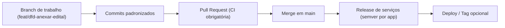

Esta página consolida as **regras de disciplina de código** do Portal AGEPAR:

- **Commits** → padrão [Conventional Commits] adaptado ao monorepo.  
- **Branches** → fluxo simples centrado em `main` com branches curtos de feature/fix.  
- **Versionamento** → *semver* por serviço (BFF, Host, Docs), com monorepo em modo **rolling**.

> Referência rápida (também citado na página de **Intro**):  
> - **Commits**: Conventional Commits (ex.: `feat(bff): rota /api/automations/form2json`)  
> - **Versionamento**: *semver* no app, *rolling* no monorepo

---

## 1) Visão geral e objetivos

Por que definir convenções?

- Facilitar **leitura de histórico** (`git log`, GitHub, etc.).
- Ajudar em **debug / auditoria** (“quando foi introduzida tal rota?”).
- Permitir **automação futura** (changelog, bump de versão, release notes).
- Garantir que qualquer dev novo **entenda rapidamente** o que está acontecendo.

Fluxo conceitual:



---

## 2) Convenções de commit

### 2.1) Formato básico (Conventional Commits)

Formato recomendado da **linha de assunto**:

```text
<type>(<scope>): <descrição em minúsculo e no imperativo>
```

Exemplos válidos:

```text
feat(bff): expor rota /api/automations/form2json
feat(host): listar blocos por categoria
fix(auth): corrigir renovação de sessão expirada
docs(appendices): documentar convenções de commit/branch
chore(infra): atualizar imagem base do docker-compose.dev
refactor(ferias): extrair validador de períodos para função
test(bff): cobrir /health e /version com pytest
ci(github-actions): adicionar cache de pnpm
```

Regras sugeridas:

* `type` **minúsculo**, um dos tipos da tabela abaixo.
* `scope` **curto** e estável: `bff`, `host`, `docs`, `infra`, `catalog`, `dfd`, `ferias`, `rbac`, etc.
* `descrição` em português, no **imperativo** e em minúsculas:

  * ✔️ `corrigir erro de login`
  * ✔️ `criar página de dashboard`
  * ❌ `corrigido bug no login`
  * ❌ `Adicionando nova página`

### 2.2) Tipos suportados (mínimo viável)

| Tipo       | Quando usar                                                               |
| ---------- | ------------------------------------------------------------------------- |
| `feat`     | Nova funcionalidade para o usuário (rota, automação, tela nova, etc.).    |
| `fix`      | Correção de bug (inclui hotfix em produção).                              |
| `docs`     | Mudanças apenas em documentação (Docusaurus, README, etc.).               |
| `refactor` | Refatoração sem mudança de comportamento (idealmente sem impacto de API). |
| `test`     | Adição/ajuste de testes automatizados (pytest, Vitest, etc.).             |
| `chore`    | Tarefas de manutenção (scripts, configs, limpeza, ajustes pequenos).      |
| `build`    | Mudanças em build system, dependências, Dockerfiles.                      |
| `ci`       | Mudanças em pipelines de CI/CD (GitHub Actions, etc.).                    |
| `perf`     | Otimizações de performance.                                               |
| `revert`   | Reversão explícita de um commit anterior.                                 |

> Dica: se estiver em dúvida entre `chore` e outro tipo, prefira **o tipo mais específico**
> (`fix`, `docs`, `build`, etc.).

### 2.3) Corpo e rodapé do commit

Quando necessário, use **corpo** e **rodapé**:

```text
feat(ferias): gerar zip com requerimento e substituicao

- gera PDFs a partir dos templates atuais
- junta tudo em um .zip único
- persiste submission e audit como no padrão de automations

BREAKING CHANGE: altera a estrutura de saída do endpoint /submit
Refs: #123
```

Regras:

* Corpo em **lista de pontos** (quando fizer sentido).
* Use `BREAKING CHANGE:` no rodapé para indicar quebra de compatibilidade:

  * Ex.: mudanças de contrato de API, campos obrigatórios, ou formato de arquivo.
* Use `Refs: #123` ou `Closes: #123` para linkar a issues/tarefas.

---

## 3) Convenções de branch

### 3.1) Branch principal

* Branch padrão: **`main`**.
* Expectativa: `main` está sempre **deployável** (buildando e com testes principais passando).
* CI ilustrativa (ver página de CI/CD) já considera apenas `main` para execução de pipeline:

```yaml title=".github/workflows/ci.yml (trecho)"
on:
  push:
    branches: [ main ]
  pull_request:
```

### 3.2) Branches de trabalho

Padrão recomendado:

```text
<tipo>/<descrição-kebab-case>
```

Onde `tipo` é geralmente o mesmo conjunto dos tipos de commit (`feat`, `fix`, `chore`, `docs`, `refactor`, `perf`, `ci`, `build`).

Exemplos:

```text
feat/dfd-anexar-edital
feat/ferias-substituicao-opcional
fix/auth-renovar-cookie-de-sessao
docs/apendices-commit-branch
chore/catalog-reorganizar-categorias
infra/upgrade-postgres-15
```

Sugestões:

* Uma branch **por tema/feature** (evitar “branch cozinha-sim-e-não-tudo-junto”).
* Branches **curtas** (poucos dias) e sempre com PR para `main`.
* Antes de abrir PR:

  * Rebase ou merge de `main` para reduzir conflitos.
  * Garantir que **tests básicos** rodam (`pytest`, `npm test`, etc., quando existirem).

### 3.3) Branches especiais (opcional)

Se o projeto evoluir para releases mais formais, é possível adotar branches como:

```text
release/1.2.0
hotfix/1.2.1
```

Por ora, o padrão preferido é:

* **Rolling no monorepo**: o que está em `main` é o estado atual, preparado para deploy.
* **Tags** opcionais por serviço (ver seção de versionamento).

---

## 4) Versionamento (semver + monorepo rolling)

### 4.1) SemVer por serviço

O Portal AGEPAR segue a ideia:

* **Cada serviço tem sua própria versão semver** (`MAJOR.MINOR.PATCH`).
* O **monorepo como um todo** não possui um único número de versão global.

Exemplo de onde vivem as versões hoje:

* **BFF (FastAPI)**
  Em `apps/bff/app/main.py`:

  ```py title="apps/bff/app/main.py (trecho)" showLineNumbers
  APP = FastAPI(
      title="Portal AGEPAR BFF",
      version="0.3.0",
      docs_url="/api/docs",
      redoc_url="/api/redoc",
  )
  ```

* **Host (React/Vite/TS)**
  Em `apps/host/package.json`:

  ```json title="apps/host/package.json" showLineNumbers
  {
    "name": "portal-agepar-host",
    "private": true,
    "version": "0.1.0",
    ...
  }
  ```

* **Docs (Docusaurus)**
  Em `apps/docs-site/package.json` (inicialmente `0.0.0`, pode evoluir):

  ```json title="apps/docs-site/package.json" showLineNumbers
  {
    "name": "apps-docs-site",
    "version": "0.0.0",
    "private": true,
    ...
  }
  ```

* **Metadados do catálogo (host)**
  Em `catalog/catalog.dev.json`:

  ```json title="catalog/catalog.dev.json (trecho)" showLineNumbers
  {
    "generatedAt": "2025-08-29T12:00:00Z",
    "host": {
      "version": "1.0.0",
      "minBlockEngine": "1.0.0"
    },
    ...
  }
  ```

> Recomenda-se manter essas versões **coerentes** com os releases reais
> (por exemplo, quando o Host for `1.2.0`, refletir isso também no campo `host.version` do catálogo).

### 4.2) Quando incrementar MAJOR/MINOR/PATCH

Regra baseada em semver:

* **MAJOR** (`X.0.0`) — mudanças incompatíveis:

  * Quebram contrato de API de automations.
  * Mudam estrutura do catálogo (`blocks[]`, `ui`, etc.) de forma não retrocompatível.
  * Exigem ações de migração manual (DB, scripts, etc.).

* **MINOR** (`x.Y.0`) — funcionalidades novas retrocompatíveis:

  * Nova automação (`/api/automations/novo_slug`).
  * Novas opções no catálogo (`tags`, `requiredRoles`, etc.) sem quebrar existentes.
  * Melhoria de DX, endpoints de leitura adicionais, etc.

* **PATCH** (`x.y.Z`) — correções retrocompatíveis:

  * Bugfix em automations, ajustes de layout, performance.
  * Pequenos ajustes de docs/código que não afetam contratos.

Conexão com tipos de commit (regra prática):

* `feat(...)` **sem** `BREAKING CHANGE` → candidato a **MINOR**.
* `fix(...)`, `perf(...)` → candidato a **PATCH**.
* Commit com `BREAKING CHANGE:` no rodapé → candidata a **MAJOR**.

### 4.3) Exemplo de fluxo de release

Suponha um release do BFF `0.4.0` com nova automação de férias:

1. Implementar na branch:

   ```text
   feat(ferias): gerar requerimento e substituicao de ferias
   ```

2. Ajustar versão do BFF em `main.py`:

   ```py
   APP = FastAPI(
       title="Portal AGEPAR BFF",
       version="0.4.0",
       ...
   )
   ```

3. Atualizar, se necessário, `catalog/catalog.dev.json` (ex.: se o Host tiver mudado):

   ```json
   "host": {
     "version": "1.1.0",
     "minBlockEngine": "1.0.0"
   }
   ```

4. Commit de release (convencional):

   ```text
   chore(release): prepara bff 0.4.0 e host 1.1.0
   ```

5. Opcional: criar uma tag no repositório apenas para o BFF:

   ```bash
   git tag bff-v0.4.0
   git push origin bff-v0.4.0
   ```

### 4.4) Monorepo rolling

Por padrão:

* **Não existe versão única do monorepo.**
* `main` representa o **estado atual** dos três serviços:

  * Cada serviço com sua própria versão.
  * Deploys podem ser feitos a partir do último commit de `main`.
* Tags, quando utilizadas, tendem a ser **por serviço** (`bff-vX.Y.Z`, `host-vX.Y.Z`, etc.).

---

## 5) Checklist rápido (para o dia a dia)

Antes de abrir PR:

* [ ] Nome da branch segue padrão `tipo/descrição-kebab-case`.
* [ ] Commits seguem `type(scope): descrição` com tipos da tabela.
* [ ] Se houve quebra de compatibilidade, incluir `BREAKING CHANGE:` no commit.
* [ ] Versões de BFF/Host/Docs ajustadas quando a alteração justificar (semver).
* [ ] `catalog.dev.json` atualizado se novos blocos/categorias forem adicionados.
* [ ] CI local (quando existir) passando para BFF/Host/Docs.

---

> _Criado em 2025-12-03_
