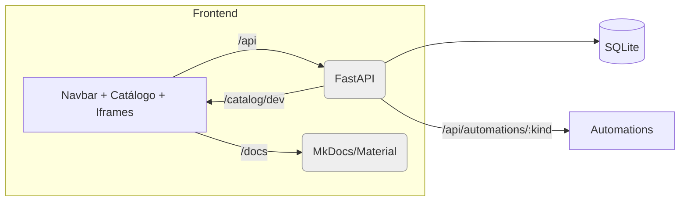

_Criado em 2025-10-27_

Este site documenta arquitetura, DevOps, BFF (FastAPI), Host (React/Vite/TS), Catálogo e Automations do Plataforma AGEPAR.

> Gerado automaticamente a partir de dois JSONs: **timeline** e **outline mapeado**.

## Visão Geral

A **Plataforma AGEPAR** organiza um monorepo com três serviços principais executados via Docker Compose:

- **bff** (FastAPI) — porta **8000** no host
- **host** (Vite + React/TS) — porta **5173**, com *proxy* para `/api`, `/catalog`, `/docs`
- **docs** (servidor interno MkDocs/Material em `http://docs:8000`), exposto via **host** em `/docs`

### Fluxo alto nível



## Padrões e Decisões de Arquitetura

**BFF (FastAPI)**  
- Sessões mock: `POST /api/auth/login` e `GET /api/me`  
- Catálogo servido em: `/catalog/dev`  
- Automations: `/api/automations/{kind}/...` (ex.: `form2json`)  
- Banco: SQLite inicializado no *startup* (`init_db`) com tabelas `submissions` e `audits`  
- Validação: **Pydantic v2** `ConfigDict(populate_by_name=True, extra="ignore")` e normalização de campos para evitar `422` triviais  
- Persistência: `submissions` (payload, status, result, error) e auditoria em `audits`  
- Erros claros: `400/401/403/404/409/422` com mensagens úteis  
- Segurança: sem segredos no repo; CORS restrito; cookies de sessão  
- Logs: `INFO` no caminho feliz; `ERROR` com contexto

**Host (Vite + React/TS)**  
- Lê o **catálogo** e monta navbar por categorias; cards por categoria  
- Blocos do catálogo são renderizados conforme `ui` (ex. `iframe` via `<iframe src={block.ui.url} />`)  
- RBAC simples via `requiredRoles` (*ANY-of*)  
- Ordem: preservar ordem de escrita do catálogo (categorias e blocos)  
- Proxies Vite: `/api` e `/catalog` → `bff:8000`; `/docs` (inclui livereload) → `docs:8000`

**Docs (MkDocs/Material)**  
- Servidas pelo **host** em `/docs`  
- Conteúdo voltado a não-devs; tema Material com Mermaid e Glightbox  
- Páginas em `docs/` + `mkdocs.yml`

**Catálogo (`/catalog/dev`)**  
Estrutura base:
```json
{
  "categories": [{ "id": "compras", "label": "Compras", "icon": "ShoppingCart" }],
  "blocks": [{ "categoryId": "compras", "ui": { "type": "iframe", "url": "/some/ui" }, "navigation": [], "routes": [] }]
}
```

## Estrutura do Repositório (alto nível)

```text
portal-agepar/
  apps/
    bff/                 # FastAPI + automations
  host/                  # Vite/React/TS
  docs/                  # MkDocs Material (servido em /docs)
  docs-site/             # Docusaurus (estas páginas)
  docker-compose*.yml    # Orquestração local
  README.md
```

> Arquivos de composição detectados: ['portal-agepar-main/infra/docker-compose.dev.yml', 'portal-agepar-main/infra/docker-compose.pg.yml']
> Pistas FastAPI: ['portal-agepar-main/apps/bff/app/main.py', 'portal-agepar-main/apps/bff/app/auth/middleware.py', 'portal-agepar-main/apps/bff/app/auth/rbac.py']
> Pastas de catálogo: ['portal-agepar-main/catalog']

## Convenções

- **Linters/formatters**: seguir configs do repo (`prettier`, `eslint`, `ruff/black` se presentes)  
- **Commits**: Conventional Commits (ex.: `feat(bff): rota /api/automations/form2json`)  
- **Versionamento**: *semver* no app, *rolling* no monorepo  
- **Logs**: `request_id`, `user`, `automation`, `submission_id` quando aplicável

## Como rodar (dev)

```bash
# 1) subir serviços
docker compose up --build

# 2) acessar
# Host (frontend)
http://localhost:5173

# BFF (API)
http://localhost:8000

# Docs (via host)
http://localhost:5173/docs
```

## Healthchecks rápidos

- `GET /api/health` (BFF) deve retornar `200`  
- `GET /catalog/dev` deve trazer `categories[]` e `blocks[]`  
- `GET /docs/` deve responder o site de documentos internos

## Próximos passos neste site

A documentação técnica da Plataforma AGEPAR está organizada por **seções numeradas** dentro de `docs/`, cada uma com seu próprio `index.md`:

1. **Visão Geral & Arquitetura** — `01-visão-geral-e-arquitetura/`  
2. **Ambiente Dev (Setup)** — `02-ambiente-dev-setup/`  
3. **Build, Run & Deploy** — `03-build-run-deploy/`  
4. **Frontend / Host (React/Vite/TS)** — `04-frontend-host-react-vite-ts/`  
5. **Catálogo (`/catalog/dev`)** — `05-catálogo-catalog-dev/`  
6. **BFF (FastAPI)** — `06-bff-fastapi/`  
7. **Automations (Padrão de Módulos)** — `07-automations-padrão-de-módulos/`  
8. **Banco de Dados & Persistência** — `08-banco-de-dados-persistência/`  
9. **Segurança** — `09-segurança/`  
10. **Observabilidade** — `10-observabilidade/`  
11. **Padrões de Erro & DX** — `11-padrões-de-erro-dx/`  
12. **Testes** — `12-testes/`  
13. **Documentação (Docusaurus)** — `13-documentação-docusaurus/`  
14. **Guias de Produto (Compras Públicas)** — `14-guias-de-produto-fluxo-compras-público/`  
15. **Apêndices** — `15-apêndices/`

> Cada seção possui um `index.md` e páginas específicas (ex.: `01-visão-geral-e-arquitetura/index.md`). A navegação é controlada pela sidebar do Docusaurus.

---

_Criado em 2025-10-27_