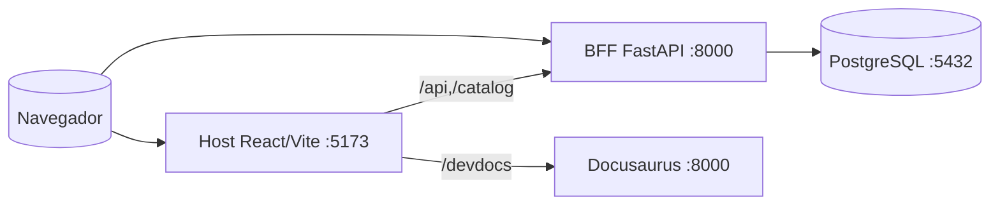

Esta documentação foi revisada para refletir o **estado atual** do monorepo.

## O que existe hoje

- **BFF** em `apps/bff` com FastAPI, auth local, sessão persistida em banco,
  catálogo, notificações, auditoria e automações.
- **Host** em `apps/host` com React/Vite/TS, rotas protegidas, RBAC de vitrine,
  páginas SPA e renderização de módulos via iframe.
- **Docs** em `apps/docs-site` com Docusaurus v3.
- **PostgreSQL** como banco do ambiente dev.
- **Infra dev** em `infra/docker-compose.dev.yml` + `infra/docker-compose.pg.yml`.

## Desenho de alto nível

```mermaid
flowchart LR
  Browser[(Navegador)]
  Host[Host React/Vite :5173]
  BFF[BFF FastAPI :8000]
  Docs[Docusaurus :8000]
  PG[(PostgreSQL :5432)]

  Browser --> Host
  Browser --> BFF
  Host -->|/api,/catalog| BFF
  Host -->|/devdocs| Docs
  BFF --> PG
```

## Diferenças em relação à documentação antiga

A documentação anterior ainda carregava referências históricas a:
- **MkDocs**
- **SQLite**
- docs publicadas em **`/docs`**
- quickstart com `docker compose up` incompleto
- foco excessivo em “sessões mock” como se fossem o fluxo principal

O repositório atual, porém, está em:
- **Docusaurus**
- **PostgreSQL**
- docs em **`/devdocs/`**
- auth local com sessão persistida em banco
- script operacional preferencial em `infra/scripts/dev.sh`

## Estado atual resumido

### Serviços
- `host` → `5173`
- `bff` → `8000`
- `docs` → `8000` interno, `9000:8000` exposto diretamente
- `postgres` → `5432`

### Proxies do Host
- `/api`
- `/catalog`
- `/devdocs`

### Rotas do BFF mais relevantes
- `/health`
- `/version`
- `/api/auth/*`
- `/api/me`
- `/catalog/dev`
- `/api/automations/*`

## Como navegar nesta doc

- **01 — Visão Geral e Arquitetura**: contrato atual do monorepo
- **02 — Ambiente & Dev Setup**: compose, `.env`, scripts e operação local
- **03 — Build, Run & Deploy**: execução direta, proxy e artefatos
- **06 — BFF**: auth, rotas, padrões e erros
- **07 — Automations**: padrão dos módulos e inventário atual
- **08 — Banco**: Postgres, schema e persistência
- **12 — Testes**: o que existe e o que ainda falta

- **13 — Documentação**: padrões editoriais e estrutura do Docusaurus
- **05 da seção 01**: auditoria rápida do estado atual do repositório
