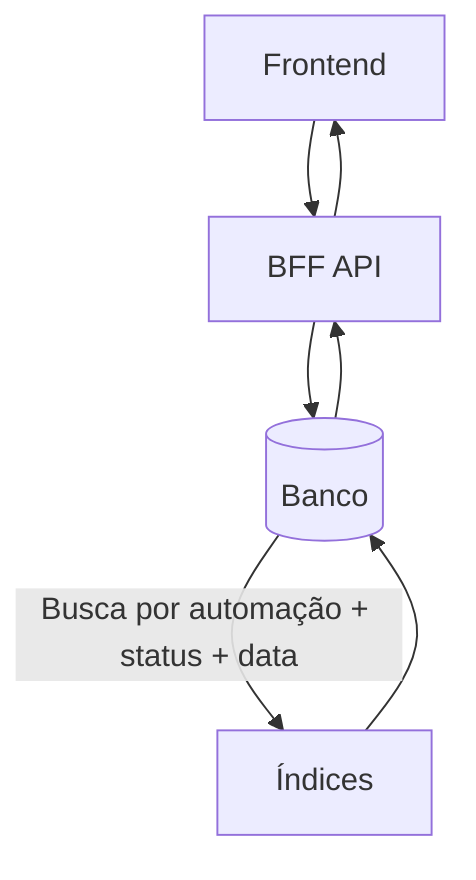

# Índices e Performance de Banco

O banco de dados do **BFF (FastAPI)** armazena informações críticas como **submissões**, **auditoria** e **sessões**.  
Para manter escalabilidade, é essencial adotar **índices adequados** e monitorar **consultas de alto custo**.

---

## 🎯 Objetivos

- Garantir **respostas rápidas** para consultas frequentes.  
- Evitar **full scans desnecessários**.  
- Definir uma estratégia de **índices padronizados**.  
- Preparar para **alta carga em produção** (Postgres).  

---

## 📌 Índices Recomendados

### 🔹 Tabela `submissions`
- `automation_slug` → consultas filtrando por automação.  
- `status` → consultas de monitoramento (pendentes, em erro).  
- `created_at` → ordenação por data (últimas submissões).  

```sql
CREATE INDEX idx_submissions_slug ON submissions(automation_slug);
CREATE INDEX idx_submissions_status ON submissions(status);
CREATE INDEX idx_submissions_created_at ON submissions(created_at DESC);
````

---

### 🔹 Tabela `audits`

* `timestamp` → relatórios temporais.
* `user_id` → auditoria por usuário.
* `action` → relatórios de eventos específicos.

```sql
CREATE INDEX idx_audits_timestamp ON audits(timestamp DESC);
CREATE INDEX idx_audits_user_id ON audits(user_id);
CREATE INDEX idx_audits_action ON audits(action);
```

---

### 🔹 Tabela `sessions`

* `user_id` → logout global, gestão de sessões.
* `expires_at` → remoção de sessões expiradas.

```sql
CREATE INDEX idx_sessions_user_id ON sessions(user_id);
CREATE INDEX idx_sessions_expires_at ON sessions(expires_at);
```

---

## ⚙️ Estratégia de Performance

1. **Monitoramento contínuo**

   * Usar `EXPLAIN (ANALYZE)` em consultas críticas.
   * Logar queries lentas (>500ms).

2. **Limpeza de dados históricos**

   * `audits` pode crescer rapidamente → considerar **particionamento por mês**.
   * `submissions` antigos podem ser arquivados após X anos.

3. **Vacuum & Analyze (Postgres)**

   * Automatizar com `autovacuum` para manter estatísticas de planner.

4. **Paginação eficiente**

   * Usar `id` ou `created_at` como cursor para paginação → evita `OFFSET` pesado.

---

## 🔄 Fluxo de Consultas Comuns



---

## 🛠️ Migrações de Índices

* Índices devem ser adicionados via **Alembic** para versionamento.
* Em Postgres, usar `CREATE INDEX CONCURRENTLY` para evitar lock em produção.

Exemplo de migração:

```python
def upgrade():
    op.create_index("idx_submissions_slug", "submissions", ["automation_slug"])
    op.create_index("idx_submissions_status", "submissions", ["status"])
    op.create_index("idx_submissions_created_at", "submissions", ["created_at"], postgresql_using="btree")

def downgrade():
    op.drop_index("idx_submissions_created_at", table_name="submissions")
    op.drop_index("idx_submissions_status", table_name="submissions")
    op.drop_index("idx_submissions_slug", table_name="submissions")
```

---

## 🚀 Futuro

* Implementar **particionamento em `audits`** (Postgres `PARTITION BY RANGE(timestamp)`).
* Criar **índices compostos** (`automation_slug + status + created_at`) para relatórios.
* Avaliar **materialized views** para dashboards.
* Integrar métricas de banco com **Prometheus/Grafana**.

---

📖 Próximo: [Overview do Host (Frontend)](../../20-host/overview.md)
