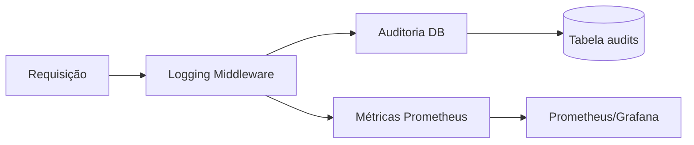

# Logging e Observabilidade no BFF

O **BFF (FastAPI)** do Portal AGEPAR possui mecanismos de **logging estruturado, auditoria e observabilidade** para garantir rastreabilidade e suporte à operação em produção.

---

## 📑 Objetivos

- Fornecer **visibilidade** sobre requisições e respostas.  
- Registrar **eventos relevantes** de negócio e segurança.  
- Permitir **análise posterior** via tabelas de auditoria.  
- Estar preparado para integrar com **ferramentas externas** (Prometheus, Grafana, ELK, OpenTelemetry).  

---

## 📝 Logging

### 🔹 Formato
- Logs são emitidos em **JSON estruturado**, contendo:
  - Timestamp  
  - Nível (`INFO`, `ERROR`, `WARNING`)  
  - Rota acessada  
  - Usuário (se autenticado)  
  - Contexto resumido (payload, status_code)  

### 🔹 Boas práticas
- **INFO** → caminho feliz (requisições válidas).  
- **ERROR** → falhas inesperadas (exceptions, falha de DB).  
- **WARNING** → comportamentos anômalos (ex.: tentativa de acesso negado).  
- Evitar logar **dados sensíveis** (senhas, tokens, CPF completo).  

### 🔹 Exemplo de log
```json
{
  "timestamp": "2025-09-16T12:45:03Z",
  "level": "INFO",
  "user": "user123",
  "route": "/api/automations/dfd/submit",
  "status_code": 200,
  "message": "Submissão registrada com sucesso"
}
````

---

## 🗄️ Auditoria

### 🔹 Tabela `audits`

* Registra **eventos de negócio e segurança**.
* Campos:

  * `id` (PK)
  * `timestamp`
  * `user_id` (ou `anonymous`)
  * `action` (ex.: `login_success`, `automation_submit`)
  * `status` (`success`, `failure`)
  * `details` (JSON com contexto)

### 🔹 Exemplos de eventos auditados

* Login bem-sucedido ou falho.
* Execução de automação (`submit`).
* Download de submissão.
* Alteração de sessão.

---

## 📊 Observabilidade

### 🔹 Métricas (planejado)

Integração futura com **Prometheus** via [Prometheus FastAPI Instrumentator](https://github.com/trallnag/prometheus-fastapi-instrumentator).

Métricas esperadas:

* Número de requisições por rota.
* Latência média por rota.
* Contagem de erros (`4xx`, `5xx`).
* Submissões processadas por automação.

### 🔹 Trace distribuído (planejado)

* Integração com **OpenTelemetry** para rastrear requisições ponta a ponta.
* Exportação para **Grafana Tempo** ou **Jaeger**.

---

## 🔄 Fluxo de Observabilidade



---

## 🚀 Próximos Passos

1. Implementar **exportação Prometheus** no container do BFF.
2. Configurar **painéis Grafana** para latência e erros.
3. Avaliar **tracing distribuído** com OpenTelemetry.

---

📖 **Próximo passo:** [Erros e Status](erros-e-status.md)

