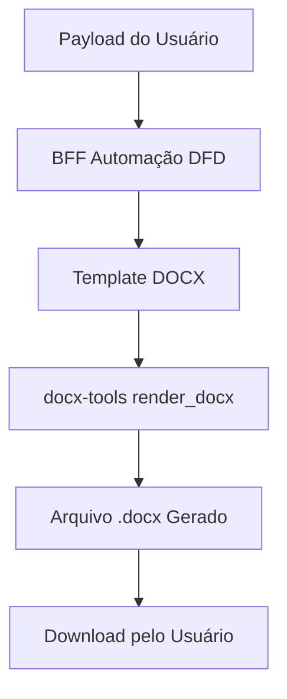

# Utils – docx-tools

O módulo **`docx-tools`** fornece funções auxiliares para manipulação de arquivos **Microsoft Word (.docx)** no BFF.  
Essas ferramentas são usadas principalmente em automações que geram documentos oficiais (ex.: **DFD, PCA, TR**).

---

## 🎯 Objetivos

- Gerar documentos `.docx` a partir de **templates pré-definidos**.  
- Preencher variáveis de contexto (placeholders) com dados enviados pelo usuário.  
- Permitir exportação em múltiplos formatos (`.docx`, `.pdf`, `.odt`).  
- Garantir consistência e padronização nos documentos emitidos.  

---

## 📦 Dependências

- [python-docx](https://python-docx.readthedocs.io/) → manipulação de arquivos `.docx`.  
- [docxtpl](https://docxtpl.readthedocs.io/) → preenchimento de templates com Jinja2.  
- [pypandoc](https://pypi.org/project/pypandoc/) (opcional) → conversão de `.docx` para `.pdf` ou `.odt`.  

Instalação:
```bash
pip install python-docx docxtpl pypandoc
````

---

## 📂 Estrutura Recomendada

```
apps/bff/app/utils/docx_tools.py
apps/bff/app/templates/dfd_template.docx
apps/bff/app/templates/pca_template.docx
```

---

## ⚙️ Funções Principais

### 🔹 Geração de Documento a partir de Template

```python
from docxtpl import DocxTemplate

def render_docx(template_path: str, context: dict, output_path: str):
    doc = DocxTemplate(template_path)
    doc.render(context)
    doc.save(output_path)
    return output_path
```

**Exemplo de uso:**

```python
render_docx(
    "templates/dfd_template.docx",
    {"ano": 2025, "orgao": "Secretaria de Administração"},
    "output/dfd-2025.docx"
)
```

---

### 🔹 Conversão para PDF/ODT

```python
import pypandoc

def convert_docx(input_path: str, output_path: str, format: str = "pdf"):
    return pypandoc.convert_file(input_path, to=format, outputfile=output_path)
```

**Exemplo de uso:**

```python
convert_docx("output/dfd-2025.docx", "output/dfd-2025.pdf", format="pdf")
```

---

## 📑 Exemplo de Template (`dfd_template.docx`)

No documento Word, usar **placeholders Jinja2**:

```
Ano: {{ ano }}
Órgão: {{ orgao }}
Responsável: {{ responsavel }}
Justificativa: {{ justificativa }}
```

Ao renderizar com `render_docx`, os placeholders são substituídos pelos valores enviados no payload.

---

## 📊 Fluxo de Geração de Documentos



---

## 🚀 Futuro

* Adicionar suporte a **assinaturas digitais** em documentos.
* Criar **biblioteca centralizada de templates** versionados por órgão.
* Implementar cache de documentos temporários.
* Permitir exportação direta para **HTML** e **Markdown** além de `.docx` e `.pdf`.

---

📖 Próximo: [Overview do Host](../../20-host/overview.md)

