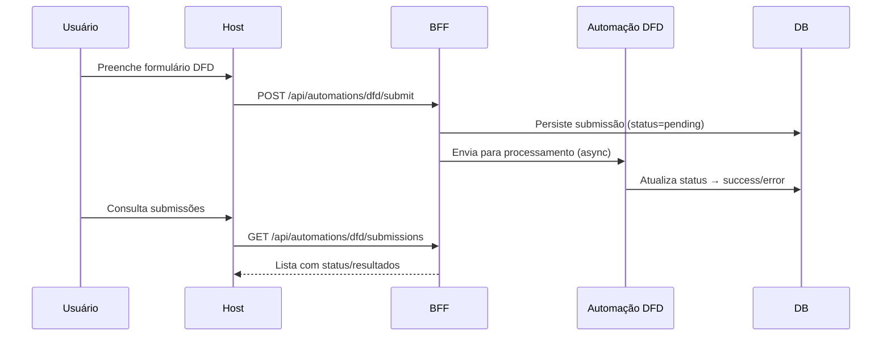
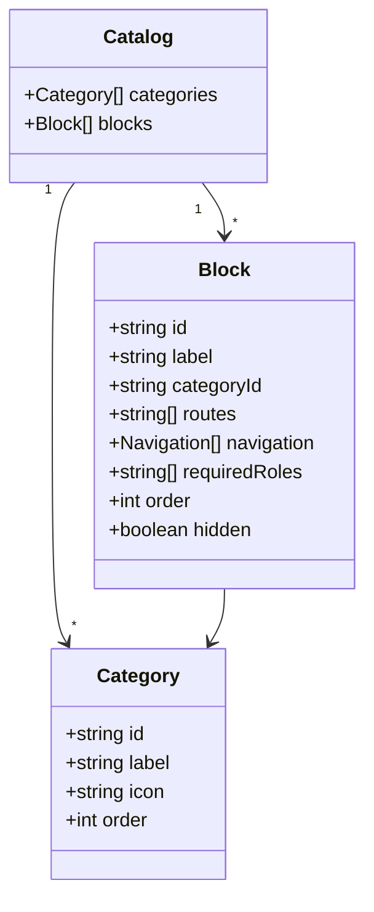

# Referência – Esquemas Mermaid

Este documento reúne **diagramas técnicos** do Portal AGEPAR em formato **Mermaid**, permitindo visualização direta no MkDocs Material.

---

## 📚 Arquitetura Geral

```mermaid
flowchart LR
  subgraph Frontend [Host – React/Vite]
    UI[UI (Navbar, Cards, Iframes)]
    CAT[Catálogo JSON Loader]
  end

  subgraph Backend [BFF – FastAPI]
    API[REST API /api/...]
    AUT[Automations (DFD, Form2JSON, ...)]
    DB[(Postgres)]
    AUD[Audits]
  end

  subgraph Docs [MkDocs]
    DOCS[Documentação Técnica]
  end

  UI -->|Fetch| API
  CAT -->|/catalog/dev| API
  AUT --> DB
  AUT --> AUD
  API --> DB
  UI --> DOCS
````

---

## 🔐 Fluxo de Autenticação

```mermaid
sequenceDiagram
  participant U as Usuário
  participant H as Host (Frontend)
  participant B as BFF (FastAPI)
  participant DB as DB (Sessions)

  U->>H: Acessa /login
  H->>B: POST /api/auth/login {username, password}
  B->>DB: Valida credenciais
  DB-->>B: OK
  B-->>H: Set-Cookie agepar_session
  H-->>U: Redireciona para Home
  U->>H: Acessa /api/me
  H->>B: GET /api/me (com cookie)
  B-->>H: { id, username, roles }
  H-->>U: Exibe dashboard personalizado
```

---

## 🤖 Fluxo de Automação (DFD)



---

## 📦 Catálogo e RBAC



---

## 🔮 Futuro

* Diagrama de **deploy** (Docker Compose → Kubernetes).
* Fluxo de **pipelines CI/CD**.
* Relacionamento de tabelas do DB (ERD simplificado).